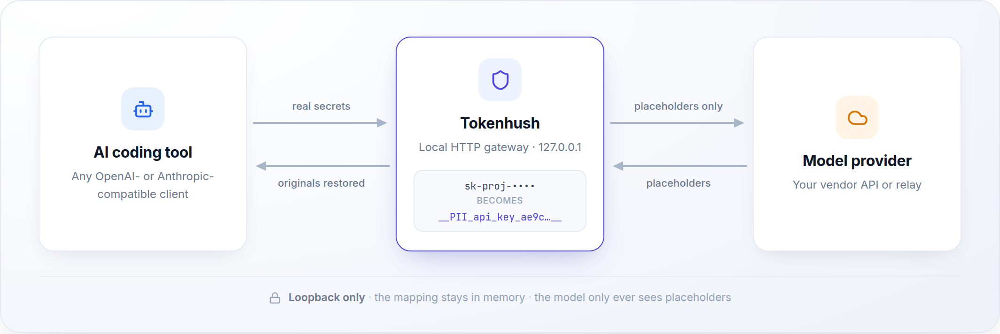

# Tokenhush

**English** | [中文](README.zh-CN.md)

> Local, reversible secret redaction for AI coding tools. No MITM, no root certificate.

[](https://github.com/fregie/tokenhush/actions/workflows/ci.yml)
[](https://github.com/fregie/tokenhush/releases)
[](LICENSE)
[](https://go.dev/dl/)
[](#-quick-start)

**[Star the repo](https://github.com/fregie/tokenhush/stargazers)** · **[Watch releases](https://github.com/fregie/tokenhush/watchers)**


*What the model receives with Tokenhush running: detected secrets across many files at once, every value replaced by a placeholder.*

Tokenhush is a local, loopback-only HTTP gateway. It sits between your AI coding tool and the vendor API. It replaces detected secrets in the outbound request body with session-scoped placeholders, forwards the cleaned request, and restores the originals in the response, so your tool still gets the real values back. The model only ever sees placeholders. It listens on `127.0.0.1` only and installs no root certificate.

```text
Your tool sends      OPENAI_API_KEY=<real key>
The model receives   OPENAI_API_KEY=__PII_api_key_ae9c0b46a8f3__
Your tool gets back  OPENAI_API_KEY=<real key>
```

[Quick start](#-quick-start) · [Why Tokenhush](#-why-tokenhush) · [Features](#-features) · [How it works](#-how-it-works) · [Verify it works](#-verify-it-works) · [CLI](#-cli) · [Configuration](#-configuration) · [Documentation](#-documentation)

---

## 🚀 Quick start

Any client that lets you set a custom OpenAI-compatible or Anthropic base URL works. Four steps: install, start the gateway, point one tool at it, and route requests to your provider.

### 1. Install

| Platform | One-line install |
|---|---|
| macOS | `brew install --cask fregie/tap/tokenhush` |
| Linux | `curl -fsSL https://raw.githubusercontent.com/fregie/tokenhush/main/install.sh \| bash` |
| Windows | `irm https://raw.githubusercontent.com/fregie/tokenhush/main/install.ps1 \| iex` |

The Linux and Windows installers resolve the release, download the matching archive, verify its sha256 against the release `checksums.txt`, and install the binary to a per-user directory (`~/.local/bin` on Linux, `%LOCALAPPDATA%\Programs\tokenhush` on Windows). No admin rights, no package manager. Pin a release with `--version X.Y.Z` (Linux) or `-Version X.Y.Z` (Windows).

The release wave has shipped, so the installers download and verify the published binary for your platform and need no Go toolchain. The macOS cask tracks the latest published release.

Prefer to build it yourself?

```sh
go install github.com/fregie/tokenhush/cmd/tokenhush@main
```

`@latest` still resolves to the older published tag, so use `@main` for this line. Put the binary on your `PATH` so the examples below work verbatim. Full install paths, service wrappers, and release status: [docs/deployment.md](docs/deployment.md).

### 2. Start the gateway

```sh
tokenhush run
```

It stays in the foreground, listens on `http://127.0.0.1:8787` by default, and exits on Ctrl-C. On start it prints a banner: the loopback endpoint, the effective upstream routing (configured entries plus the built-in fallbacks), and the two base-URL forms to point a tool at. Leave it running and open a second terminal.

### 3. Point your tool at it

Tokenhush works with any client that lets you override its base URL. These 14 ship with a ready-to-paste snippet from `tokenhush env <tool>`:

| Your tool | What to run |
|---|---|
| [Claude Code](docs/tool-setup.md#claude) | `eval "$(tokenhush env claude)"` then `claude` |
| [Codex CLI](docs/tool-setup.md#codex) | `tokenhush env codex` — paste into `~/.codex/config.toml` (API-key mode only) |
| [Aider](docs/tool-setup.md#aider) | `eval "$(tokenhush env aider)"` then `aider` |
| [Cline](docs/tool-setup.md#cline) | `tokenhush env cline` — set the OpenAI Compatible base URL |
| [Roo Code](docs/tool-setup.md#roo) | `tokenhush env roo` — set the OpenAI Compatible base URL |
| [opencode](docs/tool-setup.md#opencode) | `tokenhush env opencode` — paste into `opencode.json` |
| [Qwen Code](docs/tool-setup.md#qwen) | `eval "$(tokenhush env qwen)"` then `qwen` |
| [Charm Crush](docs/tool-setup.md#crush) | `tokenhush env crush` — paste into `crush.json` |
| [Zed](docs/tool-setup.md#zed) | `tokenhush env zed` — paste into `settings.json` |
| [Continue.dev](docs/tool-setup.md#continue) | `tokenhush env continue` — paste into `~/.continue/config.yaml` |
| [Open WebUI](docs/tool-setup.md#openwebui) | `eval "$(tokenhush env openwebui)"`, then start the server |
| [Goose](docs/tool-setup.md#goose) | `eval "$(tokenhush env goose)"` then `goose` |
| [OpenHands](docs/tool-setup.md#openhands) | `eval "$(tokenhush env openhands)"` |
| [Kilo Code](docs/tool-setup.md#kilo) | `tokenhush env kilo` — set the OpenAI Compatible base URL |

Two rules cover every tool:

- Anthropic-style clients take the bare origin: `http://127.0.0.1:8787`.
- OpenAI-compatible clients take `/v1`: `http://127.0.0.1:8787/v1`.

Using something else? Set its OpenAI-compatible base URL to `http://127.0.0.1:8787/v1`, or its Anthropic base URL to `http://127.0.0.1:8787`. Step-by-step guides for every tool, including the exact file to edit, are in [docs/tool-setup.md](docs/tool-setup.md).

### 4. Route requests to your provider

With no config, OpenAI-compatible paths go to `https://api.openai.com` and Anthropic paths go to `https://api.anthropic.com`. **Using a relay or any other endpoint? Set the upstream first**, or the gateway will forward to the wrong provider.

Create `tokenhush.yaml` in the config directory (or point `tokenhush run --config PATH` at it):

```yaml
upstreams:
  - match: /v1/chat/completions
    target: https://your-provider.example.com
```

- Use the provider **origin** (plus any prefix that comes before `/v1`), with no trailing slash and **no `/v1`**. Your tool already sends `/v1/chat/completions`, and the gateway appends the request path.
- Keep your provider's API key in the tool's own config. The gateway forwards auth headers untouched and redacts only the request **body**.

Routing is by **request path**, not provider name, and one path maps to one upstream. A relay that serves many models behind `/v1` is fine: the model is chosen by the request body, not by the route.

Worked routing examples: [docs/tool-setup.md#configuring-request-routing-upstreams](docs/tool-setup.md#configuring-request-routing-upstreams). Every key in the config file: [docs/tool-setup.md#configuration-reference](docs/tool-setup.md#configuration-reference), or the [Configuration](#-configuration) section below.

## 🔒 Why Tokenhush

AI coding tools need your code to be useful, so they read a lot: open files, the whole repo, config, and the keys lying around it. A lot of that leaves your machine with every request. Opt-outs exist, but they are easy to get wrong or forget, and they vary from tool to tool. Once a request is sent, there is no undo.

Tokenhush adds one checkpoint in front of the tool. It reads each request, replaces anything that looks like a secret, and forwards the cleaned version. You keep working the way you always have. You just stop shipping your secrets along with it.

## ✨ Features

- **Every nested field is walked.** Tokenhush walks the entire outbound JSON request body, so secrets buried in nested objects and arrays are seen, not just top-level fields. Streaming responses are handled as they arrive.
- **Six built-in detectors, five on by default.** `prefix` (known key shapes: `sk-`, `AKIA`, `ghp_`, `glpat-`, `xox*`, `AIza`, `npm_`), `jwt`, `pem` (PEM private-key headers), `luhn` (Luhn-checked card numbers), and `email` are on. The sixth, `entropy` (high-entropy strings), is off by default because its false positives on real agent traffic, long tool names and session ids, broke function calling. Turn it on only for a workload that carries no images or long random identifiers.
- **Precise email, parameterized by rule options.** The `email` detector fires only when the address's domain ends at a label boundary with a known public suffix (`.com`, `.co.uk`), so subdomains count and a look-alike such as `evilcorp.com` is rejected when the narrower `.corp.com` is the configured suffix in `replace` mode (an additive `.corp.com` still carries the built-in `.com`, so `evilcorp.com` would match). The built-in suffix table is compiled in, frozen, and always on. A rule document or signed pack may carry a typed, strictly validated `options` object: an unknown option key is a typed error, and the only detector option today is `email`, whose `suffixes` list adds suffixes to the built-in set and whose `replace` flag swaps that set out — permitted only for a non-remote local document, and refused by the floor for a remote pack.
- **Placeholders are stable for the session.** A match becomes `__PII_<type>_<digest>__`, for example `__PII_api_key_ae9c0b46a8f3__`. The secret-to-placeholder mapping lives in memory only, for this session. Restarting drops it.
- **Loopback only, with checks.** The gateway binds `127.0.0.1`, plus `[::1]` when the host has an IPv6 loopback. The `Host` header is always checked, `Origin` is checked for browser-style requests, and the control API sits behind a per-run bearer token stored `0600`. It fails closed rather than open.
- **A 14-tool `env` helper.** `tokenhush env <tool>` prints a ready-to-paste snippet for `claude`, `codex`, `aider`, `cline`, `roo`, `opencode`, `qwen`, `crush`, `zed`, `continue`, `openwebui`, `goose`, `openhands`, and `kilo`.
- **Signed rule sync, with a non-weakening floor.** `tokenhush rules sync` fetches an Ed25519-signed rule pack and verifies its signature, freshness, serial (no rollback), and the signed revocation list before use. The floor rejects exactly four things: a pack that disables a built-in detector, a pack that drops a required category, a rule that carries an `allow` action, and a rule that sets the email `replace` flag. So a pack may add detections and extend the built-in email suffix set, but can never weaken the built-ins. Packs load at the next start, never hot, and any problem falls back to the built-in defaults with a warning.
- **Small, portable, extensible.** Pure Go, built with `CGO_ENABLED=0`. Extension points are compile-time: the `Rule` contract in `pkg/filter` is how a built-in detector, a signed pack, and a third-party rule all enter the same registry.

## 🔁 How it works

<picture>
  <source media="(prefers-color-scheme: dark)" srcset="asset/how-it-works-dark.png">
  
</picture>

- **Outbound:** the gateway walks the JSON body, runs the enabled detectors, and turns each match into a session placeholder before forwarding upstream.
- **Inbound:** placeholders this session minted are swapped back to the originals, and only your tool receives them. A foreign placeholder is returned unchanged.

> [!IMPORTANT]
> Placeholders are **never** filled back in on the way out. Only your client gets the originals. That is what blocks prompt-injection tricks that try to make the gateway echo a secret back to the model.

## ✅ Verify it works

The fastest check needs only the gateway's own log. Run `tokenhush run`, watch its stderr while your tool works. Startup prints the endpoint and the routing, every value it redacts produces one masked line, and every response-side restore produces one count line:

```text
tokenhush: redacted request api_key (len=32) sk-p…j0
tokenhush: restored response placeholders=1
```

Both lines are metadata only. The redaction line carries the detector type, the matched byte length and a masked form, never the full value; the restore line carries only a count. `tokenhush status` reports the redaction counts as JSON:

```sh
tokenhush status --json
```

For a full round trip, run a local echo upstream on `127.0.0.1:9999` so you can see exactly what left the gateway:

```sh
python3 - <<'PY'
import http.server, sys
class Echo(http.server.BaseHTTPRequestHandler):
    def do_POST(self):
        body = self.rfile.read(int(self.headers.get("Content-Length", 0)))
        sys.stderr.write("upstream received: " + body.decode() + "\n"); sys.stderr.flush()
        self.send_response(200); self.send_header("Content-Type", "application/json")
        self.send_header("Content-Length", str(len(body))); self.end_headers()
        self.wfile.write(body)
    def log_message(self, *args): pass
http.server.HTTPServer(("127.0.0.1", 9999), Echo).serve_forever()
PY
```

Point a throwaway gateway at it (leaving your real config alone), then start it:

```sh
export TOKENHUSH_HOME="$(mktemp -d)"
mkdir -p "$TOKENHUSH_HOME/config"
cat > "$TOKENHUSH_HOME/config/tokenhush.yaml" <<'YAML'
listen:
  host: 127.0.0.1
  port: 8787
upstreams:
  - match: /v1/chat/completions
    target: http://127.0.0.1:9999
YAML
tokenhush run
```

Send one request with a fake secret in it:

```sh
curl -sS http://127.0.0.1:8787/v1/chat/completions \
  -H 'Content-Type: application/json' \
  -d '{"model":"echo","messages":[{"role":"user","content":"my email is me@example.com"}]}'
```

Three things to check:

1. The echo upstream terminal prints the body with the address replaced by `__PII_email_<digest>__`. The secret left as a placeholder.
2. The gateway terminal prints two lines: `tokenhush: redacted request email (len=17) ****` and `tokenhush: restored response placeholders=1`.
3. The `curl` output contains the original address again, restored by the gateway on the response path. The upstream never saw the secret, and the client never saw the placeholder.

`tokenhush status --json` reports `"redactions": 1` for that request. The full recipe, including how to read the status document, is in [docs/verify.md](docs/verify.md).


*The client-side view: a token is pasted into the tool, and the assistant reports that it only ever received a `__PII_custom_...__` placeholder.*

## 🧭 How Tokenhush compares

| Approach | What it gives you | What it does not |
|---|---|---|
| Trust `.gitignore` and provider opt-outs | No extra software. You keep secrets out of the files you remember to exclude, and you can disable training or logging features per provider. | You have to get every pattern right and keep it right. A tool that reads the repo, an `.env` you forgot to exclude, or a key pasted into a prompt still leaves the machine. There is no undo after a request is sent. |
| Turn off the features that send too much | Fewer bytes leave, sometimes a lot fewer. | You lose capability, the setting can drift or be reset by an update, and it does nothing about secrets that reach the request anyway. |
| A local MITM proxy with a root certificate | Can inspect and rewrite traffic from any client on the machine, including ones with no base-URL setting. | It terminates TLS, so you install a root certificate and add a permanently trusted party to your machine. That is a large change in trust for a secret-scrubbing feature. |
| Tokenhush | A loopback HTTP gateway your tool points at. It replaces secrets with reversible placeholders in the request body and restores them in the response. No TLS termination, no root certificate, and the mapping lives in memory only. | It only covers tools you can point at a base URL (14 helpers ship). It does not redact the response path, does not catch encoded secrets, and does not cover clients that ignore base URLs. |

## ❓ FAQ

**Does Tokenhush see my keys?**
Yes, in process and in memory. It has to read each request body to find and replace secrets. What it never does is persist them: no request or response bodies, no detected secrets, and no placeholder-to-secret mapping are written to disk. The redaction log is masked and goes to stderr only.

**Does it write secrets to disk?**
No. The only files it writes are metadata: `run.json` (`pid`, `port`, `addrs`, `started_at`), the `0600` control token, the verified rules cache, and the update anti-rollback mark. Bodies and mappings stay in memory.

**Does it slow me down?**
It runs in the request path on loopback, walks the request body, and forwards it to the provider. It does not terminate TLS and adds no network hop beyond the one your tool already makes to the provider. Measured overhead for v0.5.0 is not published yet, so treat any figure you see as unverified.

**Does it work offline?**
The data path is local: the gateway binds loopback and talks to your provider, which needs network anyway. The only two requests Tokenhush itself can make to the vendor, update check and rule sync, are both switchable off. Nothing else leaves the machine.

**Will it break my tool's function calling?**
The five default detectors are the conservative set. `entropy` is off by default precisely because its false positives on long tool names and session ids broke function calling in testing; leave it off unless your workload carries no images, data URLs, or long random identifiers. Placeholders are stable per session and restored on the response path, so the tool still receives the values it sent.

**Does it work with a company HTTP proxy?**
Tokenhush does not add a proxy of its own, and the strict config schema has no proxy key. The gateway makes a normal outbound HTTPS connection to the provider origin you configure, so it needs the same outbound reachability your tool has. If access in your environment goes through a corporate proxy, treat the gateway like any other CLI on the machine.

**Where do the two vendor requests go, and can I turn them off?**
Both go to `updates.tokenhush.com`, and both are command-scoped: update check runs only on `tokenhush update`, rule sync only on `tokenhush rules sync`, and each short-circuits before any network call when its switch is set. Retention for both is 30 days. Switch them off with `TOKENHUSH_NO_UPDATE_CHECK=1` and `TOKENHUSH_NO_RULE_SYNC=1`. `tokenhush privacy` prints the disclosure. Beyond those two, the only traffic leaving the machine is your own requests to your provider.

## 🚫 What it does NOT do

- **No MITM and no root certificate.** Tokenhush never terminates TLS. That is also why Cursor agent traffic, the ChatGPT and Claude desktop apps, and browser web UIs are not covered: they do not honour a configurable base URL, and covering them would need system-level interception.
- **The response path does not redact.** Response-scoped rules can allow, warn, or block only. On a streaming (SSE) response, a block takes effect from the first whole event and cannot recall deltas already emitted to the client.
- **Encoded secrets are not caught.** A secret that is base64-, hex-, or URL-encoded before it leaves is not detected; the rewrite has no normalization pass by design. A non-identity request `Content-Encoding` is refused with 415 rather than decoded for detection.
- **A secret in a JSON object key is not caught.** Only values are walked.
- **There is no `doctor` command, no allowlist-mutation command, and no service command.** Plugins are compile-time only, so there is no runtime plugin loading.

## ⌨️ CLI

```text
tokenhush run          start the gateway in the foreground
tokenhush rules        sync signed detection rules or roll back
tokenhush update       check for and apply a signed self-update
tokenhush status       read the running gateway's metadata
tokenhush env <tool>   print a tool setup snippet
tokenhush version      print version and build information
tokenhush privacy      show the vendor-bound egress disclosure
```

| Command | What it does | Flags |
|---|---|---|
| `tokenhush run` | Starts the gateway in the foreground. Default listen `127.0.0.1:8787`. Exits on Ctrl-C. | `--config PATH`, `--port N` (1..65535), `--log-level debug\|info\|warn\|error`, `--log-redactions` (default true; `--log-redactions=false` silences the redaction and restore logs) |
| `tokenhush rules` | `sync [--check]` verifies and activates the signed rule pack; `rollback` returns to the previous verified serial, or the built-in defaults. | `sync --check` |
| `tokenhush update` | Checks for and applies a signed self-update. Homebrew and Scoop installs delegate to their package manager; a self-managed install self-replaces. | `--check` |
| `tokenhush status` | Reads the running gateway's metadata. Human form is `key: value` lines; `--json` emits the frozen status document. When nothing is running it prints `not running` and exits 1. | `--json` |
| `tokenhush env <tool>` | Prints a ready-to-paste setup snippet for one of the 14 tools. | `--config PATH`, `--port N` |
| `tokenhush version` | Prints `tokenhush v0.5.0 <os>/<arch> <goversion> (commit …, built …)`. | none |
| `tokenhush privacy` | Prints the vendor-bound egress disclosure: exactly two categories, each with its switch, host, and retention. | `--json` |

Every command exits `0` on success, `1` when a check or operation fails, and `2` on a usage error (unknown command or tool, bad flag value).

`tokenhush run` stays in the foreground and exits on Ctrl-C. There is no built-in service command, so for auto-start use your OS's own tools: a launchd agent on macOS, a systemd user unit on Linux, or a Task Scheduler entry on Windows.

## ⚙️ Configuration

Tokenhush reads `tokenhush.yaml`. A missing file means defaults, and the schema is closed: an unknown key is an error, not a warning.

```yaml
listen:            {host: 127.0.0.1, port: 8787}
log:               {level: info}
detectors:         {prefix: true, email: true, luhn: true, jwt: true, pem: true, entropy: false}
allowlist:         ["literal"]
upstreams:         [{match: "/v1/chat/completions", target: "https://api.openai.com"}]
scan_budget_bytes: 33554432
detector_timeout:  30s
```

| Location | Configuration | Data |
|---|---|---|
| macOS | `~/Library/Application Support/tokenhush/config/` | `~/Library/Application Support/tokenhush/Data/` |
| Linux | `${XDG_CONFIG_HOME:-~/.config}/tokenhush/` | `${XDG_DATA_HOME:-~/.local/share}/tokenhush/` |
| Windows | `%AppData%\tokenhush\` | `%LOCALAPPDATA%\tokenhush\` |

Set `TOKENHUSH_HOME` to move both under one root.

| Key | Meaning |
|---|---|
| `listen.host` / `listen.port` | Only `127.0.0.1`, `::1`, or `localhost`; `0.0.0.0` is rejected. Port 1..65535, default 8787. |
| `log.level` | `debug`, `info`, `warn`, or `error`, default `info`. |
| `detectors` | The six switches: `prefix`, `email`, `luhn`, `jwt`, `pem`, `entropy`. Five are on by default; `entropy` is off by default. |
| `allowlist` | Literals that are never redacted. |
| `upstreams` | A **list** of `{match, target}` entries, not a map. `match` is a path prefix; `target` is an origin with no trailing slash. |
| `scan_budget_bytes` | Maximum bytes scanned per request, default `33554432` (32 MiB). |
| `detector_timeout` | Per-detector time backstop, default `30s`. |

Unmatched paths fall back to the built-ins: `/v1/messages` goes to Anthropic, and `/v1/chat/completions` and `/v1/responses` go to OpenAI. `GET /v1/models` is the one named exception and defaults to OpenAI. Any other unknown path is an explicit error, never a silent misroute. Routing is by request path; the model is chosen by the request body.

## 🛡️ Security model

Tokenhush binds loopback only: `127.0.0.1` always, plus `[::1]` when the host has an IPv6 loopback. The Host allowlist is always enforced, and `Origin` is checked for browser-style requests.

The control surface is exactly `GET /status`, behind a per-run bearer token stored `0600`. There is no allowlist-mutation endpoint and no second endpoint. A non-GET request gets a JSON 405 with `Allow: GET`; any other GET gets a JSON 404.

Nothing is persisted: no request or response bodies, no detected secrets, and no placeholder-to-secret mapping. Only metadata is written, to `run.json`, the control token, the verified rules cache, and the update anti-rollback mark. The design fails closed: a detector failure refuses the request rather than forwarding it unredacted, and a non-identity `Content-Encoding` is rejected with 415 rather than decoded.

The only traffic Tokenhush itself can send to the vendor is exactly two switchable categories, both to `updates.tokenhush.com` with 30-day retention: update-check (switch off with `TOKENHUSH_NO_UPDATE_CHECK=1`) and rule-sync (switch off with `TOKENHUSH_NO_RULE_SYNC=1`). `tokenhush privacy` prints the disclosure. For the threat model and every invariant, see [docs/security.md](docs/security.md); for the generated disclosure, see [docs/generated/network-egress.md](docs/generated/network-egress.md); to report a vulnerability, see [SECURITY.md](SECURITY.md).

## 📦 Install & platforms

| Platform | One-line install |
|---|---|
| macOS | `brew install --cask fregie/tap/tokenhush` |
| Linux | `curl -fsSL https://raw.githubusercontent.com/fregie/tokenhush/main/install.sh \| bash` |
| Windows | `irm https://raw.githubusercontent.com/fregie/tokenhush/main/install.ps1 \| iex` |

The Linux and Windows installers verify the archive's sha256 against the release `checksums.txt` before installing anything, need no admin rights, and accept a pinned version (`--version X.Y.Z` / `-Version X.Y.Z`). To build from source instead, use Go 1.25+: `go build -o tokenhush ./cmd/tokenhush`, or `go install github.com/fregie/tokenhush/cmd/tokenhush@main`.

The installers download and verify the published binary for your platform, so no Go toolchain is needed. The full set of install paths, service wrappers, and release status is in [docs/deployment.md](docs/deployment.md).

| Platform | Targets | Notes |
|---|---|---|
| macOS | arm64, amd64 | Pure Go, `CGO_ENABLED=0`, no C toolchain needed. |
| Linux | arm64, amd64 | Pure Go, `CGO_ENABLED=0`. |
| Windows | arm64, amd64 | Pure Go, `CGO_ENABLED=0`. |

## 📚 Documentation

| Document | What's inside |
|---|---|
| [docs/tool-setup.md](docs/tool-setup.md) / [中文](docs/tool-setup.zh-CN.md) | Per-tool setup for the 14 tools, request routing, and the config reference. |
| [docs/verify.md](docs/verify.md) / [中文](docs/verify.zh-CN.md) | The echo-upstream verification recipe in full. |
| [docs/deployment.md](docs/deployment.md) / [中文](docs/deployment.zh-CN.md) | Install and build paths, service wrappers, release status. |
| [docs/architecture.md](docs/architecture.md) / [中文](docs/architecture.zh-CN.md) | Layered architecture, the rule abstraction, and the data path. |
| [docs/security.md](docs/security.md) / [中文](docs/security.zh-CN.md) | Security model, the eight invariants, and the residual-risk register. |
| [docs/plugins.md](docs/plugins.md) / [中文](docs/plugins.zh-CN.md) | The `Rule` extension point and its restrictions. |
| [docs/generated/network-egress.md](docs/generated/network-egress.md) / [中文](docs/generated/network-egress.zh-CN.md) | The two switchable vendor-bound egress categories, generated from `egress.yaml`. |
| [docs/PRO-MIGRATION.md](docs/PRO-MIGRATION.md) / [中文](docs/PRO-MIGRATION.zh-CN.md) | What the Pro repository must do after this rewrite. |
| [CONTRIBUTING.md](CONTRIBUTING.md) / [中文](CONTRIBUTING.zh-CN.md) | How to build, test, and contribute. |
| [SECURITY.md](SECURITY.md) / [中文](SECURITY.zh-CN.md) | Vulnerability disclosure policy. |
| [LICENSE](LICENSE) | Apache License 2.0. |

## Project status

This repository is the v0.5.0 from-scratch core. It exposes the seven-command surface (`run`, `rules`, `update`, `status`, `env`, `version`, `privacy`), a strict validated `tokenhush.yaml`, and the security invariants documented in [docs/security.md](docs/security.md). CI runs unit tests plus the guard suites on Linux, macOS, and Windows.

## 🤝 Contributing

Contributions are welcome. See [CONTRIBUTING.md](CONTRIBUTING.md) for development setup, testing, and pull request guidelines.

## 📄 License

[Apache License 2.0](LICENSE).
