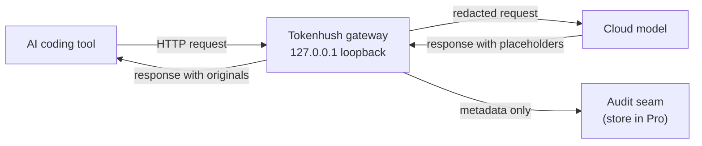

# Tokenhush

**English** | [中文](README.zh-CN.md)

> A local gateway that redacts secrets and sensitive data from your AI coding tools' requests before they reach the model. Catch every secret. Leak nothing. 100% local.

[](https://github.com/fregie/tokenhush/actions/workflows/ci.yml)
[](https://github.com/fregie/tokenhush/releases)
[](LICENSE)
[](go.mod)
[](#supported-tools)

Tokenhush is a local base-URL gateway that sits between your AI coding tools and the cloud model. Point Claude Code, Codex CLI, Aider, Cline, Roo Code, Continue, or any OpenAI-compatible client at `127.0.0.1`, and it detects and redacts sensitive content before the request leaves your machine. The core exposes a metadata-only audit seam; the concrete local audit store (persistence, tamper-evident chain, retention) lives in the private Pro layer.

[Features](#features) · [Installation](#installation) · [Quick start](#quick-start) · [CLI](#cli) · [Documentation](#documentation) · [Contributing](#contributing)

## Why Tokenhush

AI coding agents ship the whole repository, your `.env` files, and your keys to the cloud. In 2026 a developer captured traffic with mitmproxy and proved that Grok Build CLI uploaded a full repo, including git history and `.env`, with an opt-out that did not work (a community post with 593 upvotes). The same privacy questions keep resurfacing around OpenCode, Claude Code, and other agents.

Tokenhush adds one local gate in front of those tools. It sees the request, controls what goes out, and avoids false positives with deterministic detectors. Nothing leaves your machine except the redacted request.

## Features

- **Full-body outbound redaction.** A fixed allowlist of fields is not enough, so every request body is walked leaf by leaf. A protocol-agnostic JSON traversal covers nested structures, and SSE incremental backfill keeps streaming responses covered as they arrive.
- **Six deterministic detectors.** Known key prefixes (`sk-`, `AKIA`, `ghp_`, and more), high-entropy strings, JWTs, PEM private-key headers, Luhn card numbers, and email addresses.
- **HMAC-deterministic placeholders.** A match becomes a stable token such as `__PII_email_9f2c8a4b6d1e__`. The mapping is HMAC-derived, held in memory, and scoped to the session. A restart loses the mapping, so you may occasionally see a placeholder in output. That is safe degradation, not a leak.
- **Metadata-only audit seam.** The core defines the audit interfaces (`AuditSink` / `AuditQuerier`) and a no-op default; a record carries metadata such as provider, path, byte counts, and detector hits. The concrete local store (persistence, tamper-evident HMAC chain, retention) is implemented in the private Pro layer, not in this repository.
- **Dual-stack loopback with guards.** The gateway binds `127.0.0.1` and `[::1]` only. A Host allowlist is always enforced, an Origin check applies to browser-style requests, and the control API requires a bearer token stored with `0600` permissions.
- **`tokenhush env` onboarding.** Prints copy-paste setup snippets for `claude`, `codex`, `aider`, `cline`, and `roo`.
- **`tokenhush doctor` diagnostics.** Runs common setup checks with clear exit codes: `0` when nothing fails, `1` on a failed check, `2` on a usage error.
- **Cross-platform, CGO-free.** One pure Go codebase builds macOS, Linux, and Windows binaries for amd64 and arm64 with `CGO_ENABLED=0`.
- **Fail-safe by design.** The gateway fails safe, not open.
- **Public extension points.** Cross-layer interfaces (`Router`, `CostSink`, `AuditExporter`) and content plugins (`Inspector` / `Transformer`) let you extend the pipeline. V1 supports compile-time plugins only.

## How it works



- **Outbound request:** the gateway walks the full JSON body and runs all six detectors. Matches become session-scoped placeholders, and the redacted request is forwarded upstream.
- **Streaming responses:** SSE chunks are refilled incrementally, so placeholders that arrive mid-stream map back to their originals.
- **Inbound response:** placeholders are replaced with the original values, and only the client receives them.
- **Audit seam:** the gateway sends metadata such as provider, path, byte counts, and detector hits to an injected audit sink. The default sink is a no-op, and the private Pro layer supplies the concrete store; the seam never records content.

> [!IMPORTANT]
> The hard invariant is that placeholders are **never** backfilled in the outbound direction. Only the client gets originals. This blocks prompt-injection attempts that try to trick the gateway into echoing a secret back to the model.

## Supported tools

| Tool | Integration | Status |
|---|---|---|
| Claude Code CLI | `ANTHROPIC_BASE_URL` | Supported |
| Codex CLI | `~/.codex/config.toml` → `base_url` | Supported (API key mode) |
| Aider | `OPENAI_API_BASE` / `ANTHROPIC_API_BASE` | Supported |
| Cline / Roo Code | OpenAI Compatible base URL in settings | Supported |
| Continue | `config.json` → `apiBase` | Manual setup |
| Open WebUI | OpenAI-compatible endpoint | Manual setup |

`tokenhush env <tool>` prints ready-to-paste snippets for `claude`, `codex`, `aider`, `cline`, and `roo`. See [docs/configuration.md](docs/configuration.md) for full per-tool instructions.

> [!WARNING]
> Not covered in V1: Cursor agent traffic, ChatGPT and Claude desktop apps, and browser web UIs. These need system-level MITM, which the public core does not implement.

## Installation

### Package managers

| Platform | Command |
|---|---|
| macOS | `brew install --cask fregie/tap/tokenhush` |
| Linux | `curl -fsSL https://raw.githubusercontent.com/fregie/tokenhush/main/install.sh \| bash` |
| Windows | `scoop bucket add fregie https://github.com/fregie/scoop-bucket && scoop install tokenhush` |

The Linux installer downloads the archive for your OS and architecture, verifies its sha256, and installs it. It installs to `~/.local/bin` by default, and accepts `--dry-run`, `--version`, `--dir`, and `--base-url`. It also reads `TOKENHUSH_VERSION`, `TOKENHUSH_INSTALL_DIR`, and `TOKENHUSH_BASE_URL`.

Every release ships archives for darwin, linux, and windows on amd64 and arm64, a `checksums.txt` with sha256 hashes, and per-archive SPDX SBOMs.

### From source

Go 1.25 or newer is required.

```bash
go install github.com/fregie/tokenhush/cmd/tokenhush@latest
# or build inside the repo:
go build -o bin/tokenhush ./cmd/tokenhush
```

### First-run prompts

macOS binaries are not notarized. If Gatekeeper blocks the first launch, right-click the binary and choose **Open**, then confirm **Open** in the dialog. You can also clear the quarantine attribute:

```bash
xattr -dr com.apple.quarantine "$(command -v tokenhush)"
```

On Windows, a manually downloaded `.zip` may trigger SmartScreen on first run of `tokenhush.exe`. Click **More info**, then **Run anyway**. Scoop installs avoid this prompt.

See the full [Deployment Guide](docs/deployment.md).

## Quick start

```bash
# 1. Start the gateway in the foreground. It listens on 127.0.0.1:8787 by default.
tokenhush run

# 2. In another terminal, point Claude Code at the gateway and start it.
eval "$(tokenhush env claude)"
claude

# 3. Confirm the gateway is running.
tokenhush status
```

`tokenhush run` prints `tokenhush: gateway listening on http://127.0.0.1:<port>` together with the path to the control token file.

## CLI

```text
<!-- check-docs:commands:start -->
    tokenhush run          start the gateway in the foreground
    tokenhush status       show whether the gateway is running
    tokenhush env <tool>   print tool setup snippets
    tokenhush doctor       diagnose common setup problems
    tokenhush version      print version and build information
<!-- check-docs:commands:end -->
```

| Command | Description | Key flags |
|---|---|---|
| `tokenhush run` | Start the gateway in the foreground. | `--config PATH`, `--port N` (1..65535), `--log-level debug\|info\|warn\|error` |
| `tokenhush status` | Show whether the gateway is running. | `--json` |
| `tokenhush env <tool>` | Print tool setup snippets. Tools: `claude`, `codex`, `aider`, `cline`, `roo`. | `--config PATH`, `--port N` |
| `tokenhush doctor` | Diagnose common setup problems. Exits `0` when no check fails, `1` on any failure, `2` on a usage error. | `--config PATH`, `--port N`, `--json` |
| `tokenhush version` | Print version and build information. | none |

> [!NOTE]
> `tokenhush run` stays in the foreground and exits on Ctrl-C. A built-in service command is not part of V1. For auto-start, manage your own OS-native wrapper: a launchd agent on macOS, a systemd user unit on Linux, or a Task Scheduler entry on Windows.

### Control API

The control plane listens on loopback and requires a bearer token. `GET /status` returns JSON with `state`, `addrs`, `uptime_ms`, `requests`, and `redactions`, and requires `Authorization: Bearer <token>`. The token is generated per `run` and stored with `0600` permissions in the data directory. Requests carrying an `Origin` get an origin check, and a Host allowlist is always enforced. The core control plane exposes only `GET /status`; the private Pro layer adds its own audit endpoint.

## Configuration

Tokenhush reads `tokenhush.yaml`. A missing file means defaults, and unknown keys are rejected.

| Location | Path |
|---|---|
| macOS | `~/Library/Application Support/tokenhush/` |
| Linux | `${XDG_CONFIG_HOME:-~/.config}/tokenhush/` |
| Windows | `%AppData%\tokenhush\` |

Data lives separately: macOS uses `~/Library/Application Support/tokenhush/`, Linux uses `${XDG_DATA_HOME:-~/.local/share}/tokenhush/`, and Windows uses `%LOCALAPPDATA%\tokenhush\`. Set `TOKENHUSH_HOME` to override both directories.

| Top-level key | What it controls |
|---|---|
| `listen` | `host` (only `127.0.0.1`, `::1`, or `localhost`; `0.0.0.0` is rejected) and `port` (1..65535, default 8787) |
| `detectors` | Enable or disable the six detectors: `prefixes`, `high_entropy`, `jwt`, `private_keys`, `luhn`, `email` |
| `allowlist` | Literals that are never redacted |
| `log` | `level`: `debug`, `info`, `warn`, or `error` |
| `upstreams` | Map a host or path prefix to your own OpenAI-compatible upstream |

> The `audit` key is no longer part of the core config. A config that still contains an `audit:` block fails to load with an actionable migration error; see [docs/migration-v0.2.0.md](docs/migration-v0.2.0.md).

Unmatched routes fall back to built-ins: `/v1/messages` goes to Anthropic, and `/v1/chat/completions` and `/v1/responses` go to OpenAI. See [docs/configuration.md](docs/configuration.md) for the full reference.

## Security model

Tokenhush binds loopback only, enforces a Host allowlist, and routes audit through a metadata-only seam that stores no content. It never backfills placeholders outbound, ships no root certificate and no MITM, and fails safe rather than open. See [docs/security.md](docs/security.md) for the threat model and full invariants.

## Documentation

| Document | Contents |
|---|---|
| [docs/README.md](docs/README.md) | Documentation index |
| [docs/deployment.md](docs/deployment.md) | Installation channels, service wrappers, and release artifacts |
| [docs/configuration.md](docs/configuration.md) | `tokenhush.yaml` reference and per-tool setup |
| [docs/architecture.md](docs/architecture.md) | Core architecture, data flow, and modules |
| [docs/security.md](docs/security.md) | Security model, threat model, and hard invariants |
| [docs/plugins.md](docs/plugins.md) | Writing content plugins (`Inspector` / `Transformer`) |
| [docs/extension-api.md](docs/extension-api.md) | Extension interfaces (`Router`, `CostSink`, `AuditExporter`) |
| [docs/migration-v0.2.0.md](docs/migration-v0.2.0.md) | Migrating from v0.1.x: the audit capability moved to the Pro layer |
| [CONTRIBUTING.md](CONTRIBUTING.md) | How to build, test, and contribute |

## Project status

The V1 core shipped as **`v0.1.0`** ([GitHub Release](https://github.com/fregie/tokenhush/releases/tag/v0.1.0)). The `v0.2.0` line keeps `tokenhush run` (foreground gateway with dual-stack loopback), `status`, `env <tool>`, `doctor`, and `version`, plus the metadata-only audit seam. The concrete audit store, the `audit` subcommand, and the `/audit` control endpoint moved to the private Pro layer, so a config that still carries an `audit:` block must be migrated (see [docs/migration-v0.2.0.md](docs/migration-v0.2.0.md)). The code is pure Go with `CGO_ENABLED=0`, and CI runs unit tests and an end-to-end smoke test on Linux, macOS, and Windows.

## Open-core boundary

This is the public core repository, licensed under Apache-2.0. Pro and enterprise capabilities live in the private Pro repository, which imports this Go module to build paid binaries. Pro code never enters this repository.

## Contributing

Contributions are welcome. See [CONTRIBUTING.md](CONTRIBUTING.md) for development setup, testing, and pull request guidelines.

## License

[Apache License 2.0](LICENSE).
