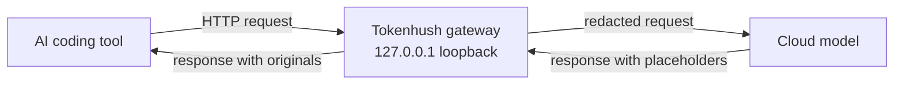

# Tokenhush

**English** | [中文](README.zh-CN.md)

> Keeps secrets out of your AI coding tool's requests. Runs on your machine.

[](https://github.com/fregie/tokenhush/actions/workflows/ci.yml)
[](https://github.com/fregie/tokenhush/releases)
[](LICENSE)
[](go.mod)
[](#supported-tools)

**[Star the repo](https://github.com/fregie/tokenhush/stargazers)** · **[Watch releases](https://github.com/fregie/tokenhush/watchers)** · **[tokenhush.com](https://tokenhush.com)**

Your AI coding tool uploads your whole project to the cloud, `.env` files and API keys included. Opt-outs are unreliable, and there's no undo once a request is sent. Tokenhush runs on your machine, between the tool and the model. Before a request leaves, it swaps real secrets for placeholders; the cloud sees only placeholders, and your tool still gets the real values back. It's one small program that listens only on your own machine, installs no root certificate, and doesn't touch other apps.

```text
Your tool sends:      OPENAI_API_KEY=sk-proj-abc123
The cloud receives:   OPENAI_API_KEY=__PII_prefix_9f2c__
Your tool still gets: OPENAI_API_KEY=sk-proj-abc123
```

[Features](#features) · [Installation](#installation) · [Quick start](#quick-start) · [CLI](#cli) · [Documentation](#documentation) · [Contributing](#contributing)

## Why Tokenhush

AI coding tools need to read your code and config to be useful, but a request sends more than the file you're editing: whole repositories, `.env` files, and keys go along too. You can switch features off, but you can't always trust that they stay off, and after the data leaves there's no undo. Tokenhush adds one gate in front of those tools. It reads each request, replaces anything that looks like a secret, and forwards the cleaned request. You get high-confidence interception, and what leaves your machine is the redacted request.

## Features

- **Every field, six detectors.** Tokenhush walks the whole request body, leaf by leaf, so nested JSON is covered, and streaming responses are handled as they arrive. It flags known key prefixes (`sk-`, `AKIA`, `ghp_`, and more), high-entropy strings, JWTs, PEM private-key headers, Luhn card numbers, and email addresses.
- **Stable placeholders.** A secret becomes a token such as `__PII_email_9f2c8a4b6d1e__`. The mapping lives in memory and lasts for the session. A restart drops it, so you may see a placeholder in output; that's safe degradation, not a leak.
- **Local and fail-safe.** The gateway binds `127.0.0.1` and `[::1]` only, always checks the Host header, checks Origin for browser-style requests, and guards the control API with a bearer token stored with `0600` permissions. When something goes wrong, it closes instead of forwarding blindly.
- **Helpers built in.** `tokenhush env` prints copy-paste setup for 14 tools: `claude`, `codex`, `aider`, `cline`, `roo`, `opencode`, `qwen`, `crush`, `zed`, `continue`, `openwebui`, `goose`, `openhands`, and `kilo`. `tokenhush doctor` runs setup checks with clear exit codes: `0` when nothing fails, `1` on a failed check, `2` on a usage error.
- **One codebase, public extension points.** Pure Go with `CGO_ENABLED=0` builds for macOS, Linux, and Windows on amd64 and arm64. Cross-layer interfaces (`Router`, `CostSink`) and content plugins (`Inspector` / `Transformer`) let you extend the pipeline; V1 supports compile-time plugins only.

## How it works



- **Outbound and streaming:** the gateway walks the JSON body, runs all six detectors, and turns matches into session placeholders before forwarding upstream. Response chunks are mapped back as they arrive, so a placeholder that shows up mid-stream still resolves.
- **Inbound:** placeholders are swapped back to the originals, and only your tool receives them.

> [!IMPORTANT]
> The hard rule: placeholders are **never** filled back in on the way out. Only the client gets originals. This blocks prompt-injection tricks that try to make the gateway echo a secret back to the model.

## Supported tools

| Tool | Integration | Status |
|---|---|---|
| Claude Code CLI | `ANTHROPIC_BASE_URL` | Supported |
| Codex CLI | `~/.codex/config.toml` → `base_url` | Supported (API key mode) |
| Aider | `OPENAI_API_BASE` / `ANTHROPIC_API_BASE` | Supported |
| Cline / Roo Code | OpenAI Compatible base URL in settings | Supported |
| opencode | `opencode.json` → `provider.options.baseURL` | Supported |
| Qwen Code | `OPENAI_BASE_URL` / `ANTHROPIC_BASE_URL` | Supported |
| Charm Crush | `crush.json` → `providers.<id>.base_url` | Supported |
| Zed | `settings.json` → `openai_compatible.<id>.api_url` | Supported |
| Continue.dev | `config.yaml` → `models[].apiBase` | Supported |
| Open WebUI | `OPENAI_API_BASE_URL` | Supported |
| Goose | `OPENAI_HOST` + `OPENAI_BASE_PATH` | Supported |
| OpenHands | `LLM_BASE_URL` | Supported |
| Kilo Code | OpenAI Compatible base URL in extension settings | Supported |

`tokenhush env <tool>` prints ready-to-paste snippets for `claude`, `codex`, `aider`, `cline`, `roo`, `opencode`, `qwen`, `crush`, `zed`, `continue`, `openwebui`, `goose`, `openhands`, and `kilo`. See [docs/configuration.md](docs/configuration.md) for per-tool instructions and the route reachability matrix.

> [!WARNING]
> Not covered in V1: Cursor agent traffic, the ChatGPT and Claude desktop apps, and browser web UIs. These need system-level MITM, which the public core doesn't implement.

## Installation

### Package managers

| Platform | Command |
|---|---|
| macOS | `brew install --cask fregie/tap/tokenhush` |
| Linux | `curl -fsSL https://raw.githubusercontent.com/fregie/tokenhush/main/install.sh \| bash` |
| Windows | `scoop bucket add fregie https://github.com/fregie/scoop-bucket && scoop install tokenhush` |

The Linux installer downloads the archive for your OS and architecture, verifies its sha256, and installs to `~/.local/bin` by default. It accepts `--dry-run`, `--version`, `--dir`, and `--base-url`, and reads `TOKENHUSH_VERSION`, `TOKENHUSH_INSTALL_DIR`, and `TOKENHUSH_BASE_URL`. Every release ships archives for darwin, linux, and windows on amd64 and arm64, a `checksums.txt` with sha256 hashes, and per-archive SPDX SBOMs.

### From source

Go 1.25 or newer is required.

```bash
go install github.com/fregie/tokenhush/cmd/tokenhush@latest
# or build inside the repo:
go build -o bin/tokenhush ./cmd/tokenhush
```

### First-run prompts

macOS binaries aren't notarized. If Gatekeeper blocks the first launch, right-click the binary, choose **Open**, then confirm **Open**. Or clear the quarantine attribute:

```bash
xattr -dr com.apple.quarantine "$(command -v tokenhush)"
```

On Windows, a manually downloaded `.zip` may trigger SmartScreen the first time you run `tokenhush.exe`. Click **More info**, then **Run anyway**. Scoop installs skip this prompt. See the full [Deployment Guide](docs/deployment.md).

## Quick start

```bash
# 1. Start the gateway in the foreground. It listens on 127.0.0.1:8787 by default.
tokenhush run

# 2. In another terminal, point Claude Code at the gateway and start it.
eval "$(tokenhush env claude)"
claude

# 3. Confirm the gateway is running.
tokenhush status
```

`tokenhush run` prints `tokenhush: gateway listening on http://127.0.0.1:<port>` and the path to the control token file.

## CLI

```text
<!-- check-docs:commands:start -->
    tokenhush run          start the gateway in the foreground
    tokenhush status       show whether the gateway is running
    tokenhush env <tool>   print tool setup snippets
    tokenhush doctor       diagnose common setup problems
    tokenhush version      print version and build information
<!-- check-docs:commands:end -->
```

| Command | Description | Key flags |
|---|---|---|
| `tokenhush run` | Start the gateway in the foreground. | `--config PATH`, `--port N` (1..65535), `--log-level debug\|info\|warn\|error` |
| `tokenhush status` | Show whether the gateway is running. | `--json` |
| `tokenhush env <tool>` | Print tool setup snippets. Tools: `claude`, `codex`, `aider`, `cline`, `roo`, `opencode`, `qwen`, `crush`, `zed`, `continue`, `openwebui`, `goose`, `openhands`, `kilo`. | `--config PATH`, `--port N` |
| `tokenhush doctor` | Diagnose common setup problems. Exits `0` when no check fails, `1` on any failure, `2` on a usage error. | `--config PATH`, `--port N`, `--json` |
| `tokenhush version` | Print version and build information. | none |

> [!NOTE]
> `tokenhush run` stays in the foreground and exits on Ctrl-C. V1 has no built-in service command. For auto-start, use your OS's own tooling: a launchd agent on macOS, a systemd user unit on Linux, or a Task Scheduler entry on Windows.

### Control API

The control plane listens on loopback and needs a bearer token. `GET /status` returns JSON with `state`, `addrs`, `uptime_ms`, `requests`, and `redactions`, and requires `Authorization: Bearer <token>`. The token is generated on each `run` and stored with `0600` permissions in the data directory. Requests with an `Origin` get an origin check, and the Host allowlist is always enforced. The core exposes only `GET /status`.

## Configuration

Tokenhush reads `tokenhush.yaml`. A missing file means defaults; unknown keys are rejected.

| Location | Path |
|---|---|
| macOS | `~/Library/Application Support/tokenhush/` |
| Linux | `${XDG_CONFIG_HOME:-~/.config}/tokenhush/` |
| Windows | `%AppData%\tokenhush\` |

Data lives separately: macOS uses `~/Library/Application Support/tokenhush/`, Linux uses `${XDG_DATA_HOME:-~/.local/share}/tokenhush/`, and Windows uses `%LOCALAPPDATA%\tokenhush\`. Set `TOKENHUSH_HOME` to override both directories.

| Top-level key | What it controls |
|---|---|
| `listen` | `host` (only `127.0.0.1`, `::1`, or `localhost`; `0.0.0.0` is rejected) and `port` (1..65535, default 8787) |
| `detectors` | Enable or disable the six detectors: `prefixes`, `high_entropy`, `jwt`, `private_keys`, `luhn`, `email` |
| `allowlist` | Literals that are never redacted |
| `log` | `level`: `debug`, `info`, `warn`, or `error` |
| `upstreams` | Map a host or path prefix to your own OpenAI-compatible upstream |

Unmatched routes fall back to built-ins: `/v1/messages` goes to Anthropic, and `/v1/chat/completions` and `/v1/responses` go to OpenAI. `GET /v1/models` is the one **named exception** and defaults to OpenAI (an `upstreams:` override can move it); every other unknown path is an explicit error, never a silent misroute. See [docs/configuration.md](docs/configuration.md) for the full reference.

## Security model

Tokenhush binds loopback only, enforces a Host allowlist, and stores no request or response content. It never backfills placeholders outbound, ships no root certificate and no MITM, and fails safe rather than open. See [docs/security.md](docs/security.md) for the threat model and full invariants, and [SECURITY.md](SECURITY.md) for how to report a vulnerability.

## Documentation

| Document | Contents |
|---|---|
| [docs/README.md](docs/README.md) | Documentation index |
| [docs/deployment.md](docs/deployment.md) | Installation channels, service wrappers, and release artifacts |
| [docs/configuration.md](docs/configuration.md) | `tokenhush.yaml` reference and per-tool setup |
| [docs/architecture.md](docs/architecture.md) | Core architecture, data flow, and modules |
| [docs/security.md](docs/security.md) | Security model, threat model, and hard invariants |
| [docs/verify.md](docs/verify.md) | Verify redaction yourself with a local echo upstream |
| [docs/plugins.md](docs/plugins.md) | Writing content plugins (`Inspector` / `Transformer`) |
| [docs/extension-api.md](docs/extension-api.md) | Cross-layer extension interfaces |
| [docs/migration-v0.2.0.md](docs/migration-v0.2.0.md) | Migrating from v0.1.x: the audit capability moved to the Pro layer |
| [docs/migration-v0.3.0.md](docs/migration-v0.3.0.md) | Migrating to v0.3.0: `pkg/gateway`, the `/v1/models` named exception, and 9 more `env` tools |
| [CONTRIBUTING.md](CONTRIBUTING.md) | How to build, test, and contribute |
| [SECURITY.md](SECURITY.md) | Vulnerability disclosure policy, supported versions, and response times |

## Project status

The V1 core first shipped as **`v0.1.0`** ([GitHub Release](https://github.com/fregie/tokenhush/releases/tag/v0.1.0)); the current line is **`v0.3.0`**. It keeps `tokenhush run` (foreground gateway with dual-stack loopback), `status`, `env <tool>` (14 tools), `doctor`, and `version`, and moves the shared assembly layer into the exported `pkg/gateway` package. If you are upgrading from `v0.2.0`, see [docs/migration-v0.3.0.md](docs/migration-v0.3.0.md); from v0.1.x, see [docs/migration-v0.2.0.md](docs/migration-v0.2.0.md). The code is pure Go with `CGO_ENABLED=0`, and CI runs unit tests and an end-to-end smoke test on Linux, macOS, and Windows.

## Open-core boundary

This is the public core repository, licensed under Apache-2.0. Pro and enterprise capabilities live in the private Pro repository, which imports this Go module to build paid binaries. Pro code never enters this repository.

## Contributing

Contributions are welcome. See [CONTRIBUTING.md](CONTRIBUTING.md) for development setup, testing, and pull request guidelines.

## License

[Apache License 2.0](LICENSE).
