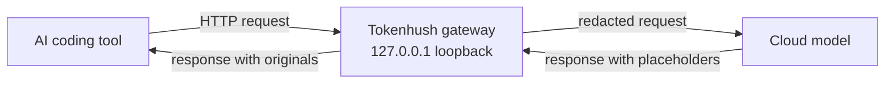

# Tokenhush

**English** | [中文](README.zh-CN.md)

> Keep secrets out of your AI coding tool's requests. Runs on your machine.

[](https://github.com/fregie/tokenhush/actions/workflows/ci.yml)
[](https://github.com/fregie/tokenhush/releases)
[](LICENSE)
[](go.mod)
[](#quick-start-5-minutes)

**[Star the repo](https://github.com/fregie/tokenhush/stargazers)** · **[Watch releases](https://github.com/fregie/tokenhush/watchers)**

Your AI coding tool sends more than the file you're editing. It sends the whole repo, your `.env` files, and any keys lying around. You can switch those features off, but you can't be sure they stay off — and once a request is sent, there's no undo.

Tokenhush sits between your tool and the model, on your own machine. Before a request goes out, it swaps real secrets for harmless placeholders. The model only ever sees the placeholders; your tool still gets the real values back. It's one small program, it listens on your machine only, and it installs no root certificate.

```text
Your tool sends      OPENAI_API_KEY=__PII_api_key_4f8c1e9a7b3d__
The cloud receives   OPENAI_API_KEY=__PII_api_key_2c7e0f5b9a41__
Your tool gets back  __PII_api_key_4f8c1e9a7b3d__
```

[Why Tokenhush](#why-tokenhush) · [Features](#features) · [How it works](#how-it-works) · [Quick start](#quick-start-5-minutes) · [Verify it works](#verify-it-works) · [CLI](#cli) · [Configuration](#configuration) · [Documentation](#documentation)

---

## 🔒 Why Tokenhush

AI coding tools need your code to be useful, so they read a lot: open files, the whole repo, config, and secrets. A lot of that leaves your machine with every request. Opt-outs exist, but they're easy to get wrong or forget, and there's no way to take a request back.

Tokenhush adds one checkpoint in front of the tool. It reads each request, replaces anything that looks like a secret, and forwards the cleaned version. You keep working the way you always have — you just stop shipping your secrets along with it.

## ✨ Features

- **Every field, not just the top level.** Tokenhush walks the whole request body, so nested JSON is covered, and it handles streaming responses as they arrive. It catches known key shapes (`sk-`, `AKIA`, `ghp_`, …), random-looking high-entropy strings, JWTs, PEM private keys, card numbers, and email addresses.
- **The same placeholder every time.** A secret turns into a token such as `__PII_email_9f2c8a4b6d1e__`. The mapping lives in memory, for this session only. A restart drops it, so you may occasionally see a placeholder in output — that's expected and safe, not a leak.
- **Stays on your machine.** The gateway listens on `127.0.0.1` and `[::1]` only, checks the Host header, checks Origin for browser-style requests, and locks the control API behind a per-run token stored with `0600` permissions. If something goes wrong, it stops instead of forwarding.
- **Setup helpers included.** `tokenhush env <tool>` prints a ready-to-paste snippet for 14 tools. `tokenhush doctor` checks your setup and exits `0` (all good), `1` (a check failed), or `2` (a usage error).
- **Small, portable, extensible.** Pure Go, built with `CGO_ENABLED=0` for macOS, Linux, and Windows on amd64 and arm64. Cross-layer interfaces (`Router`, `CostSink`) and content plugins (`Inspector` / `Transformer`) let you extend the pipeline; V1 supports compile-time plugins only.

## 🔁 How it works

```text
your tool  ──▶  Tokenhush (127.0.0.1)  ──▶  your provider
```



- **Outbound:** the gateway walks the JSON body, runs all six detectors, and turns each match into a session placeholder before forwarding upstream.
- **Inbound:** placeholders are swapped back to the originals, and only your tool receives them.

> [!IMPORTANT]
> The hard rule: placeholders are **never** filled back in on the way out. Only the client gets the originals. That's what blocks prompt-injection tricks that try to make the gateway echo a secret back to the model.

## 🚀 Quick start (5 minutes)

Any tool that lets you set a custom OpenAI-compatible or Anthropic base URL works. Four steps: install, start the gateway, tell it where your provider is, and point one tool at it.

Not sure whether you need step 3?

| Your setup | What to do |
|---|---|
| Your provider is OpenAI (or Anthropic, for Claude Code) | Skip step 3 — the built-in routes already go there |
| A relay/proxy station (中转站) or any other OpenAI-compatible endpoint | Do step 3 and set `upstreams:` |

### 1. Install

| Platform | Command |
|---|---|
| macOS | `brew install --cask fregie/tap/tokenhush` |
| Linux | `curl -fsSL https://raw.githubusercontent.com/fregie/tokenhush/main/install.sh \| bash` |
| Windows | `scoop bucket add fregie https://github.com/fregie/scoop-bucket && scoop install tokenhush` |

No package manager? `go install github.com/fregie/tokenhush/cmd/tokenhush@latest` needs Go 1.25+.

If macOS Gatekeeper blocks the first launch, right-click the binary and choose **Open**. On Windows, a downloaded `.zip` may trigger SmartScreen — click **More info**, then **Run anyway**. For service wrappers, release artifacts, and the full first-run notes, see the [Deployment Guide](docs/deployment.md).

### 2. Start the gateway

```bash
tokenhush run
```

It stays in the foreground and listens on `http://127.0.0.1:8787`. Leave it running and open a second terminal for the next step.

### 3. Route requests to your provider

The gateway picks a provider by the request path. With no config, OpenAI-compatible paths go to `https://api.openai.com` and Anthropic paths go to `https://api.anthropic.com`.

**Using a relay or any other endpoint? Set the upstream first.** Otherwise your tool talks to the gateway, and the gateway talks to the wrong provider.

Create `tokenhush.yaml` in the config directory (or point `tokenhush run --config PATH` at it):

| Platform | Config directory |
|---|---|
| macOS | `~/Library/Application Support/tokenhush/` |
| Linux | `${XDG_CONFIG_HOME:-~/.config}/tokenhush/` |
| Windows | `%AppData%\tokenhush\` |

```yaml
upstreams:
  /v1: https://your-provider.example.com
```

- Use the provider **origin** (plus any prefix that comes *before* `/v1`), with no trailing slash and **no `/v1`** — your tool already sends `/v1/chat/completions`, and the gateway appends the request path.
- Keep your provider's API key in the tool's own config. The gateway forwards auth headers untouched and redacts only the request **body**.
- Full rules, precedence, and worked examples: [Configuring request routing](docs/tool-setup.md#configuring-request-routing-upstreams). Then restart the gateway.

> [!IMPORTANT]
> Routing is by **request path**, not provider name, and one path maps to one upstream. A relay that serves many models behind `/v1` is fine — the model is chosen by the request body, not by the route.

### 4. Point your tool at it

Run your tool's snippet. It prints the exact config for the current port, in your shell's dialect. Every tool links to its own step-by-step guide.

| Your tool | What to run |
|---|---|
| [Claude Code](docs/tool-setup.md#claude-code-cli) | `eval "$(tokenhush env claude)"` then `claude` |
| [Codex CLI](docs/tool-setup.md#codex-cli) | `tokenhush env codex` — paste into `~/.codex/config.toml` |
| [Aider](docs/tool-setup.md#aider) | `eval "$(tokenhush env aider)"` then `aider` |
| [opencode](docs/tool-setup.md#opencode) | `tokenhush env opencode` — paste into `opencode.json` |
| [Cline / Roo Code](docs/tool-setup.md#cline-roo-code) | `tokenhush env cline` (or `roo`) — set the OpenAI Compatible base URL |
| [Qwen Code](docs/tool-setup.md#qwen-code) | `eval "$(tokenhush env qwen)"` then `qwen` |
| [Charm Crush](docs/tool-setup.md#charm-crush) | `tokenhush env crush` — paste into `crush.json` |
| [Zed](docs/tool-setup.md#zed) | `tokenhush env zed` — paste into `settings.json` |
| [Continue.dev](docs/tool-setup.md#continuedev) | `tokenhush env continue` — paste into `~/.continue/config.yaml` |
| [Open WebUI](docs/tool-setup.md#open-webui) | `eval "$(tokenhush env openwebui)"`, then start the server |
| [Goose](docs/tool-setup.md#goose) | `eval "$(tokenhush env goose)"` then `goose` |
| [OpenHands](docs/tool-setup.md#openhands) | `eval "$(tokenhush env openhands)"` |
| [Kilo Code](docs/tool-setup.md#kilo-code) | `tokenhush env kilo` — set the OpenAI Compatible base URL |

**Using something else?** No problem. Set its OpenAI-compatible base URL to `http://127.0.0.1:8787/v1`, or its Anthropic base URL to `http://127.0.0.1:8787`. Then confirm with [Verify it works](#verify-it-works).

> [!NOTE]
> One rule of thumb: Anthropic-style clients take the bare origin (`http://127.0.0.1:8787`); OpenAI-compatible clients take `/v1` (`http://127.0.0.1:8787/v1`). `tokenhush env` always prints the right one.

> [!WARNING]
> Not covered in V1: Cursor agent traffic, the ChatGPT and Claude desktop apps, and browser web UIs. These need system-level MITM, which the public core doesn't do.

## ✅ Verify it works

Tokenhush prints one **masked** line to stderr for every value it redacts, so the quickest check needs nothing extra — just watch `tokenhush run` while you use your tool.

1. Leave `tokenhush run` in the foreground and watch its output.
2. Put a **fake** credential in a file your tool can read. Never use a real key:
   ```bash
   printf 'OPENAI_API_KEY=%s\n' "__PII_api_key_c303287c2cf2__" > /tmp/tokenhush-test.txt
   ```
3. Ask your tool to read that file — any prompt that pulls in its contents.
4. The gateway prints a masked line and replaces the value before forwarding:
   ```text
   tokenhush: redacted request api_key (len=32) sk-p…j0
   ```
5. `tokenhush status` shows the `redactions` counter climb too.

That line carries the detector type, the matched byte length, and a masked form — never the full value. The secret becomes a placeholder like `__PII_api_key_ab12cd34ef56__` before it's forwarded, and your tool still gets the original back in the response. The log is on by default; silence it with `tokenhush run --log-redactions=false`.

Want to see exactly what your provider received? Run the local echo-upstream check in [docs/verify.md](docs/verify.md). It shows the placeholder that left the gateway and confirms the upstream saw no raw value.

## ⌨️ CLI

```text
<!-- check-docs:commands:start -->
    tokenhush run          start the gateway in the foreground
    tokenhush status       show whether the gateway is running
    tokenhush env <tool>   print tool setup snippets
    tokenhush doctor       diagnose common setup problems
    tokenhush privacy      show requests that leave your machine for the vendor
    tokenhush update       upgrade via the owning package manager
    tokenhush rules        sync signed detection rules or roll back
    tokenhush version      print version and build information
<!-- check-docs:commands:end -->
```

| Command | What it does | Useful flags |
|---|---|---|
| `tokenhush run` | Starts the gateway in the foreground. | `--config PATH`, `--port N` (1..65535), `--log-level debug\|info\|warn\|error`, `--log-redactions` (on by default; `--log-redactions=false` silences it) |
| `tokenhush status` | Shows whether the gateway is running. | `--json` |
| `tokenhush env <tool>` | Prints a setup snippet. Tools: `claude`, `codex`, `aider`, `cline`, `roo`, `opencode`, `qwen`, `crush`, `zed`, `continue`, `openwebui`, `goose`, `openhands`, `kilo`. | `--config PATH`, `--port N` |
| `tokenhush doctor` | Diagnoses common setup problems. Exits `0` when no check fails, `1` on any failure, `2` on a usage error. | `--config PATH`, `--port N`, `--json` |
| `tokenhush privacy` | Lists every request Tokenhush can send to the vendor, what the server sees, and how to turn each category off. | `--json` |
| `tokenhush update` | Upgrades Tokenhush. Homebrew and Scoop installs delegate to their package manager; a self-managed install verifies the signed release and self-updates. | `--check` |
| `tokenhush rules <sync\|rollback>` | Syncs the signed detection rules, or rolls back to the previous verified pack (or the built-in defaults). | `sync --check` |
| `tokenhush version` | Prints version and build info. | none |

> [!NOTE]
> `tokenhush run` stays in the foreground and exits on Ctrl-C. V1 has no built-in service command — for auto-start, use your OS's own tools: a launchd agent on macOS, a systemd user unit on Linux, or a Task Scheduler entry on Windows.

### Control API

The control plane listens on loopback and needs a bearer token. `GET /status` returns JSON with `state`, `addrs`, `uptime_ms`, `requests`, and `redactions`, and requires `Authorization: Bearer <token>`. The token is generated on each `run` and stored with `0600` permissions in the data directory. Requests with an `Origin` get an origin check, and the Host allowlist is always enforced. The core exposes only `GET /status`.

## ⚙️ Configuration

Tokenhush reads `tokenhush.yaml`. No file means defaults; unknown keys are rejected.

| Location | Path |
|---|---|
| macOS | `~/Library/Application Support/tokenhush/` |
| Linux | `${XDG_CONFIG_HOME:-~/.config}/tokenhush/` |
| Windows | `%AppData%\tokenhush\` |

Data lives separately: macOS `~/Library/Application Support/tokenhush/`, Linux `${XDG_DATA_HOME:-~/.local/share}/tokenhush/`, Windows `%LOCALAPPDATA%\tokenhush\`. Set `TOKENHUSH_HOME` to move both at once.

| Key | What it controls |
|---|---|
| `listen` | `host` (only `127.0.0.1`, `::1`, or `localhost`; `0.0.0.0` is rejected) and `port` (1..65535, default 8787) |
| `detectors` | Turn the six detectors on or off: `prefixes`, `high_entropy`, `jwt`, `private_keys`, `luhn`, `email` |
| `allowlist` | Literals that are never redacted |
| `log` | `level`: `debug`, `info`, `warn`, or `error` |
| `upstreams` | Map a host or path prefix to your own OpenAI-compatible upstream |

Unmatched routes fall back to the built-ins: `/v1/messages` goes to Anthropic; `/v1/chat/completions` and `/v1/responses` go to OpenAI. `GET /v1/models` is the one **named exception** and defaults to OpenAI (an `upstreams:` override can move it). Any other unknown path is an explicit error, never a silent misroute. The full reference, the routing rules, and worked examples live in [docs/tool-setup.md](docs/tool-setup.md).

## 🛡️ Security model

Tokenhush binds loopback only, enforces a Host allowlist, and stores no request or response content. Placeholders are never filled back in outbound — only your client sees the originals. It ships no root certificate and no MITM, and it fails closed rather than open.

The only traffic it can send to the vendor is the two switchable, command-scoped categories in the [network egress disclosure](docs/generated/network-egress.md): rule sync (switch off with `TOKENHUSH_NO_RULE_SYNC=1`) and update check (switch off with `TOKENHUSH_NO_UPDATE_CHECK=1`). The disclosure lists exactly what each one sends, what the server sees, and how long it's kept. For the threat model and every invariant, see [docs/security.md](docs/security.md); to report a vulnerability, see [SECURITY.md](SECURITY.md).

## 📚 Documentation

| Document | What's inside |
|---|---|
| [docs/README.md](docs/README.md) | Documentation index |
| [docs/tool-setup.md](docs/tool-setup.md) | Per-tool setup, request routing, the route matrix, and the `tokenhush.yaml` reference |
| [docs/deployment.md](docs/deployment.md) | Install channels, service wrappers, release artifacts |
| [docs/architecture.md](docs/architecture.md) | Core architecture, data flow, modules |
| [docs/security.md](docs/security.md) | Security model, threat model, hard invariants |
| [docs/generated/network-egress.md](docs/generated/network-egress.md) | The two switchable vendor-bound egress categories, in full |
| [docs/verify.md](docs/verify.md) | Prove redaction yourself with a local echo upstream |
| [docs/oss-testing.md](docs/oss-testing.md) | Self-test guide: build from source, connect a real tool, run the checklist |
| [docs/plugins.md](docs/plugins.md) | Write content plugins (`Inspector` / `Transformer`) |
| [docs/extension-api.md](docs/extension-api.md) | Cross-layer extension interfaces |
| [CONTRIBUTING.md](CONTRIBUTING.md) | How to build, test, and contribute |
| [SECURITY.md](SECURITY.md) | Vulnerability disclosure policy and response times |

## Project status

The V1 core first shipped as **`v0.1.0`** ([GitHub Release](https://github.com/fregie/tokenhush/releases/tag/v0.1.0)); the current line is **`v0.3.0`**. It keeps `tokenhush run` (foreground gateway on dual-stack loopback), `status`, `env <tool>` (14 tools), `doctor`, and `version`, and moves the shared assembly layer into the exported `pkg/gateway` package.

The config is validated on load: an upgrade that adds a key won't break an older file, and one that removes a key fails fast with an "unknown field" error. The code is pure Go with `CGO_ENABLED=0`, and CI runs unit tests plus an end-to-end smoke test on Linux, macOS, and Windows.

## Open-core boundary

This is the public core repository, licensed under Apache-2.0. Pro and enterprise capabilities live in the private Pro repository, which imports this Go module to build paid binaries. Pro code never enters this repository.

## 🤝 Contributing

Contributions are welcome. See [CONTRIBUTING.md](CONTRIBUTING.md) for development setup, testing, and pull request guidelines.

## 📄 License

[Apache License 2.0](LICENSE).
