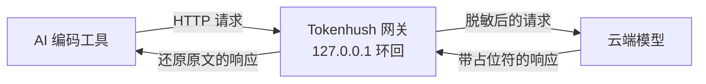

# Tokenhush

[English](README.md) | **中文**

> 把密钥挡在 AI 编码工具的请求之外，全程在你自己机器上跑。

[](https://github.com/fregie/tokenhush/actions/workflows/ci.yml)
[](https://github.com/fregie/tokenhush/releases)
[](LICENSE)
[](go.mod)
[](#快速开始5-分钟)

**[给仓库加星](https://github.com/fregie/tokenhush/stargazers)** · **[订阅版本更新](https://github.com/fregie/tokenhush/watchers)**

AI 编码工具发出去的，远不止你正在编辑的那个文件。整个仓库、`.env`、散落各处的密钥，都可能跟着一起上云。这些功能能关，但你不确定它是不是真关了；而且请求一旦发出去，就收不回来。

Tokenhush 就装在你本机，夹在工具和模型中间。请求发出前，它先把真密钥换成无害的占位符；模型只看到占位符，你的工具照样拿回真值。它就一个小程序，只听本机，不装根证书。

```text
工具发出      __PII_high_entropy_a82f4c9e1b60__
云端收到      __PII_high_entropy_3d71b0c5e6a2__
工具拿回      __PII_api_key_9c4e2a7f1d38__
```

[为什么需要 Tokenhush](#为什么需要-tokenhush) · [功能特性](#功能特性) · [工作原理](#工作原理) · [快速开始（5 分钟）](#快速开始5-分钟) · [验证是否生效](#验证是否生效) · [CLI](#cli) · [配置](#配置) · [文档](#文档)

---

## 🔒 为什么需要 Tokenhush

AI 编码工具要干活，就得读很多东西：打开的文件、整个仓库、配置、密钥。而几乎每一次请求，都会把这些一起带出去。关闭开关是有的，但很容易漏配、忘记，而且请求发出去之后没有撤回键。

Tokenhush 在这些工具前面加一道检查点：每条请求进来，把像密钥的内容换掉，再把干净的版本转发出去。你的使用方式完全不变，只是不再连密钥一起打包发送。

## ✨ 功能特性

- **每个字段都扫，不只扫表层。** Tokenhush 会把整个请求体逐层走一遍，嵌套 JSON 也不放过；流式响应边到边处理。它能认出常见密钥前缀（`sk-`、`AKIA`、`ghp_` 等）、看起来随机的高熵字符串、JWT、PEM 私钥、卡号、邮箱。
- **同一个密钥，永远是同一个占位符。** 密钥会变成 `__PII_email_9f2c8a4b6d1e__` 这样的令牌。映射只存在内存里，仅在本次会话有效；重启就没了。所以偶尔在输出里看到占位符是正常现象，也是安全降级，不是泄露。
- **只在本机。** 网关仅监听环回：始终绑 `127.0.0.1`，主机有 IPv6 环回时同时绑 `[::1]`。它校验 Host，浏览器类请求还查 Origin；控制 API 用每次 `run` 随机生成的令牌保护，令牌以 `0600` 权限落盘。一旦出错，它选择停下，而不是继续转发。
- **自带配置助手。** `tokenhush env <工具>` 会为 14 个工具打印可直接粘贴的片段。`tokenhush doctor` 做体检，退出码一看就懂：`0` 全通过，`1` 有检查失败，`2` 用法错误。
- **小、能跑、可扩展。** 纯 Go，用 `CGO_ENABLED=0` 构建，覆盖 macOS、Linux、Windows 的 amd64 与 arm64。跨层接口（`Router`、`CostSink`）和内容插件（`Inspector` / `Transformer`）可以扩展流水线；V1 只支持编译期插件。

## 🔁 工作原理

```text
你的工具  ──▶  Tokenhush（127.0.0.1）  ──▶  你的 provider
```



- **出站：** 网关把 JSON 请求体走一遍，跑完六个检测器，每个命中项都换成会话级占位符，再转发出去。
- **入站：** 网关把占位符换回原文，只有你的工具能看到真值。

> [!IMPORTANT]
> 硬规则：占位符**绝不**在出站方向被回填。只有客户端能拿到原文。正因如此，想通过提示注入让网关把密钥回显给模型的把戏，也做不成。

## 🚀 快速开始（5 分钟）

只要工具能自定义 OpenAI 兼容或 Anthropic 的基础 URL，就都能接。四步：装好、启动网关、告诉它你的 provider 在哪、把一个工具指过来。

不确定要不要做第 3 步？

| 你的情况 | 怎么做 |
|---|---|
| 用的是 OpenAI（Claude Code 则是 Anthropic） | 跳过第 3 步，内置路由已经指向它 |
| 用的是中转站或其它 OpenAI 兼容端点 | 一定要做第 3 步，配置 `upstreams:` |

### 1. 安装

| 平台 | 命令 |
|---|---|
| macOS | `brew install --cask fregie/tap/tokenhush` |
| Linux | `curl -fsSL https://raw.githubusercontent.com/fregie/tokenhush/main/install.sh \| bash` |
| Windows | `irm https://raw.githubusercontent.com/fregie/tokenhush/main/install.ps1 \| iex` |

偏好包管理器？Windows 也有 Scoop bucket：`scoop bucket add fregie https://github.com/fregie/scoop-bucket && scoop install tokenhush`。

不用包管理器也行：`go install github.com/fregie/tokenhush/cmd/tokenhush@latest`（需要 Go 1.25+）。

macOS 首次启动若被 Gatekeeper 拦下，右键点按二进制选 **打开**。Windows 上未签名的 `tokenhush.exe` 可能触发 SmartScreen，点 **更多信息 → 仍要运行**。服务包装、发行产物和完整的首次运行提示见[部署指南](docs/deployment.zh-CN.md)。

### 2. 启动网关

```bash
tokenhush run
```

它留在前台运行，监听 `http://127.0.0.1:8787`。让它继续跑，另开一个终端做下一步。

### 3. 把请求路由到你的 provider

网关按**请求路径**决定发给哪个 provider。没配置时，OpenAI 兼容路径去 `https://api.openai.com`，Anthropic 路径去 `https://api.anthropic.com`。

**用中转站或别的端点？先设上游。** 否则你的工具连的是网关，而网关连的是错的 provider。

在配置目录创建 `tokenhush.yaml`（或用 `tokenhush run --config PATH` 指到别处）：

| 平台 | 配置目录 |
|---|---|
| macOS | `~/Library/Application Support/tokenhush/` |
| Linux | `${XDG_CONFIG_HOME:-~/.config}/tokenhush/` |
| Windows | `%AppData%\tokenhush\` |

```yaml
upstreams:
  /v1: https://your-provider.example.com
```

- 填 provider 的 **origin**（如果它的前缀在 `/v1` **之前**，那就连前缀一起写），不要尾斜杠，也**不要带 `/v1`**——你的工具发出来的路径已经含 `/v1/chat/completions`，网关会把请求路径拼在后面。
- provider 的 API key 还是放在工具自己那边。网关原样转发鉴权头，只对请求**体**脱敏。
- 完整规则、优先级和可照抄示例见[配置请求路由](docs/tool-setup.zh-CN.md#配置请求路由upstreams)。改完重启网关。

> [!IMPORTANT]
> 路由看的是**请求路径**，不是 provider 名字；一条路径只对应一个上游。中转站在 `/v1` 后面挂了很多模型也没关系——模型由请求体决定，路由不管这个。

### 4. 把你的工具指过来

运行你那个工具的片段。它会按当前端口、用你的 shell 写法，打印出准确的配置。每个工具都链到自己的逐步教程。

| 你的工具 | 运行什么 |
|---|---|
| [Claude Code](docs/tool-setup.zh-CN.md#claude-code-cli) | `eval "$(tokenhush env claude)"` 然后 `claude` |
| [Codex CLI](docs/tool-setup.zh-CN.md#codex-cli) | `tokenhush env codex`——粘进 `~/.codex/config.toml` |
| [Aider](docs/tool-setup.zh-CN.md#aider) | `eval "$(tokenhush env aider)"` 然后 `aider` |
| [opencode](docs/tool-setup.zh-CN.md#opencode) | `tokenhush env opencode`——粘进 `opencode.json` |
| [Cline / Roo Code](docs/tool-setup.zh-CN.md#cline-roo-code) | `tokenhush env cline`（或 `roo`）——设置 OpenAI Compatible base URL |
| [Qwen Code](docs/tool-setup.zh-CN.md#qwen-code) | `eval "$(tokenhush env qwen)"` 然后 `qwen` |
| [Charm Crush](docs/tool-setup.zh-CN.md#charm-crush) | `tokenhush env crush`——粘进 `crush.json` |
| [Zed](docs/tool-setup.zh-CN.md#zed) | `tokenhush env zed`——粘进 `settings.json` |
| [Continue.dev](docs/tool-setup.zh-CN.md#continuedev) | `tokenhush env continue`——粘进 `~/.continue/config.yaml` |
| [Open WebUI](docs/tool-setup.zh-CN.md#open-webui) | `eval "$(tokenhush env openwebui)"`，再启动服务 |
| [Goose](docs/tool-setup.zh-CN.md#goose) | `eval "$(tokenhush env goose)"` 然后 `goose` |
| [OpenHands](docs/tool-setup.zh-CN.md#openhands) | `eval "$(tokenhush env openhands)"` |
| [Kilo Code](docs/tool-setup.zh-CN.md#kilo-code) | `tokenhush env kilo`——设置 OpenAI Compatible base URL |

**用的工具不在列表里？** 没关系。把它的 OpenAI 兼容基础 URL 设为 `http://127.0.0.1:8787/v1`，或把 Anthropic 基础 URL 设为 `http://127.0.0.1:8787`，然后用[验证是否生效](#验证是否生效)确认。

> [!NOTE]
> 一个简单的判断：Anthropic 系客户端填裸 origin（`http://127.0.0.1:8787`）；OpenAI 兼容客户端填 `/v1`（`http://127.0.0.1:8787/v1`）。`tokenhush env` 永远给你对的那个。

> [!WARNING]
> V1 不覆盖：Cursor 的 agent 流量、ChatGPT 和 Claude 桌面应用、浏览器里的 Web UI。这些得用系统级 MITM，公开核心不做。

## ✅ 验证是否生效

Tokenhush 每拦截一处，就会往 stderr 打印一行**打码**记录。所以最快的验证不需要任何额外工具——用着工具，盯着 `tokenhush run` 的输出就行。

1. 让 `tokenhush run` 留在前台，看着它输出。
2. 在工具能读到的文件里放一个**假**凭据。千万别用真密钥：
   ```bash
   printf 'OPENAI_API_KEY=%s\n' "__PII_api_key_c303287c2cf2__" > /tmp/tokenhush-test.txt
   ```
3. 让工具读这个文件——任何会把它内容带进请求的提问都行。
4. 网关会打印一行打码记录，并在转发前把值替换掉：
   ```text
   tokenhush: redacted request api_key (len=32) sk-p…j0
   ```
5. `tokenhush status` 里的 `redactions` 计数也会跟着涨。

这行只有检测器类型、命中的字节长度和打码形式，绝不含完整值。密钥在转发前会变成 `__PII_api_key_ab12cd34ef56__` 这样的占位符，而你的工具仍会从响应里拿回原文。这个日志默认开启；想关掉就用 `tokenhush run --log-redactions=false`。

想亲眼看看你的 provider 到底收到了什么？跑 [docs/verify.zh-CN.md](docs/verify.zh-CN.md) 里的本地回显上游检查：它会展示离开网关的占位符，并确认上游没收到原始值。

## ⌨️ CLI

```text
<!-- check-docs:commands:start -->
    tokenhush run          在前台启动网关
    tokenhush status       显示网关是否正在运行
    tokenhush env <tool>   打印工具配置片段
    tokenhush doctor       诊断常见配置问题
    tokenhush privacy      显示会离开本机发往厂商的请求
    tokenhush update       通过所属包管理器升级
    tokenhush rules        同步已签名的检测规则或回滚
    tokenhush version      打印版本与构建信息
<!-- check-docs:commands:end -->
```

| 命令 | 做什么 | 常用参数 |
|---|---|---|
| `tokenhush run` | 在前台启动网关。 | `--config PATH`、`--port N`（1..65535）、`--log-level debug\|info\|warn\|error`、`--log-redactions`（默认开；`--log-redactions=false` 关闭） |
| `tokenhush status` | 显示网关是否在运行。 | `--json` |
| `tokenhush env <tool>` | 打印配置片段。工具：`claude`、`codex`、`aider`、`cline`、`roo`、`opencode`、`qwen`、`crush`、`zed`、`continue`、`openwebui`、`goose`、`openhands`、`kilo`。 | `--config PATH`、`--port N` |
| `tokenhush doctor` | 诊断常见配置问题。全部通过退出 `0`，任一失败退出 `1`，用法错误退出 `2`。 | `--config PATH`、`--port N`、`--json` |
| `tokenhush privacy` | 列出 Tokenhush 可能发往厂商的每类请求、服务端能看到什么、以及怎么逐项关闭。 | `--json` |
| `tokenhush update` | 升级 Tokenhush。Homebrew 和 Scoop 安装交给各自的包管理器；自管安装会校验已签名版本并自更新。 | `--check` |
| `tokenhush rules <sync\|rollback>` | 同步已签名的检测规则，或回滚到上一个已验签的规则包（没有就退回内置默认）。 | `sync --check` |
| `tokenhush version` | 打印版本与构建信息。 | 无 |

> [!NOTE]
> `tokenhush run` 一直在前台，按 Ctrl-C 退出。V1 没有内置的后台服务命令——想开机自启，用系统自带的方式：macOS 用 launchd agent，Linux 用 systemd user unit，Windows 用任务计划程序。

### 控制面 API

控制面只监听环回地址，且需要 bearer token。`GET /status` 返回 JSON，字段有 `state`、`addrs`、`uptime_ms`、`requests`、`redactions`，请求头需要 `Authorization: Bearer <token>`。令牌每次 `run` 重新生成，以 `0600` 权限存在数据目录。带 `Origin` 的请求会做源检查，Host 白名单始终生效。核心只暴露 `GET /status`。

## ⚙️ 配置

Tokenhush 读 `tokenhush.yaml`。没有文件就用默认值；未知的键会被拒绝。

| 位置 | 路径 |
|---|---|
| macOS | `~/Library/Application Support/tokenhush/` |
| Linux | `${XDG_CONFIG_HOME:-~/.config}/tokenhush/` |
| Windows | `%AppData%\tokenhush\` |

数据放在别处：macOS `~/Library/Application Support/tokenhush/`，Linux `${XDG_DATA_HOME:-~/.local/share}/tokenhush/`，Windows `%LOCALAPPDATA%\tokenhush\`。设 `TOKENHUSH_HOME` 可以一次搬走两个目录。

| 键 | 控制什么 |
|---|---|
| `listen` | `host`（只允许 `127.0.0.1`、`::1`、`localhost`；`0.0.0.0` 会被拒绝）和 `port`（1..65535，默认 8787） |
| `detectors` | 开关六个检测器：`prefixes`、`high_entropy`、`jwt`、`private_keys`、`luhn`、`email` |
| `allowlist` | 永不脱敏的字面量 |
| `log` | `level`：`debug`、`info`、`warn`、`error` |
| `upstreams` | 把主机或路径前缀映射到你自己的 OpenAI 兼容上游 |

没匹配上的路由走内置规则：`/v1/messages` 去 Anthropic；`/v1/chat/completions` 和 `/v1/responses` 去 OpenAI。`GET /v1/models` 是唯一的**具名例外**，默认去 OpenAI（`upstreams:` 可以改走别处）。其它未知路径都明确报错，绝不悄悄错发。完整参考、路由规则和示例见 [docs/tool-setup.zh-CN.md](docs/tool-setup.zh-CN.md)。

## 🛡️ 安全模型

Tokenhush 只绑环回地址，强制 Host 白名单，不保存任何请求或响应内容。占位符绝不在出站方向回填，只有你的客户端能看到原文。它不带根证书，不做 MITM，出错时选择关闭而不是放行。

它可能发给厂商的，只有[网络外发披露](docs/generated/network-egress.md)里那两个可关、按命令触发的类别：规则同步（用 `TOKENHUSH_NO_RULE_SYNC=1` 关闭）和更新检查（用 `TOKENHUSH_NO_UPDATE_CHECK=1` 关闭）。披露里逐项写清了各自发什么、服务端看到什么、保留多久。威胁模型和完整不变量见 [docs/security.zh-CN.md](docs/security.zh-CN.md)；报漏洞见 [SECURITY.md](SECURITY.md)（英文）。

## 📚 文档

| 文档 | 内容 |
|---|---|
| [docs/README.zh-CN.md](docs/README.zh-CN.md) | 文档索引 |
| [docs/tool-setup.zh-CN.md](docs/tool-setup.zh-CN.md) | 各工具配置、请求路由、路由矩阵与 `tokenhush.yaml` 参考 |
| [docs/deployment.zh-CN.md](docs/deployment.zh-CN.md) | 安装渠道、服务包装、发行产物 |
| [docs/architecture.zh-CN.md](docs/architecture.zh-CN.md) | 核心架构、数据流、模块 |
| [docs/security.zh-CN.md](docs/security.zh-CN.md) | 安全模型、威胁模型、硬性不变量 |
| [docs/generated/network-egress.md](docs/generated/network-egress.md) | 两个可关的厂商外发类别，完整清单 |
| [docs/verify.zh-CN.md](docs/verify.zh-CN.md)（[English](docs/verify.md)） | 用本机回显上游亲自验证脱敏 |
| [docs/oss-testing.md](docs/oss-testing.md) | 自测指南：从源码构建、接入真实工具、跑验收清单（英文） |
| [docs/plugins.zh-CN.md](docs/plugins.zh-CN.md) | 写内容插件（`Inspector` / `Transformer`） |
| [docs/extension-api.zh-CN.md](docs/extension-api.zh-CN.md) | 跨层扩展接口 |
| [CONTRIBUTING.zh-CN.md](CONTRIBUTING.zh-CN.md) | 如何构建、测试和贡献 |
| [SECURITY.md](SECURITY.md) | 漏洞披露政策与响应时间（英文） |

## 项目状态

V1 核心首发为 **`v0.1.0`**（[GitHub Release](https://github.com/fregie/tokenhush/releases/tag/v0.1.0)）；当前线为 **`v0.3.0`**，保留 `tokenhush run`（仅绑环回、主机有 IPv6 环回时为双栈的前台网关）、`status`、`env <tool>`（14 个工具）、`doctor` 和 `version`，并把共享装配层移进导出的 `pkg/gateway` 包。

配置在加载时校验：加键的升级不会弄坏旧文件，删键的升级会立刻以 "unknown field" 报错。代码是纯 Go 且 `CGO_ENABLED=0`，CI 在 Linux、macOS、Windows 上跑单元测试和端到端冒烟测试。

## 开源核心边界

这是公开核心仓库，采用 Apache-2.0 许可。Pro 和企业能力在私有的 Pro 仓库里，它通过 import 本仓库的 Go module 来构建付费二进制。Pro 代码绝不进入本仓库。

## 🤝 贡献

欢迎贡献。开发环境、测试和提 PR 的流程见 [CONTRIBUTING.zh-CN.md](CONTRIBUTING.zh-CN.md)。

## 📄 许可证

[Apache License 2.0](LICENSE)。
