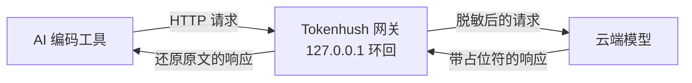

# Tokenhush

[English](README.md) | **中文**

> 本地小工具，把密钥挡在 AI 编码工具的请求之外。100% 在本机运行。

[](https://github.com/fregie/tokenhush/actions/workflows/ci.yml)
[](https://github.com/fregie/tokenhush/releases)
[](LICENSE)
[](go.mod)
[](#支持的工具)

AI 编码工具会把整个项目传到云端，`.env` 文件和 API 密钥也在里面。上传开关未必可靠，请求一旦发出去，就收不回来。Tokenhush 装在你自己的机器上，夹在工具和模型之间。请求出门之前，它先把真密钥换成占位符；云端只看到占位符，你的工具拿到回复时，真值还在。它只是一个监听本机的小程序，不装根证书，也不动其他应用。

```text
工具发出：      OPENAI_API_KEY=sk-proj-abc123
云端收到：      OPENAI_API_KEY=__PII_prefix_9f2c__
工具仍然拿到：  OPENAI_API_KEY=sk-proj-abc123
```

[功能特性](#功能特性) · [安装](#安装) · [快速开始](#快速开始) · [CLI](#cli) · [文档](#文档) · [贡献](#贡献)

## 为什么需要 Tokenhush

AI 编码工具要有用，就得读到你的代码和配置。可一次请求带出去的东西，往往比你正在编辑的文件多得多：整个仓库、`.env` 文件、各种密钥，都会一起上传。功能可以关，但关了未必一直有效；数据一旦出门，就没有撤销键。Tokenhush 在这些工具前面加一道关卡：每条请求进来，它把像密钥的内容换掉，再把干净的请求转出去。高置信拦截；除了脱敏后的请求，什么都不会离开你的机器。

## 功能特性

- **逐字段扫描，六个检测器。** Tokenhush 把整个请求体逐叶走一遍，嵌套 JSON 也能覆盖，流式响应边到边处理。它会认出已知密钥前缀（`sk-`、`AKIA`、`ghp_` 等）、高熵字符串、JWT、PEM 私钥头、Luhn 卡号、邮箱地址。
- **占位符稳定可还原。** 命中项会变成 `__PII_email_9f2c8a4b6d1e__` 这样的令牌。映射存在内存里，只在当前会话有效。重启后映射丢失，输出里可能偶尔看到占位符，这是安全降级，不是泄露。
- **只在本机，出错就关。** 网关只绑定 `127.0.0.1` 和 `[::1]`，始终校验 Host，浏览器类请求还查 Origin；控制 API 用 bearer token 保护，token 以 `0600` 权限保存。出问题时网关选择关闭，而不是继续转发。
- **自带助手。** `tokenhush env` 为 `claude`、`codex`、`aider`、`cline`、`roo` 打印可直接粘贴的配置片段。`tokenhush doctor` 跑常见检查，退出码一看就懂：全部通过是 `0`，有检查失败是 `1`，用法错误是 `2`。
- **一套代码，扩展点开放。** 纯 Go 编写，`CGO_ENABLED=0`，为 macOS、Linux、Windows 的 amd64 和 arm64 构建。跨层接口（`Router`、`CostSink`）和内容插件（`Inspector` / `Transformer`）可以扩展流水线；V1 只支持编译期插件。

## 工作原理



- **外发与流式：** 网关把 JSON 请求体走一遍，跑完六个检测器，命中项变成会话级占位符，再转发到上游。响应分块到达时边到边还原，中途出现的占位符也能对应回真值。
- **入站：** 网关把占位符换回真值，只有你的工具能看到它们。

> [!IMPORTANT]
> 硬性规则：占位符**绝不**在外发方向回填。只有客户端能拿到真值。这样，提示注入想骗网关把密钥回显给模型，也做不到。

## 支持的工具

| 工具 | 集成方式 | 状态 |
|---|---|---|
| Claude Code CLI | `ANTHROPIC_BASE_URL` | 支持 |
| Codex CLI | `~/.codex/config.toml` → `base_url` | 支持（API key 模式） |
| Aider | `OPENAI_API_BASE` / `ANTHROPIC_API_BASE` | 支持 |
| Cline / Roo Code | 设置中的 OpenAI Compatible base URL | 支持 |
| Continue | `config.json` → `apiBase` | 手动配置 |
| Open WebUI | OpenAI 兼容端点 | 手动配置 |

`tokenhush env <tool>` 会为 `claude`、`codex`、`aider`、`cline` 和 `roo` 打印可直接粘贴的配置片段。每种工具的完整说明见 [docs/configuration.zh-CN.md](docs/configuration.zh-CN.md)。

> [!WARNING]
> V1 未覆盖：Cursor 代理流量、ChatGPT 和 Claude 桌面应用，以及浏览器 Web UI。这些需要系统级 MITM，公开核心并未实现。

## 安装

### 包管理器

| 平台 | 命令 |
|---|---|
| macOS | `brew install --cask fregie/tap/tokenhush` |
| Linux | `curl -fsSL https://raw.githubusercontent.com/fregie/tokenhush/main/install.sh \| bash` |
| Windows | `scoop bucket add fregie https://github.com/fregie/scoop-bucket && scoop install tokenhush` |

Linux 安装脚本会按你的系统和架构下载压缩包，校验 sha256 后安装，默认装到 `~/.local/bin`。它接受 `--dry-run`、`--version`、`--dir`、`--base-url`，也会读 `TOKENHUSH_VERSION`、`TOKENHUSH_INSTALL_DIR`、`TOKENHUSH_BASE_URL`。每个版本都提供 darwin、linux、windows 的 amd64 与 arm64 压缩包、带 sha256 的 `checksums.txt`，以及每个压缩包的 SPDX SBOM。

### 从源码构建

需要 Go 1.25 或更高版本。

```bash
go install github.com/fregie/tokenhush/cmd/tokenhush@latest
# 或在仓库内构建：
go build -o bin/tokenhush ./cmd/tokenhush
```

### 首次运行提示

macOS 二进制没有公证。如果首次启动被 Gatekeeper 拦下，右键点按二进制，选择 **打开**，再确认 **打开**。也可以直接清掉隔离属性：

```bash
xattr -dr com.apple.quarantine "$(command -v tokenhush)"
```

Windows 上，手动下载的 `.zip` 首次运行 `tokenhush.exe` 可能触发 SmartScreen。点 **更多信息**，再点 **仍要运行**。用 Scoop 安装不会有这个提示。完整的[部署指南](docs/deployment.zh-CN.md)。

## 快速开始

```bash
# 1. 在前台启动网关。默认监听 127.0.0.1:8787。
tokenhush run

# 2. 在另一个终端中，将 Claude Code 指向网关并启动。
eval "$(tokenhush env claude)"
claude

# 3. 确认网关正在运行。
tokenhush status
```

`tokenhush run` 会打印 `tokenhush: gateway listening on http://127.0.0.1:<port>`，以及控制令牌文件的路径。

## CLI

```text
<!-- check-docs:commands:start -->
    tokenhush run          在前台启动网关
    tokenhush status       显示网关是否正在运行
    tokenhush env <tool>   打印工具配置片段
    tokenhush doctor       诊断常见配置问题
    tokenhush version      打印版本与构建信息
<!-- check-docs:commands:end -->
```

| 命令 | 说明 | 主要参数 |
|---|---|---|
| `tokenhush run` | 在前台启动网关。 | `--config PATH`、`--port N`（1..65535）、`--log-level debug\|info\|warn\|error` |
| `tokenhush status` | 显示网关是否正在运行。 | `--json` |
| `tokenhush env <tool>` | 打印工具配置片段。工具：`claude`、`codex`、`aider`、`cline`、`roo`。 | `--config PATH`、`--port N` |
| `tokenhush doctor` | 诊断常见配置问题。无检查失败时退出码为 `0`，任一项失败为 `1`，用法错误为 `2`。 | `--config PATH`、`--port N`、`--json` |
| `tokenhush version` | 打印版本与构建信息。 | 无 |

> [!NOTE]
> `tokenhush run` 留在前台运行，按 Ctrl-C 退出。V1 没有内置服务命令。要开机自启，请用系统自带的方式：macOS 用 launchd agent，Linux 用 systemd user unit，Windows 用任务计划程序。

### 控制面 API

控制面在环回地址上监听，需要 bearer token。`GET /status` 返回包含 `state`、`addrs`、`uptime_ms`、`requests` 和 `redactions` 的 JSON，且需要 `Authorization: Bearer <token>`。令牌每次 `run` 重新生成，以 `0600` 权限存在数据目录里。带 `Origin` 的请求会做源检查，Host 白名单始终生效。核心只暴露 `GET /status`。

## 配置

Tokenhush 读取 `tokenhush.yaml`。文件缺失就用默认值，未知键会被拒绝。

| 位置 | 路径 |
|---|---|
| macOS | `~/Library/Application Support/tokenhush/` |
| Linux | `${XDG_CONFIG_HOME:-~/.config}/tokenhush/` |
| Windows | `%AppData%\tokenhush\` |

数据单独存放：macOS 用 `~/Library/Application Support/tokenhush/`，Linux 用 `${XDG_DATA_HOME:-~/.local/share}/tokenhush/`，Windows 用 `%LOCALAPPDATA%\tokenhush\`。设置 `TOKENHUSH_HOME` 可以同时覆盖这两个目录。

| 顶层键 | 控制内容 |
|---|---|
| `listen` | `host`（仅 `127.0.0.1`、`::1` 或 `localhost`；`0.0.0.0` 会被拒绝）和 `port`（1..65535，默认 8787） |
| `detectors` | 启用或禁用六个检测器：`prefixes`、`high_entropy`、`jwt`、`private_keys`、`luhn`、`email` |
| `allowlist` | 永不脱敏的字面量 |
| `log` | `level`：`debug`、`info`、`warn` 或 `error` |
| `upstreams` | 将主机或路径前缀映射到你自己的 OpenAI 兼容上游 |

未匹配的路由回退到内置规则：`/v1/messages` 走 Anthropic，`/v1/chat/completions` 和 `/v1/responses` 走 OpenAI。`GET /v1/models` 是唯一的**具名例外**，默认去 OpenAI（`upstreams:` 覆盖可改走别处）；其他任何未知路径都明确报错，不会静默错路由。完整参考见 [docs/configuration.zh-CN.md](docs/configuration.zh-CN.md)。

## 安全模型

Tokenhush 只绑定环回地址，强制 Host 白名单，不保存请求或响应内容。它绝不在外发方向回填占位符，不带根证书，也不做 MITM，出错时选择关闭而非放行。威胁模型和完整不变量见 [docs/security.zh-CN.md](docs/security.zh-CN.md)。

## 文档

| 文档 | 内容 |
|---|---|
| [docs/README.zh-CN.md](docs/README.zh-CN.md) | 文档索引 |
| [docs/deployment.zh-CN.md](docs/deployment.zh-CN.md) | 安装渠道、服务包装和发行产物 |
| [docs/configuration.zh-CN.md](docs/configuration.zh-CN.md) | `tokenhush.yaml` 参考与各工具配置 |
| [docs/architecture.zh-CN.md](docs/architecture.zh-CN.md) | 核心架构、数据流和模块 |
| [docs/security.zh-CN.md](docs/security.zh-CN.md) | 安全模型、威胁模型和硬性不变量 |
| [docs/plugins.zh-CN.md](docs/plugins.zh-CN.md) | 编写内容插件（`Inspector` / `Transformer`） |
| [docs/extension-api.zh-CN.md](docs/extension-api.zh-CN.md) | 跨层扩展接口 |
| [docs/migration-v0.2.0.zh-CN.md](docs/migration-v0.2.0.zh-CN.md) | 从 v0.1.x 迁移：审计能力已移至 Pro 层 |
| [CONTRIBUTING.zh-CN.md](CONTRIBUTING.zh-CN.md) | 如何构建、测试和贡献 |

## 项目状态

V1 核心已作为 **`v0.1.0`** 发布（[GitHub Release](https://github.com/fregie/tokenhush/releases/tag/v0.1.0)）。`v0.2.0` 线保留 `tokenhush run`（带双栈环回的前台网关）、`status`、`env <tool>`、`doctor` 和 `version`。从 v0.1.x 升级请见 [docs/migration-v0.2.0.zh-CN.md](docs/migration-v0.2.0.zh-CN.md)。代码是纯 Go 且 `CGO_ENABLED=0`，CI 在 Linux、macOS 和 Windows 上运行单元测试和端到端冒烟测试。

## 开源核心边界

这是公开核心仓库，采用 Apache-2.0 许可。Pro 和企业能力位于私有 Pro 仓库，该仓库导入此 Go module 来构建付费二进制文件。Pro 代码绝不进入本仓库。

## 贡献

欢迎贡献。开发环境搭建、测试和拉取请求指南见 [CONTRIBUTING.zh-CN.md](CONTRIBUTING.zh-CN.md)。

## 许可证

[Apache License 2.0](LICENSE)。
