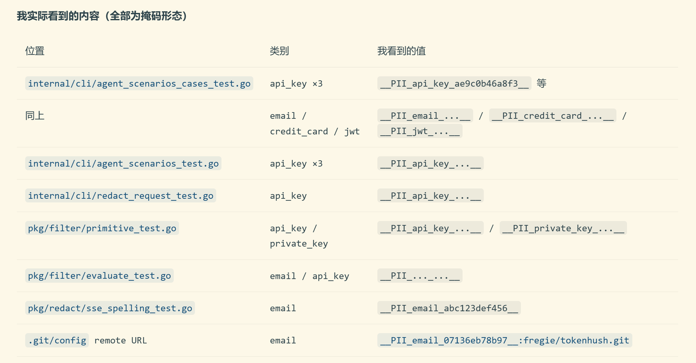
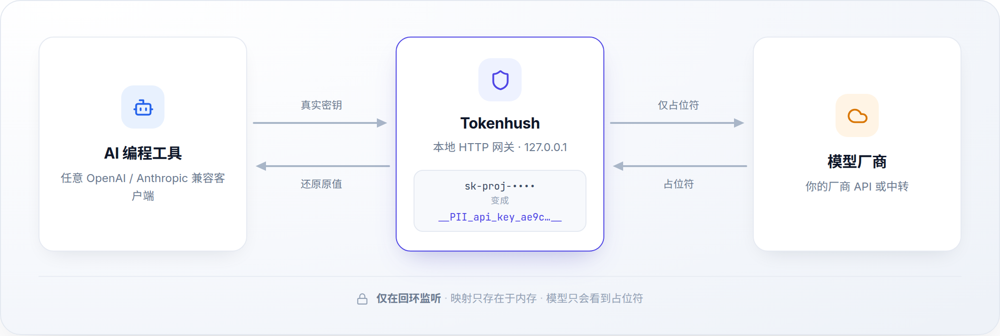
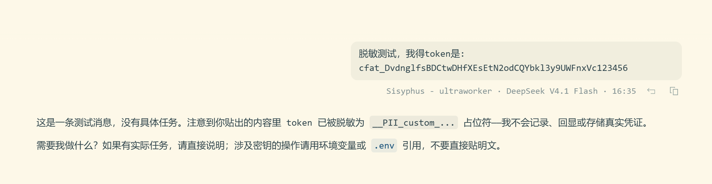

<div align="center">
  
  <p></p>
  <p><strong>中文</strong> · <a href="README.md">English</a></p>
  <p><em>本地、可逆的密钥脱敏；无 MITM、不装根证书。</em></p>
  <p>
    <a href="https://github.com/fregie/tokenhush/actions/workflows/ci.yml"></a>
    <a href="https://github.com/fregie/tokenhush/releases"></a>
    <a href="LICENSE"></a>
    <a href="go.mod"></a>
    <a href="#-快速开始"></a>
  </p>
  <p><a href="https://github.com/fregie/tokenhush/stargazers"><strong>Star 这个仓库</strong></a> · <a href="https://github.com/fregie/tokenhush/watchers"><strong>Watch 版本发布</strong></a></p>
</div>



一次请求里，模型看到的所有字段都已是掩码形态，而且覆盖多个文件。

Tokenhush 是一个本地、仅回环的 HTTP 网关，位于你的 AI 编程工具与它调用的厂商 API 之间。发请求之前，它把请求 body 里检测到的密钥替换成会话级占位符，转发清理后的请求；响应回来时再把原始值还原，所以你的工具照常工作，模型却只看得到占位符。它不终止 TLS、不做 MITM、不安装根证书，监听地址只在本机的 `127.0.0.1`。

```text
你的工具发出        OPENAI_API_KEY=sk-proj-…
网关转发上游        OPENAI_API_KEY=__PII_api_key_2c7e0f5b9a41__
你的工具拿回        OPENAI_API_KEY=sk-proj-…
```

占位符形如 `__PII_<type>_<digest>__`，例如 `__PII_api_key_ae9c0b46a8f3__`。同一个密钥在一次会话里总是映射到同一个占位符。

---

## 🛡️ 默认拦截哪些敏感信息

开箱即用，五个检测器默认开启，命中即替换成会话占位符，密钥不会离开你的机器：

| 检测器 | 拦截内容 |
|---|---|
| `prefix` | 已知厂商 key 形态 —— `sk-`、`AKIA`、`ghp_`、`glpat-`、`xox*`、`AIza`、`npm_` |
| `jwt` | JSON Web Token |
| `pem` | PEM 私钥头（`-----BEGIN … PRIVATE KEY-----`） |
| `luhn` | 通过 Luhn 校验的信用卡号 |
| `email` | 以已知公共后缀（`.com`、`.co.uk` 等）结尾的邮箱地址 |

第六个检测器 `entropy`（高熵字符串）默认关闭，按需开启——它在真实 agent 流量上的误报会破坏 function calling。

**不够用？规则可扩展。** 三条路径，都走 `pkg/filter` 里同一个 `Rule` 契约：

- **签名规则包。** `tokenhush rules sync` 拉取 Ed25519 签名规则包，可新增检测；「不可弱化下限」会拒绝任何关闭内置检测器、丢弃必需类别或携带 `allow` 动作的包。
- **按名声明敏感键。** 规则文档或规则包可列出键名（例如 `password`），匹配键的值会在任意对象深度被脱敏。
- **编译期插件。** 在自己的 Go 包里实现 8 方法的 `Rule` 接口；内置检测器、签名规则包与第三方规则进入同一个注册表，按同一确定顺序求值。

契约与限制见 [docs/plugins.md](docs/plugins.md)，开关见下文[配置](#-配置)。

---

## 🚀 快速开始

任何能设置自定义 OpenAI 兼容或 Anthropic base URL 的客户端都能用。四步：安装、启动网关、把工具指过来、把请求路由到你的厂商。

### 1. 安装

| 平台 | 一行安装 |
|---|---|
| macOS | `brew install --cask fregie/tap/tokenhush` |
| Linux | `curl -fsSL https://raw.githubusercontent.com/fregie/tokenhush/main/install.sh \| bash` |
| Windows | `irm https://raw.githubusercontent.com/fregie/tokenhush/main/install.ps1 \| iex` |

Linux 与 Windows 的脚本会解析发布版本、下载对应压缩包、用发布页的 `checksums.txt` 校验 sha256，再把二进制装到用户目录（Linux 为 `~/.local/bin`，Windows 为 `%LOCALAPPDATA%\Programs\tokenhush`），无需管理员权限，也不依赖包管理器。用 `--version X.Y.Z`（Linux）或 `-Version X.Y.Z`（Windows）可固定版本。

发布波次已经落地：安装脚本会下载并校验你所在平台的已发布二进制，无需 Go 工具链。macOS 的 cask 跟随最新已发布版本。

想自己构建：

```sh
go install github.com/fregie/tokenhush/cmd/tokenhush@main
```

`@main` 安装当前 main 线，`@latest` 仍解析到更早的已发布 tag。把 `tokenhush` 放进 `PATH`，下面的示例才能逐字运行。完整安装路径、服务包装与发布状态见 [docs/deployment.md](docs/deployment.md)。

### 2. 启动网关

```sh
tokenhush run
```

它前台运行，默认监听 `http://127.0.0.1:8787`，按 Ctrl-C 退出。启动时会打印一段横幅：回环地址、实际生效的上游路由（配置项加上内置回退），以及把工具指过来所需的两种 base URL 形式。让它在终端里跑着，另开一个终端做下一步。

### 3. 把工具指过来

任何能覆盖 base URL 的客户端都能用。下面十四种工具都随 `tokenhush env <tool>` 提供可直接粘贴的片段：

| 工具 | 怎么接 |
|---|---|
| [Claude Code](docs/tool-setup.md#claude) | `eval "$(tokenhush env claude)"` 然后 `claude` |
| [Codex CLI](docs/tool-setup.md#codex) | `tokenhush env codex`，粘贴进 `~/.codex/config.toml`（仅 API key 模式） |
| [Aider](docs/tool-setup.md#aider) | `eval "$(tokenhush env aider)"` 然后 `aider` |
| [Cline](docs/tool-setup.md#cline) | `tokenhush env cline`，设置 OpenAI Compatible base URL |
| [Roo Code](docs/tool-setup.md#roo) | `tokenhush env roo`，设置 OpenAI Compatible base URL |
| [opencode](docs/tool-setup.md#opencode) | `tokenhush env opencode`，粘贴进 `opencode.json` |
| [Qwen Code](docs/tool-setup.md#qwen) | `eval "$(tokenhush env qwen)"` 然后 `qwen` |
| [Charm Crush](docs/tool-setup.md#crush) | `tokenhush env crush`，粘贴进 `crush.json` |
| [Zed](docs/tool-setup.md#zed) | `tokenhush env zed`，粘贴进 `settings.json` |
| [Continue.dev](docs/tool-setup.md#continue) | `tokenhush env continue`，粘贴进 `~/.continue/config.yaml` |
| [Open WebUI](docs/tool-setup.md#openwebui) | `eval "$(tokenhush env openwebui)"`，然后启动服务 |
| [Goose](docs/tool-setup.md#goose) | `eval "$(tokenhush env goose)"` 然后 `goose` |
| [OpenHands](docs/tool-setup.md#openhands) | `eval "$(tokenhush env openhands)"` |
| [Kilo Code](docs/tool-setup.md#kilo) | `tokenhush env kilo`，设置 OpenAI Compatible base URL |

一条规则覆盖所有工具：

- Anthropic 风格客户端用裸源站：`http://127.0.0.1:8787`。
- OpenAI 兼容客户端用 `/v1`：`http://127.0.0.1:8787/v1`。

用别的工具？把它的 OpenAI 兼容 base URL 设为 `http://127.0.0.1:8787/v1`，或把 Anthropic base URL 设为 `http://127.0.0.1:8787`。每种工具的逐步骤指南（含具体要改哪个文件）见 [docs/tool-setup.md](docs/tool-setup.md)。

### 4. 把请求路由到你的厂商

没有配置时，OpenAI 兼容路径发往 `https://api.openai.com`，Anthropic 路径发往 `https://api.anthropic.com`。**用中转站或其它端点？先设置上游**，否则网关会转发到错误的厂商。

在配置目录创建 `tokenhush.yaml`（或用 `tokenhush run --config PATH` 指定文件）：

```yaml
upstreams:
  - match: /v1/chat/completions
    target: https://your-provider.example.com
```

- 用厂商**源站**（以及 `/v1` 之前的任何前缀），不要结尾斜杠，**不要带 `/v1`**。你的工具已经会发 `/v1/chat/completions`，网关会把请求路径接在后面。
- 厂商的 API key 留在工具自己的配置里。网关原样转发认证头，只脱敏请求 **body**。

路由按**请求路径**而不是厂商名，一个路径对应一个上游。中转站在 `/v1` 后面服务多个模型没问题：模型由请求 body 决定，而不是由路由决定。

路由的完整规则与示例：[docs/tool-setup.md#configuring-request-routing-upstreams](docs/tool-setup.md#configuring-request-routing-upstreams)。配置文件的每个键：[docs/tool-setup.md#configuration-reference](docs/tool-setup.md#configuration-reference)，或见下文[配置](#-配置)一节。

## 🔒 为什么需要 Tokenhush

AI 编程工具要有用，就得读很多东西：打开的文件、整个仓库、配置，还有散落各处的密钥。这些内容会跟着每一次请求离开你的机器。厂商的 opt-out 是有的，但它们容易被配错、被忘记，而且请求一旦发出，就无法收回。

Tokenhush 在工具前面加一道检查点。它读取每个请求，替换掉看起来像密钥的东西，再转发清理后的版本。你的工作方式不用改变，只是不再把密钥一起发出去。

## ✨ 功能

- **每个字段都查，不止顶层。** 网关会遍历整个请求 body，嵌套 JSON 同样覆盖；响应（含 SSE 流）会先整段缓冲，之后才提交任何内容。它能抓已知 key 形态（`sk-`、`AKIA`、`ghp_`、`glpat-`、`xox*`、`AIza`、`npm_`）、JWT、PEM 私钥头、卡号与邮箱地址。
- **六个内置检测器，各自可开关。** 五个默认开启，可在 `detectors:` 下逐个关闭：`prefix`（已知厂商 key 形态）、`email`（邮箱地址）、`luhn`（经过 Luhn 校验的卡号）、`jwt`（JSON Web Token）、`pem`（PEM 私钥头）。第六个 `entropy`（高熵字符串）**默认关闭**，需要用 `entropy: true` 显式开启，因为它在真实 agent 流量上的误报（长工具名、会话 id）会破坏 function calling。
- **精确邮箱匹配，可由规则 options 参数化。** `email` 检测器只在地址域名于标签边界上以已知公共后缀（`.com`、`.co.uk`）结尾时才命中，因此子域名同样计入，而 `evilcorp.com` 这类形似地址只有在 `replace` 模式下把更窄的 `.corp.com` 配置为后缀时才会被拒绝（追加模式下的 `.corp.com` 仍带有内置的 `.com`，因此 `evilcorp.com` 仍会命中）。内置后缀表编译进程序、已冻结、始终生效。规则文档或签名规则包可以携带带类型、经严格校验的 `options` 对象：未知选项键会得到带类型的错误；目前唯一的检测器选项是 `email`，其 `suffixes` 列表把后缀追加进内置集合，`replace` 标志则用声明的后缀整体换掉内置集合——`replace` 仅限非远程的本地文档，远程包设置它会被 floor 拒绝。
- **占位符在会话内稳定，且只存在内存里。** 一个密钥变成 `__PII_email_9f2c8a4b6d1e__` 这样的 token。映射只保存在本次会话的内存中，重启即丢弃，所以你偶尔可能在输出里看到占位符，这是预期且安全的，不是泄漏。
- **只在本机。** 网关只绑定回环：始终 `127.0.0.1`，主机有 IPv6 回环时再加 `[::1]`。它校验 Host 头，对浏览器风格请求校验 Origin，并用每次 `run` 生成的 bearer token 保护控制 API，该 token 以 `0600` 权限存放。出错时它选择停止转发，而不是放行未脱敏的内容。
- **随附接入助手。** `tokenhush env <tool>` 为十四种工具打印可直接粘贴的片段。
- **更多签名规则集。** `tokenhush rules sync` 可以从托管规则服务拉取额外规则包，且设计上安全：规则包用 Ed25519 签名，客户端在使用前校验签名、新鲜度、序列号（防回滚）和签名吊销列表。一条“不可弱化下限”**恰好拒绝四件**事：关闭内置检测器的包、丢弃必需类别的包、携带 `allow` 动作的规则，以及设置 email `replace` 标志的规则；因此规则包可以新增检测、扩充内置邮箱后缀集，但永远无法削弱内置检测。签名密钥仍是规则包所增内容之外的信任根，边界见 [docs/plugins.md](docs/plugins.md)。规则在下次启动时加载（绝不热加载），任何问题都会带警告回退到内置默认值。`TOKENHUSH_NO_RULE_SYNC=1` 可以关掉它。
- **按名指定敏感键，按值脱敏。** 签名规则包或编译文档可以声明 `sensitive_keys`（严格子对象：`keys` 最多 256 个名称，`case_sensitive` 默认 false）；匹配的立即对象成员键（例如 `password`）的值会在请求路径上、任意对象深度被脱敏。不会铸造任何内部替换；该叶上的 `Block` 规则或 blocklist 命中仍会阻断，allowlist 仍然优先。容器值形态与 k8s/docker-env 同形仍不匹配，记录在 [docs/security.md](docs/security.md)。
- **小、可移植、可扩展。** 纯 Go，以 `CGO_ENABLED=0` 构建，覆盖 macOS、Linux、Windows。跨层接口（`Router`、`CostSink`）与内容插件（`Inspector` / `Transformer`）让你扩展管线；当前只支持编译期插件。

## 🔁 工作原理

<picture>
  <source media="(prefers-color-scheme: dark)" srcset="asset/how-it-works-dark.zh-CN.png">
  
</picture>

- **出站：** 网关遍历 JSON body，运行已启用的检测器（默认开启五个，`entropy` 需显式开启），把每个匹配变成会话占位符，再转发给上游。
- **回程：** 整段响应（含 SSE）先被缓冲并解码——不存在 token 级流式输出——占位符再被换回原值，只有你的工具会拿到它们。外部占位符按原样返回。

> [!IMPORTANT]
> 硬规则：占位符在出站方向**永不**回填。只有客户端拿到原值。这正是阻断提示注入回显的机制，注入内容试图让网关把密钥回显给模型时，回显的只会是占位符。

## ✅ 验证它有效

最快的检查不需要额外工具：跑 `tokenhush run`，用它的时候盯着输出。启动会打印端点与路由；每拦截一个值打印一行掩码日志，响应路径每还原一次打印一行计数日志。要看清楚厂商究竟收到了什么，用下面的回环 echo 上游。

先用 Python 起一个假的厂商（原样回显收到的 body）在 `127.0.0.1:9999`：

```sh
python3 - <<'PY'
import http.server, sys

class Echo(http.server.BaseHTTPRequestHandler):
    def do_POST(self):
        body = self.rfile.read(int(self.headers.get("Content-Length", 0)))
        sys.stderr.write("upstream received: " + body.decode() + "\n")
        sys.stderr.flush()
        self.send_response(200)
        self.send_header("Content-Type", "application/json")
        self.send_header("Content-Length", str(len(body)))
        self.end_headers()
        self.wfile.write(body)

    def log_message(self, *args):
        pass

http.server.HTTPServer(("127.0.0.1", 9999), Echo).serve_forever()
PY
```

再起一个一次性的网关指向它：

```sh
export TOKENHUSH_HOME="$(mktemp -d)"
mkdir -p "$TOKENHUSH_HOME/config"
cat > "$TOKENHUSH_HOME/config/tokenhush.yaml" <<'YAML'
listen:
  host: 127.0.0.1
  port: 8787
upstreams:
  - match: /v1/chat/completions
    target: http://127.0.0.1:9999
YAML
tokenhush run
```

最后发一个带邮箱地址的请求：

```sh
curl -sS http://127.0.0.1:8787/v1/chat/completions \
  -H 'Content-Type: application/json' \
  -d '{"model":"echo","messages":[{"role":"user","content":"my email is me@example.com"}]}'
```

你会看到三件事：

1. echo 上游的终端打印出 body，里面的密钥已被替换成 `__PII_email_<digest>__` 占位符，密钥本身没有离开网关。
2. 网关终端打印两行 stderr 日志。拦截行格式为 `tokenhush: redacted request <type> (len=<N>) <masked>`，例如 `tokenhush: redacted request email (len=14) ****@example.com`；多数类型的 `<masked>` 是 `****`，不透明凭据类型（`api_key`、`high_entropy`）是有界的前缀/后缀（如 `sk-p…j0`），`private_key` 命中报告 PEM 头类型（如 `RSA PRIVATE KEY`），`email` 命中只报告域名，掩码形式永远不会等于密钥。还原行格式为 `tokenhush: restored response placeholders=<N>`，例如 `tokenhush: restored response placeholders=1`，只包含计数。两行都只写 stderr、仅含元数据、永不落盘。此外，网关本地生成的每个请求侧拒绝恰好打印一行 `tokenhush: refused request <code>`，例如 `tokenhush: refused request body_too_large`，同样只写 stderr、仅含元数据，`<code>` 之外还可能带分类的 `reason=` 或 `rule_id=`。
3. `curl` 输出里又是原始值，因为响应路径还原了本次会话铸造的占位符。上游从未见到密钥，客户端从未见到占位符。

像脚本一样读取运行中的网关：

```sh
tokenhush status --json
```

上面的请求对应 `"redactions":1`。完整的回声验证步骤见 [docs/verify.md](docs/verify.md)。



上图是客户端一侧的视角：用户粘贴了一个 token，助手回答它只收到了 `__PII_custom_...__`。这张图展示的是客户端看到的结果。

## 🧭 与其他方案对比

| 方案 | 它做什么 | 局限 |
|---|---|---|
| **Tokenhush** | 在工具发请求前，把请求 body 里的密钥换成会话占位符，响应回程再还原。只在本机回环监听，不做 MITM，不装根证书。 | 只覆盖 HTTP 请求 body；响应路径不做脱敏（见下文边界）。 |
| 只靠 `.gitignore` / 厂商 opt-out | 通过配置和厂商开关减少外发内容。 | 配错、遗漏或厂商默认变更都会让密钥照常外发；请求发出后无法收回。 |
| 直接关闭相关功能 | 不发送某些上下文，从源头减少暴露。 | 工具因此变笨；而且你无法确认开关在生产环境里始终生效。 |
| 本地 MITM 代理 | 能拦截并改写工具到厂商的 TLS 流量，覆盖面比 HTTP body 更大。 | 需要安装并信任根证书、终止 TLS，信任成本和影响范围都明显更高。 |

Tokenhush 提供的是这三条之外的另一种取舍：可逆、无 MITM、无根证书、只在本机，代价是覆盖范围限定在它作为 HTTP 端点能看到的那部分流量。

## ❓ 常见问题

**Tokenhush 会看到我的密钥吗？**
它就在你本机运行，密钥只存在于进程内存里，请求与响应 body、检测到的密钥、占位符到密钥的映射都不会被持久化，也不会发给我们。唯一由 Tokenhush 自身发出的流量是两个可开关的厂商绑定类别（见下一问），它们只含元数据，`tokenhush privacy` 会完整列出。

**会写盘吗？**
不会写入任何请求或响应内容。磁盘上只有元数据，比如以 `0600` 权限存放的控制 API bearer token。你自己写的 `tokenhush.yaml` 当然在磁盘上。

**会拖慢吗？**
网关与你的工具在同一台机器上，通过回环通信；它不做 TLS 终止，也不额外绕一层网络。检测是进程内对请求 body 的一遍扫描，受 32 MiB 的扫描预算和 30 秒超时兜底限制。我们没有发布实测基准数据，所以不编造具体数字；你可以用上面的 echo 验证在自己的流量上观察。

**断网能用吗？**
能。网关本身是本地进程，只有你的工具请求厂商时才需要网络。两个厂商绑定类别都按命令触发，可以关掉；关掉后相关命令不会发出请求。

**会影响 function calling 吗？**
检测在请求路径上遍历嵌套 JSON，只改检测器命中的字符串，其余结构、字段名和请求头原样转发。`entropy` 之所以默认关闭，正是因为它在真实 agent 流量上的误报（长工具名、会话 id）曾经破坏 function calling。需要更激进的覆盖时再显式开启。

**会和公司代理冲突吗？**
Tokenhush 不安装系统代理，也不改你的操作系统代理设置；它只是一个监听在回环地址上的 HTTP 端点，由你的工具主动指向它，再按请求路径转发到你配置的 upstream。

**那两次厂商请求发往哪里，怎么关？**
两个类别都发往 `updates.tokenhush.com`，保留 30 天：update-check 用 `TOKENHUSH_NO_UPDATE_CHECK=1` 关闭，rule-sync 用 `TOKENHUSH_NO_RULE_SYNC=1` 关闭。跑 `tokenhush privacy --json` 可以看机器可读的完整披露。

## 🚫 本产品不做什么

- **不做 MITM，不装根证书。** 不终止 TLS，也不安装信任根；监听器仅限回环，非回环绑定从构造上被拒绝。
- **响应路径不脱敏。** 响应路径上的规则只能 allow、warn 或 block。响应（含 SSE 流）在提交任何字节之前已整段缓冲，因此 block 是"什么都还没发出"的 `502`，不存在 token 级流式输出。响应超过 `response_buffer_bytes` 上限是 `502`，超过 `response_timeout` deadline 是 `504`，二者都在提交之前。
- **不做编码规范化。** 先经 base64、hex 或 URL 编码再离开的密钥检测不到；非 identity 的请求 `Content-Encoding` 以 415 拒绝，而不是为检测而解码。
- **不检查对象键。** 放在 JSON 对象**键**而不是值里的密钥会原样转发。
- **没有多余命令。** 没有 `doctor` 命令，没有独立的 `allowlist` 变更命令，没有服务命令，也没有运行时插件加载；控制面恰好是 `GET /status`。
- **不覆盖系统级流量。** 本版本不覆盖 Cursor agent 流量、ChatGPT 与 Claude 桌面 App、以及浏览器 Web UI；这些需要系统级 MITM，公开内核不做。

## ⌨️ 命令行

CLI 恰好有七个命令，退出码冻结：`0` 成功、`1` 检查或操作失败、`2` 用法错误。

```text
tokenhush run          在当前终端启动网关
tokenhush status       查看网关是否在运行
tokenhush env <tool>   打印某个工具的接入片段
tokenhush privacy      列出 tokenhush 自身可能发往厂商的请求
tokenhush rules        同步签名检测规则或回滚
tokenhush update       检查并应用签名自更新
tokenhush version      打印版本与构建信息
```

| 命令 | 作用 | 常用 flag |
|---|---|---|
| `tokenhush run` | 前台启动网关，默认监听 `127.0.0.1:8787`，Ctrl-C 退出。 | `--config PATH`、`--port N`（1..65535）、`--log-level debug\|info\|warn\|error`、`--log-redactions`（默认开启，`--log-redactions=false` 同时静默拦截行与还原行） |
| `tokenhush status` | 读取运行中网关的元数据。人读形式是 `key: value` 行，`--json` 输出冻结的状态文档；没有网关运行时打印 `not running` 并以 1 退出。 | `--json` |
| `tokenhush env <tool>` | 为十四种工具之一打印可直接粘贴的接入片段。 | `--config PATH`、`--port N` |
| `tokenhush privacy` | 打印厂商绑定的出口披露，恰好两个类别。 | `--json` |
| `tokenhush rules` | `sync [--check]` 同步 Ed25519 签名的检测规则包；`rollback` 回到上一个验证过的序列号或内置默认值。 | `sync --check` |
| `tokenhush update` | 检查并应用签名自更新；`--check` 只报告。 | `--check` |
| `tokenhush version` | 打印 `tokenhush v<version> <os>/<arch> <goversion> (commit …, built …)`，其中 `<version>` 为发行版本号。 | 无 |

`tokenhush status --json` 是一份十键文档，全部是会话元数据：`state`、`addrs`、`port`、`uptime_ms`、`requests`、`redactions`、`content_policy_blocks`、`rule_blocks`、`walk_skips`、`pack_serial`。

### 控制 API

控制面只监听回环，并需要 bearer token。它恰好暴露 `GET /status`，返回的 JSON 需要 `Authorization: Bearer <token>`。token 每次 `run` 生成，以 `0600` 权限存放在数据目录。非 GET 请求返回 JSON 405 并带 `Allow: GET`；其他 GET 返回 JSON 404。带 `Origin` 的请求会做 Origin 校验，Host 白名单始终强制。

> [!NOTE]
> `tokenhush run` 前台运行，Ctrl-C 退出。本版本没有内置服务命令；需要自启动时用操作系统自己的工具：macOS 的 launchd agent、Linux 的 systemd user unit、Windows 的任务计划程序。

## ⚙️ 配置

Tokenhush 读取 `tokenhush.yaml`。没有文件就用默认值；schema 严格且封闭，未知键是错误而不是警告。

```yaml
listen:            {host: 127.0.0.1, port: 8787}
log:               {level: info}
detectors:         {prefix: true, email: true, luhn: true, jwt: true, pem: true, entropy: false}
allowlist:         ["literal"]
upstreams:         [{match: "/v1/chat/completions", target: "https://api.openai.com"}]
scan_budget_bytes: 33554432
detector_timeout:  30s
max_body_bytes:    67108864
response_buffer_bytes: 33554432
response_timeout:  5m
```

配置目录与数据目录分开：

| 平台 | 配置目录 | 数据目录 |
|---|---|---|
| macOS | `~/Library/Application Support/tokenhush/config/` | `~/Library/Application Support/tokenhush/Data/` |
| Linux | `${XDG_CONFIG_HOME:-~/.config}/tokenhush/` | `${XDG_DATA_HOME:-~/.local/share}/tokenhush/` |
| Windows | `%AppData%\tokenhush\` | `%LOCALAPPDATA%\tokenhush\` |

设置 `TOKENHUSH_HOME` 会把两者移到同一个根（配置在 `<TOKENHUSH_HOME>/config`，数据在 `<TOKENHUSH_HOME>/data`）。

| 键 | 作用 |
|---|---|
| `listen` | `host` 只能是 `127.0.0.1`、`::1` 或 `localhost`，`0.0.0.0` 会被拒绝；`port` 默认 8787。 |
| `log` | `level` ∈ `debug`、`info`、`warn`、`error`，默认 `info`。 |
| `detectors` | 六个开关，键名是 `prefix`、`email`、`luhn`、`jwt`、`pem`、`entropy`。`entropy` 默认关闭，需显式开启。 |
| `allowlist` | 永不脱敏的字面量。 |
| `upstreams` | `{match, target}` 组成的**列表**，不是映射。`match` 是路径前缀，`target` 是不带结尾斜杠的源站。 |
| `scan_budget_bytes` | 每叶、每检测器扫描预算，默认 33554432（32 MiB）。原始检测器对单个叶最多扫描这么多字节。 |
| `detector_timeout` | 检测超时兜底，默认 30s。 |
| `max_body_bytes` | 整个请求 body 的内存护栏，默认 67108864（64 MiB）。超过它的 body 在共享读取 seam 处、任何遍历或上游拨号之前以 403 `body_too_large` 拒绝，且绝不截断、绝不部分转发。 |
| `response_buffer_bytes` | 单个缓冲响应的总量上限，默认 33554432（32 MiB）。超过上限在提交前返回 `502`。 |
| `response_timeout` | 读取单个响应的整体上限，默认 `5m`。超过 deadline 在提交前返回 `504`；二者同时触发时上限优先。 |

路由按**请求路径**而非厂商名：未匹配的路径回退到内置规则，`/v1/messages` 去 Anthropic，`/v1/chat/completions` 和 `/v1/responses` 去 OpenAI，`GET /v1/models` 是指名的一个例外，默认去 OpenAI。其他未知路径是显式错误，绝不静默错发。模型由请求 body 决定，不由路由决定。完整规则与示例见 [docs/tool-setup.md](docs/tool-setup.md)。

## 🛡️ 安全模型

网关只绑定回环，强制 Host 白名单，对浏览器风格请求校验 Origin。占位符在出站方向永不回填，只有你的客户端拿到原值。它不附带根证书、不做 MITM，并且失败关闭而非放行。

除你发往自己厂商的请求之外，Tokenhush 自身唯一可能发出的流量，是[网络出口披露](docs/generated/network-egress.md)里那两个可开关、按命令触发的类别：update-check（用 `TOKENHUSH_NO_UPDATE_CHECK=1` 关闭）和 rule-sync（用 `TOKENHUSH_NO_RULE_SYNC=1` 关闭），都发往 `updates.tokenhush.com`，保留 30 天。披露文档列出每个类别发送什么、服务器看到什么、保留多久。检测失败会以 `plugin_failure` 拒绝请求，而不是转发未脱敏内容。威胁模型与全部不变量见 [docs/security.zh-CN.md](docs/security.zh-CN.md)；报告漏洞见 [SECURITY.md](SECURITY.md)。

## 📦 安装与平台

| 平台 | 一行安装 |
|---|---|
| macOS | `brew install --cask fregie/tap/tokenhush` |
| Linux | `curl -fsSL https://raw.githubusercontent.com/fregie/tokenhush/main/install.sh \| bash` |
| Windows | `irm https://raw.githubusercontent.com/fregie/tokenhush/main/install.ps1 \| iex` |

Linux 与 Windows 的脚本在安装前会用发布页的 `checksums.txt` 校验压缩包 sha256，无需管理员权限，并可用 `--version X.Y.Z` / `-Version X.Y.Z` 固定版本。想从源码构建则需 Go 1.25+：`go build -o tokenhush ./cmd/tokenhush`，或 `go install github.com/fregie/tokenhush/cmd/tokenhush@main`。

安装脚本会下载并校验你所在平台的已发布二进制，无需 Go 工具链。完整安装路径、服务包装与发布状态见 [docs/deployment.md](docs/deployment.md)。

平台方面，代码是纯 Go，`CGO_ENABLED=0`，macOS、Linux、Windows 三种系统各构建 arm64 与 amd64。

## 📚 文档

| 文档 | 内容 |
|---|---|
| [docs/tool-setup.md](docs/tool-setup.md) / [docs/tool-setup.zh-CN.md](docs/tool-setup.zh-CN.md) | 十四种工具的接入、请求路由与 `tokenhush.yaml` 参考（英文 / 中文） |
| [docs/verify.md](docs/verify.md) / [docs/verify.zh-CN.md](docs/verify.zh-CN.md) | 用本地 echo 上游亲自验证脱敏（英文 / 中文） |
| [docs/deployment.md](docs/deployment.md) / [docs/deployment.zh-CN.md](docs/deployment.zh-CN.md) | 安装路径、服务包装、发布状态（英文 / 中文） |
| [docs/architecture.md](docs/architecture.md) / [docs/architecture.zh-CN.md](docs/architecture.zh-CN.md) | 核心架构、数据流、模块划分（英文 / 中文） |
| [docs/security.md](docs/security.md) / [docs/security.zh-CN.md](docs/security.zh-CN.md) | 安全模型、威胁模型、硬不变量（英文 / 中文） |
| [docs/plugins.md](docs/plugins.md) / [docs/plugins.zh-CN.md](docs/plugins.zh-CN.md) | 编写内容插件（`Inspector` / `Transformer`）（英文 / 中文） |
| [docs/generated/network-egress.md](docs/generated/network-egress.md) / [docs/generated/network-egress.zh-CN.md](docs/generated/network-egress.zh-CN.md) | 两个可开关的厂商绑定出口类别全文（英文 / 中文） |
| [docs/PRO-MIGRATION.md](docs/PRO-MIGRATION.md) / [docs/PRO-MIGRATION.zh-CN.md](docs/PRO-MIGRATION.zh-CN.md) | Pro 仓库需要单独完成的迁移（英文 / 中文） |
| [CONTRIBUTING.md](CONTRIBUTING.md) / [CONTRIBUTING.zh-CN.md](CONTRIBUTING.zh-CN.md) | 如何构建、测试与贡献（英文 / 中文） |
| [SECURITY.md](SECURITY.md) / [SECURITY.zh-CN.md](SECURITY.zh-CN.md) | 漏洞披露流程与响应时间（英文 / 中文） |
| [CHANGELOG.md](CHANGELOG.md) / [CHANGELOG.zh-CN.md](CHANGELOG.zh-CN.md) | 从零重写核心的发行历史（自 v0.5.0 起）（英文 / 中文） |
| [LICENSE](LICENSE) | Apache-2.0 许可证全文 |

## 项目状态

本仓库是 tokenhush 内核从零重写的核心，首个发布版本为 **v0.5.0**。它提供七个命令：`run`、`status`、`env`、`privacy`、`rules`、`update`、`version`。配置在加载时严格校验，未知键直接失败。代码是纯 Go，`CGO_ENABLED=0`，CI 在 Linux、macOS、Windows 上运行单元测试与守卫测试。

## 🤝 参与贡献

欢迎贡献。开发环境、测试方式与 PR 规范见 [CONTRIBUTING.md](CONTRIBUTING.md)。

## 📄 许可证

[Apache License 2.0](LICENSE)。
