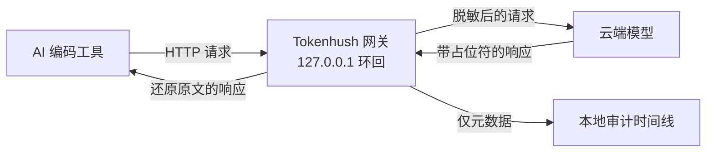

# Tokenhush

[English](README.md) | **中文**

> 一个本地网关，在你的 AI 编码工具请求到达模型之前，对其中包含的密钥和敏感数据进行脱敏。全程审计。零泄露。100% 本地。

[](https://github.com/fregie/tokenhush/actions/workflows/ci.yml)
[](https://github.com/fregie/tokenhush/releases)
[](LICENSE)
[](go.mod)
[](#支持的工具)

Tokenhush 是一个本地 base-URL 网关，位于你的 AI 编码工具与云端模型之间。把 Claude Code、Codex CLI、Aider、Cline、Roo Code、Continue 或任何 OpenAI 兼容客户端指向 `127.0.0.1`，它就会在请求离开你的机器之前检测并脱敏其中的敏感内容。每个请求还会写入一条留在你磁盘上的本地审计时间线。

[功能特性](#功能特性) · [安装](#安装) · [快速开始](#快速开始) · [CLI](#cli) · [文档](#文档) · [贡献](#贡献)

## 为什么选择 Tokenhush

AI 编码代理会把整个仓库、你的 `.env` 文件和你的密钥发送到云端。2026 年，一位开发者用 mitmproxy 抓取流量，证实 Grok Build CLI 上传了完整仓库，包括 git 历史与 `.env`，而且它的退出开关并未生效（一条获得 593 个赞的社区帖子）。围绕 OpenCode、Claude Code 和其他代理，同样的隐私问题不断出现。

Tokenhush 在这些工具前加了一道本地关卡。它能看到请求、控制外发内容，并用确定性检测器避免误报。除了脱敏后的请求，没有任何东西离开你的机器。

## 功能特性

- **全量请求体外发脱敏。** 固定字段白名单还不够，因此每个请求体都会逐叶遍历。协议无关的 JSON 遍历可覆盖嵌套结构，SSE 增量回填让流式响应在到达过程中始终受到保护。
- **六个确定性检测器。** 已知密钥前缀（`sk-`、`AKIA`、`ghp_` 等）、高熵字符串、JWT、PEM 私钥头、Luhn 卡号以及邮箱地址。
- **HMAC 确定性占位符。** 命中项会变成稳定令牌，例如 `__PII_email_9f2c8a4b6d1e__`。映射由 HMAC 派生，保存在内存中，作用域为当前会话。重启会丢失映射，因此你可能偶尔在输出里看到占位符。这是安全降级，不是泄露。
- **仅元数据的本地审计。** 每个请求追加一条元数据记录，并用 HMAC 哈希链串联，因此可检测篡改。内容日志默认关闭，需要显式启用并加密。
- **带防护的双栈环回。** 网关仅绑定 `127.0.0.1` 和 `[::1]`。始终强制执行 Host 白名单，浏览器风格的请求还会做 Origin 检查，控制面 API 需要以 `0600` 权限存储的 bearer token。
- **`tokenhush env` 引导。** 为 `claude`、`codex`、`aider`、`cline` 和 `roo` 打印可复制粘贴的配置片段。
- **`tokenhush doctor` 诊断。** 运行常见配置检查，并提供清晰的退出码：无检查失败时为 `0`，检查失败时为 `1`，用法错误时为 `2`。
- **跨平台、无 CGO。** 一套纯 Go 代码库用 `CGO_ENABLED=0` 为 amd64 和 arm64 构建 macOS、Linux 和 Windows 二进制文件。
- **失败安全设计。** 网关选择失败安全（fail-safe），而非失败开放（fail-open）。
- **公开扩展点。** 跨层接口（`Router`、`CostSink`、`AuditExporter`）和内容插件（`Inspector` / `Transformer`）让你扩展流水线。V1 仅支持编译期插件。

## 工作原理



- **外发请求：** 网关遍历完整 JSON 请求体并运行全部六个检测器。命中项变成会话级占位符，脱敏后的请求随后转发到上游。
- **流式响应：** SSE 分块会增量回填，因此流中途到达的占位符能映射回其原文。
- **入站响应：** 占位符被替换为原始值，且只有客户端会收到它们。
- **本地审计：** 网关记录提供方、路径、字节数、检测器命中等元数据。除非你主动启用，否则内容不会留存。

> [!IMPORTANT]
> 硬性不变量是：占位符**绝不**在外发方向回填。只有客户端会拿到原文。这能阻止提示注入试图诱骗网关把密钥回显给模型。

## 支持的工具

| 工具 | 集成方式 | 状态 |
|---|---|---|
| Claude Code CLI | `ANTHROPIC_BASE_URL` | 支持 |
| Codex CLI | `~/.codex/config.toml` → `base_url` | 支持（API key 模式） |
| Aider | `OPENAI_API_BASE` / `ANTHROPIC_API_BASE` | 支持 |
| Cline / Roo Code | 设置中的 OpenAI Compatible base URL | 支持 |
| Continue | `config.json` → `apiBase` | 手动配置 |
| Open WebUI | OpenAI 兼容端点 | 手动配置 |

`tokenhush env <tool>` 会为 `claude`、`codex`、`aider`、`cline` 和 `roo` 打印可直接粘贴的配置片段。每种工具的完整说明见 [docs/configuration.zh-CN.md](docs/configuration.zh-CN.md)。

> [!WARNING]
> V1 未覆盖：Cursor 代理流量、ChatGPT 和 Claude 桌面应用，以及浏览器 Web UI。这些需要系统级 MITM，公开核心并未实现。

## 安装

### 包管理器

| 平台 | 命令 |
|---|---|
| macOS | `brew install --cask fregie/tap/tokenhush` |
| Linux | `curl -fsSL https://raw.githubusercontent.com/fregie/tokenhush/main/install.sh \| bash` |
| Windows | `scoop bucket add fregie https://github.com/fregie/scoop-bucket && scoop install tokenhush` |

Linux 安装脚本会下载匹配你操作系统和架构的压缩包，校验其 sha256，然后安装。它默认安装到 `~/.local/bin`，并接受 `--dry-run`、`--version`、`--dir` 和 `--base-url`。它还会读取 `TOKENHUSH_VERSION`、`TOKENHUSH_INSTALL_DIR` 和 `TOKENHUSH_BASE_URL`。

每个发行版都提供 darwin、linux 和 windows 在 amd64 与 arm64 上的压缩包、包含 sha256 的 `checksums.txt`，以及每个压缩包的 SPDX SBOM。

### 从源码构建

需要 Go 1.25 或更高版本。

```bash
go install github.com/fregie/tokenhush/cmd/tokenhush@latest
# 或在仓库内构建：
go build -o bin/tokenhush ./cmd/tokenhush
```

### 首次运行提示

macOS 二进制文件未经过公证。如果 Gatekeeper 阻止首次启动，请右键点按二进制文件并选择 **打开**，然后在对话框中确认 **打开**。你也可以清除隔离属性：

```bash
xattr -dr com.apple.quarantine "$(command -v tokenhush)"
```

在 Windows 上，手动下载的 `.zip` 在首次运行 `tokenhush.exe` 时可能触发 SmartScreen。点击 **更多信息**，然后点击 **仍要运行**。用 Scoop 安装可避免此提示。

完整的[部署指南](docs/deployment.zh-CN.md)。

## 快速开始

```bash
# 1. 在前台启动网关。默认监听 127.0.0.1:8787。
tokenhush run

# 2. 在另一个终端中，将 Claude Code 指向网关并启动。
eval "$(tokenhush env claude)"
claude

# 3. 确认网关正在运行。
tokenhush status
```

`tokenhush run` 会打印 `tokenhush: gateway listening on http://127.0.0.1:<port>`，以及控制令牌文件的路径。

## CLI

```text
<!-- check-docs:commands:start -->
    tokenhush run          在前台启动网关
    tokenhush status       显示网关是否正在运行
    tokenhush audit        显示本地审计时间线
    tokenhush env <tool>   打印工具配置片段
    tokenhush doctor       诊断常见配置问题
    tokenhush version      打印版本与构建信息
<!-- check-docs:commands:end -->
```

| 命令 | 说明 | 主要参数 |
|---|---|---|
| `tokenhush run` | 在前台启动网关。 | `--config PATH`、`--port N`（1..65535）、`--log-level debug\|info\|warn\|error` |
| `tokenhush status` | 显示网关是否正在运行。 | `--json` |
| `tokenhush audit` | 显示本地审计时间线。 | `--json`、`--limit N`（1..1000，默认 20） |
| `tokenhush env <tool>` | 打印工具配置片段。工具：`claude`、`codex`、`aider`、`cline`、`roo`。 | `--config PATH`、`--port N` |
| `tokenhush doctor` | 诊断常见配置问题。无检查失败时退出码为 `0`，任一项失败为 `1`，用法错误为 `2`。 | `--config PATH`、`--port N`、`--json` |
| `tokenhush version` | 打印版本与构建信息。 | 无 |

> [!NOTE]
> `tokenhush run` 保持在前台运行，按 Ctrl-C 退出。内置服务命令不属于 V1。若需自动启动，请自行管理操作系统原生的包装方式：macOS 上的 launchd agent、Linux 上的 systemd user unit，或 Windows 上的任务计划程序条目。

### 控制面 API

控制面在环回地址上监听，并需要 bearer token。`GET /status` 返回包含 `state`、`addrs`、`uptime_ms`、`requests` 和 `redactions` 的 JSON。`GET /audit` 返回 JSON 数组，并接受 `since`、`until`（毫秒 Unix 时间戳）、`provider` 和 `limit`（上限 1000）查询参数。两者都需要 `Authorization: Bearer <token>`。令牌按每次 `run` 生成，并以 `0600` 权限存储在数据目录中。携带 `Origin` 的请求会进行源检查，且始终强制执行 Host 白名单。

## 配置

Tokenhush 读取 `tokenhush.yaml`。文件缺失时使用默认值，未知键会被拒绝。

| 位置 | 路径 |
|---|---|
| macOS | `~/Library/Application Support/tokenhush/` |
| Linux | `${XDG_CONFIG_HOME:-~/.config}/tokenhush/` |
| Windows | `%AppData%\tokenhush\` |

数据单独存放：macOS 使用 `~/Library/Application Support/tokenhush/`，Linux 使用 `${XDG_DATA_HOME:-~/.local/share}/tokenhush/`，Windows 使用 `%LOCALAPPDATA%\tokenhush\`。设置 `TOKENHUSH_HOME` 可同时覆盖这两个目录。

| 顶层键 | 控制内容 |
|---|---|
| `listen` | `host`（仅 `127.0.0.1`、`::1` 或 `localhost`；`0.0.0.0` 会被拒绝）和 `port`（1..65535，默认 8787） |
| `detectors` | 启用或禁用六个检测器：`prefixes`、`high_entropy`、`jwt`、`private_keys`、`luhn`、`email` |
| `allowlist` | 永不脱敏的字面量 |
| `audit` | `enabled` 和 `retention_days`（>= 1） |
| `log` | `level`：`debug`、`info`、`warn` 或 `error` |
| `upstreams` | 将主机或路径前缀映射到你自己的 OpenAI 兼容上游 |

未匹配的路由回退到内置规则：`/v1/messages` 走 Anthropic，`/v1/chat/completions` 和 `/v1/responses` 走 OpenAI。完整参考见 [docs/configuration.zh-CN.md](docs/configuration.zh-CN.md)。

## 安全模型

Tokenhush 仅绑定环回地址，强制执行 Host 白名单，并默认将审计存储保持为仅元数据。它绝不在外发方向回填占位符，不附带根证书，也不做 MITM，并选择失败安全而非失败开放。威胁模型和完整不变量见 [docs/security.zh-CN.md](docs/security.zh-CN.md)。

## 文档

| 文档 | 内容 |
|---|---|
| [docs/README.zh-CN.md](docs/README.zh-CN.md) | 文档索引 |
| [docs/deployment.zh-CN.md](docs/deployment.zh-CN.md) | 安装渠道、服务包装和发行产物 |
| [docs/configuration.zh-CN.md](docs/configuration.zh-CN.md) | `tokenhush.yaml` 参考与各工具配置 |
| [docs/architecture.zh-CN.md](docs/architecture.zh-CN.md) | 核心架构、数据流和模块 |
| [docs/security.zh-CN.md](docs/security.zh-CN.md) | 安全模型、威胁模型和硬性不变量 |
| [docs/plugins.zh-CN.md](docs/plugins.zh-CN.md) | 编写内容插件（`Inspector` / `Transformer`） |
| [docs/extension-api.zh-CN.md](docs/extension-api.zh-CN.md) | 扩展接口（`Router`、`CostSink`、`AuditExporter`） |
| [CONTRIBUTING.zh-CN.md](CONTRIBUTING.zh-CN.md) | 如何构建、测试和贡献 |

## 项目状态

V1 已发布为 **`v0.1.0`**（[GitHub Release](https://github.com/fregie/tokenhush/releases/tag/v0.1.0)）。它包含 `tokenhush run`（带双栈环回的前台网关）、`status`、`audit`、`env <tool>`、`doctor` 和 `version`，以及一个由 SQLite 支撑、带 HMAC 链的本地审计存储。代码是纯 Go 且 `CGO_ENABLED=0`，CI 在 Linux、macOS 和 Windows 上运行单元测试和端到端冒烟测试。

## 开源核心边界

这是公开核心仓库，采用 Apache-2.0 许可。Pro 和企业能力位于私有 Pro 仓库，该仓库导入此 Go module 来构建付费二进制文件。Pro 代码绝不进入本仓库。

## 贡献

欢迎贡献。开发环境搭建、测试和拉取请求指南见 [CONTRIBUTING.zh-CN.md](CONTRIBUTING.zh-CN.md)。

## 许可证

[Apache License 2.0](LICENSE)。
