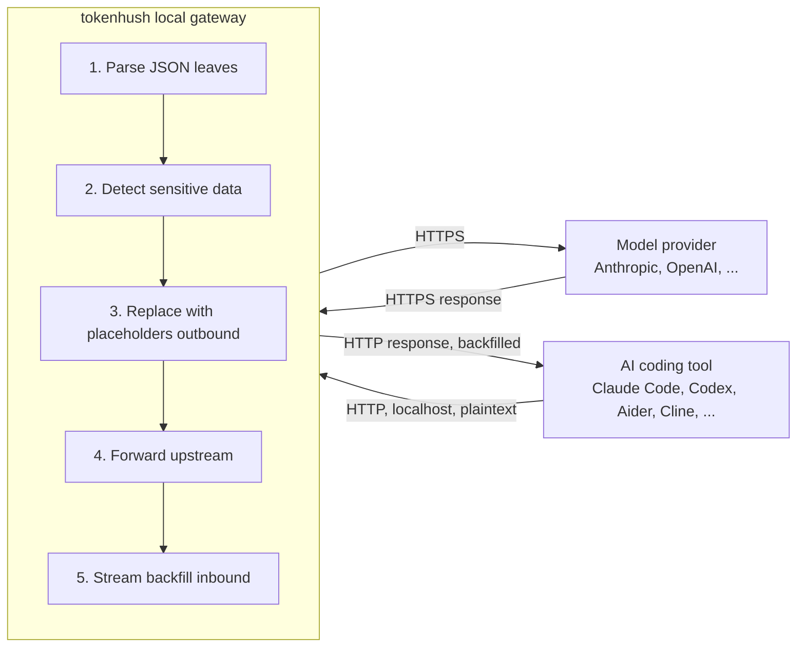

# Architecture

**English** | [中文](architecture.zh-CN.md)

> Status: V1 is implemented; the current release line is `v0.3.0` (2026-09). This document describes the shipped core architecture and the open-core boundary.

Tokenhush is a local base-URL gateway between your AI coding tool and the model provider. Before a request leaves the machine, it finds sensitive content and replaces it.

## 🎯 Goals and non-goals

**Goals**

- Detect and redact sensitive content (keys, `.env` values, PII) before a request leaves the machine.
- Onboard tools that accept a `*_BASE_URL` or custom endpoint with almost no setup.
- Run **cross-platform** on Windows, Linux, and macOS.
- Process requests locally: **sensitive values are redacted on the device before a request goes out**.

**Non-goals (explicitly out of scope for V1)**

- System-level MITM / root certificate installation.
- Covering Cursor agent traffic, ChatGPT/Claude desktop apps, or browser web UIs.
- Team collaboration, cloud, or SSO.
- System-level interception on all three platforms; system extensions and MITM stay macOS-first, a decision recorded in the private Pro repository.
- NER or a local small model for semantic detection.

## 🔁 Data flow



**Key insight**: the sensitive direction is the **request**, and requests are **non-streaming**. The tool sends the whole JSON body in one piece, so the gateway can redact it completely before forwarding, with no streaming-rewrite problem. Responses usually carry only placeholders, so backfill is a bounded "placeholder to original" swap.

> [!NOTE]
> Outbound requests are read in full before redaction. Only the inbound response path needs incremental handling, and it only ever rewrites placeholders back to originals.

## 🏗️ Components

| Package | Responsibility |
|---|---|
| `pkg/proxy` | Local HTTP reverse proxy: listener, upstream routing, SSE passthrough, lifecycle |
| `pkg/gateway` | Shared request-path assembly (listener lifecycle, control token/`run.json`, middleware chain, data plane); see `extension-api.md` |
| `pkg/redact` | Detectors (deterministic rules) + placeholder generation/mapping + backfill |
| `pkg/protocol` | Protocol-agnostic JSON leaf walk; incremental SSE parsing; recursive handling of double-encoded JSON in tool calls |
| `pkg/config` | Configuration loading and defaults (`tokenhush.yaml`) |
| `pkg/platform` | Cross-platform abstraction: paths, keyring, service. Exported for reuse by the private Pro repository |
| `pkg/extension` | Content plugin interfaces (Inspector / Transformer / Registry) plus cross-layer extension points (see `extension-api.md`, `plugins.md`) |
| `pkg/license` | Read-only Pro license validation and display (isolated, fuzz-tested) |
| `cmd/tokenhush` | Free CLI: `run` (foreground gateway), `status`, `env` (print setup snippets), `doctor`, `version`, plus the control-plane API |

## 🏗️ Key design decisions

### Protocol-agnostic leaf walk (no API normalization)

A "leaf" is a string value buried inside the request JSON. Take this body:

```json
{"messages": [{"content": "my key is sk-abc123"}]}
```

The gateway walks the JSON tree and runs detect/replace on `"my key is sk-abc123"`. It does not translate Anthropic, OpenAI, or Responses into one internal shape, because that shape would rot as APIs change. Double-encoded JSON inside tool calls is handled recursively, and SSE is parsed incrementally at the leaf level.

### Placeholders and backfill

A **placeholder** is the fake string that replaces a real secret on the way out. Format: JSON-safe, tokenizer-friendly, high-entropy, for example `__PII_email_3f9a2b__`.

- **Mapping**: the same secret maps **HMAC-deterministically** to the same placeholder. HMAC is a keyed hash: same input, same output. Two secrets cannot collide onto one placeholder and "backfill the wrong secret".
- **Storage**: **in-memory and session-scoped only**. A restart forgets the mapping, so a failed backfill shows the user a placeholder. That is **safe degradation, not a leak**.
- **Hard invariant**: backfill happens only toward the **client**. Never backfill outbound.

### Streaming

- **Outbound**: the full body is read, then redacted. No buffering problem.
- **Inbound**: a **fixed-length sliding window** (equal to the longest placeholder length) matches a placeholder split across SSE chunk boundaries. Without it, `__PII_ema` in one chunk and `il_3f9a2b__` in the next never match. No need to buffer the whole stream, and the added latency is negligible.

### Detector strategy (V1)

Deterministic rules with **high precision first**: known key prefixes (`sk-`, `AKIA`, `ghp_`, ...), high-entropy strings, JWT, private-key headers, Luhn card-number checksums, and email addresses. An allowlist and one-click release are provided. The wording stays honest: **"high-confidence secret interception"**, never "never leaks".

## 📄 Open-core boundary

The public core (this repository, Apache-2.0) is **fully usable for a single user**: proxy, redaction, the CLI, and the extension-point interfaces.

The private Pro repository builds paid binaries by importing this repository's Go module. It provides:

- System extension / MITM power mode (on the closed-source macOS app side)
- Multi-provider / multi-account routing
- Cost tracking
- Team export / SSO
- Dashboard / menu bar UI

> [!IMPORTANT]
> Pro code and algorithms **never enter this repository**, and this repository contains no `if license { ... }` paid implementation branches. The full distribution and open-core policy lives in the private Pro repository.

## 🎯 Capability ladder

| Stage | Capability | Channel |
|---|---|---|
| V1 | base-URL gateway: content-level redaction | Open-source core + free CLI |
| V2 | System-extension metadata mode: domain/process-level interception (**no CA**) | Pro (direct download) |
| V3 | Transparent proxy + local CA: content-level redaction covering Cursor/browser/desktop apps | Pro (explicit opt-in) |

> [!WARNING]
> V2 and V3 depend on the macOS Network Extension system extension (Developer ID signing + user approval + Apple capability approval) and are **not implemented in this repository**.
