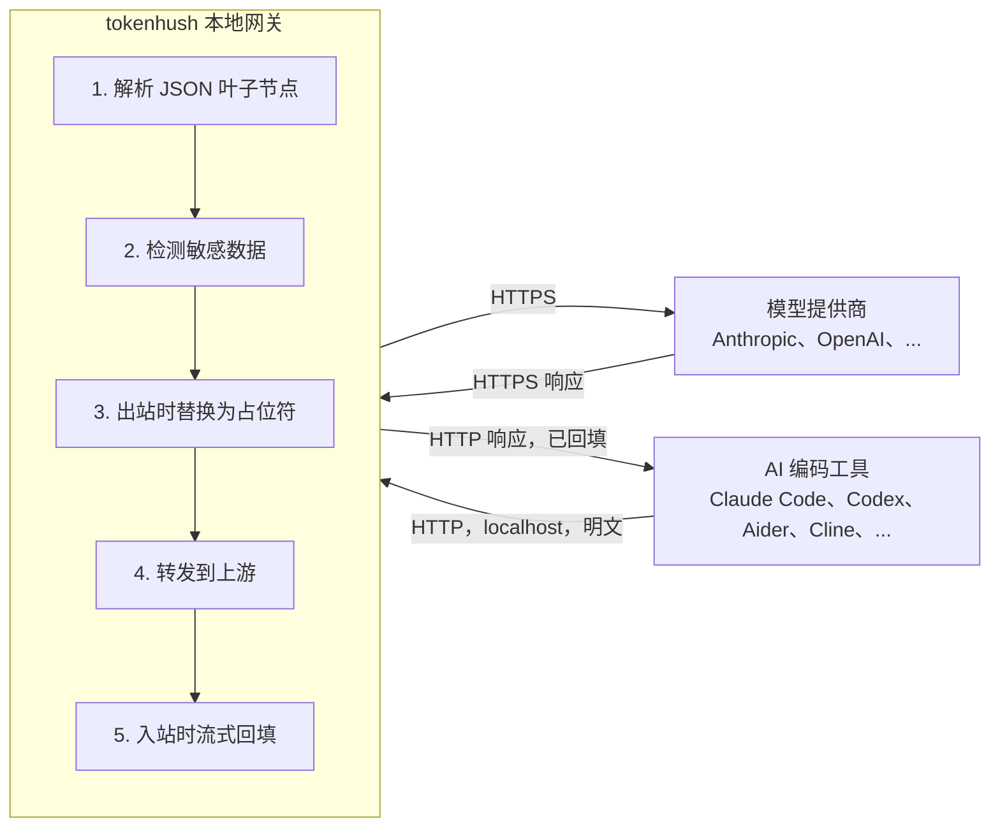

# 架构

[English](architecture.md) | **中文**

> 状态：V1 已实现；当前发行线为 `v0.4.0`（2026-09）。本文档描述已发布核心的架构，以及开源核心边界。

Tokenhush 是本地 base-URL 网关，夹在你的 AI 编码工具和模型提供商中间。请求出本机前，它先找出敏感内容换掉。

## 🎯 目标与非目标

**目标**

- 请求离开本机前，检测并脱敏敏感内容（密钥、`.env` 值、PII）。
- 让接受 `*_BASE_URL` 或自定义端点的工具几乎零配置就能接入。
- 在 Windows、Linux、macOS 上**跨平台**运行。
- 请求本地处理：**敏感内容在本机完成替换后，请求才发出**。

**非目标（V1 明确排除）**

- 系统级 MITM / 安装根证书。
- 覆盖 Cursor agent 流量、ChatGPT/Claude 桌面应用或浏览器 Web UI。
- 团队协作、云或 SSO。
- 三个平台都做系统级拦截；系统扩展与 MITM 保持 macOS 优先，该决策记录在私有 Pro 仓库。
- 用 NER 或本地小模型做语义检测。

## 🔁 数据流



**关键点**：敏感方向是**请求**，而请求**非流式**。工具把整个 JSON body 一次性发出，网关转发前就拿到全部内容，能一次脱敏干净，不必面对流式改写的难题。响应通常只带占位符，所以回填只是有界的“占位符换回原文”。

> [!NOTE]
> 出站请求先完整读取，再脱敏。只有入站响应路径需要增量处理，而且它只把占位符改写回原文。

## 🏗️ 组件

| 包 | 职责 |
|---|---|
| `pkg/proxy` | 本地 HTTP 反向代理：监听器、上游路由、SSE 透传、生命周期 |
| `pkg/gateway` | 共享请求路径装配（监听器生命周期、控制 token/`run.json`、中间件链、数据面）；见 `extension-api.zh-CN.md` |
| `pkg/redact` | 检测器（确定性规则）+ 占位符生成/映射 + 回填 |
| `pkg/protocol` | 协议无关的 JSON 叶子遍历；增量 SSE 解析；递归处理工具调用中的双重编码 JSON |
| `pkg/config` | 配置加载与默认值（`tokenhush.yaml`） |
| `pkg/platform` | 跨平台抽象：路径、密钥环、服务。导出以供私有 Pro 仓库复用 |
| `pkg/extension` | 内容插件接口（Inspector / Transformer / Registry）以及跨层扩展点（见 `extension-api.zh-CN.md`、`plugins.zh-CN.md`） |
| `pkg/license` | 只读的 Pro license 校验与展示（隔离，已做模糊测试） |
| `cmd/tokenhush` | 免费 CLI：`run`（前台网关）、`status`、`env`（打印设置片段）、`doctor`、`version`，以及控制面 API |

> 已同步的签名规则包会额外注册一个 `Inspector`（`customrules`，优先级 30）；它不是 `detectors:` 的取值。见 [plugins.zh-CN.md](plugins.zh-CN.md#已同步的签名规则包)。

## 🏗️ 关键设计决策

### 协议无关的叶子遍历（不做 API 规范化）

“叶子”指请求 JSON 里最内层的字符串值。看这个 body：

```json
{"messages": [{"content": "my key is sk-abc123"}]}
```

网关遍历 JSON 树，对字符串 `"my key is sk-abc123"` 执行检测/替换。它不为 Anthropic、OpenAI 或 Responses 建一套内部统一结构，那套结构会随 API 每次变动而腐坏。工具调用内部的双重编码 JSON 字符串递归处理，SSE 在叶子层级增量解析。

**对象键不在此模型内。** JSON 对象的成员名由一个独立、纯新增的 API（`protocol.WalkKeys`，键位 span 扫描器）检视，它们**不是** `Leaf`，绝不进入 `extension.Document` 模型。`Walk` 与 `Leaf` 未变，故上文的“叶子=值”契约依然成立。键位检测集与失败策略见 `security.zh-CN.md`。

### 占位符与回填

**占位符（placeholder）**：出站时替换真密钥的那段假字符串。格式要求 JSON 安全、对 tokenizer 友好、高熵，例如 `__PII_email_3f9a2b__`。

- **映射**：同一密钥**以 HMAC 确定性方式**映到同一占位符。HMAC 就是带密钥的哈希：同样输入，同样输出。两个不同密钥不会撞到同一个占位符，也就不会“回填错误的密钥”。
- **存储**：**只在内存里，且仅限当前会话**。重启即遗忘映射，失败的回填会让用户看到占位符。这是**安全的降级，不是泄露**。
- **硬不变量**：回填只朝向**客户端**。绝不向出站方向回填。

### 流式

- **出站**：完整读取 body，再脱敏。出站方向不存在流式改写难题。请求若带非 identity 的 `Content-Encoding`，会在 `Forwarder.ServeHTTP` 中、读取 body 之前、拨号上游之前即以 **415** 拒绝，故客户端压缩体绕不过脱敏（见 `security.zh-CN.md` 不变量 8）。请求体若声明为 JSON、但叶位 walker 无法解析，同样在拨号上游之前以 **400** 拒绝（见 `security.zh-CN.md`）。
- **入站、非 SSE**：body 整体缓冲后一次性回填。`gzip`/`deflate` 的 `Content-Encoding` 会在提交任何状态码之前解压；核心无法解码的编码（`br`、`zstd` 等）或解压失败一律应答 **502**，绝不透传。
- **入站、SSE（`text/event-stream`）**：占位符可能被拆到多个 `data:` 事件里，每个只是一段部分 JSON delta。原始字节流上的定长滑动窗口配不上它，因为占位符并不连续（前一事件 `__PII_ema`、后一事件 `il_3f9a2b__`），且中间的 SSE/JSON 分帧会改变字节。响应改为流经一个 **SSE 感知回填器**（`pkg/proxy/ssebackfill.go`）：
  - 每个单行 `data:` 载荷的终端字符串叶子被喂入一个**按路径的窗口**（`BackfillWriter`，按最长占位符定长），因此同一个 JSON 叶子路径可跨事件、跨分帧累积。
  - 当某路径的窗口在事件边界清空时，该路径即被**决出**。若发生了替换，最后一个贡献事件改写为合并后的内容、更早的贡献事件改写为空串，于是客户端把 delta 依次拼接后恰好得到一次还原值；若未发生替换，每个事件保留原始字节。
  - 改写**就地**作用于该记录的 `data:` 区间，故 SSE 分帧、事件数、以及所有非 delta 字段（`event:`、`id:`、`retry:`、注释、多行或无冒号 `data:`）都逐字节保留。事件绝不从解析出的字段重建，因此跨记录的 `id:`（last-event-id）保持正确。
  - **投递保持增量**：内容已决出的事件在同一次 `Write` 中即写出，只有对某个仍打开路径有贡献的事件才会被保留，所以客户端能及时看到每个事件，而不必等 EOF（`TestPipelineSSEIncrementalDeliveryBeforeEOF`）。
  - **内存有界**：保留字节由 `sseBackfillMaxHoldbackBytes`（256 KiB）封顶。超过上限后最旧的窗口按字面文本刷出、其事件被释放，故病态流不会让缓冲无界增长（`TestSSEBackfillerHoldbackBoundEnforcedFromConstant`）。

### 检测器策略（V1）

确定性规则，**高精度优先**：已知密钥前缀（`sk-`、`AKIA`、`ghp_`、...）、高熵字符串、JWT、私钥头、Luhn 卡号校验和、电子邮件地址。另配白名单（`tokenhush.yaml` 的静态键，加上可运行期变更且逐次审计的 store）和一键放行。措辞保持诚实：**“高置信密钥拦截”**，绝不写“永不泄露”。

## 📄 开源核心边界

公开核心（本仓库，Apache-2.0）**单用户即可完整使用**：代理、脱敏、CLI，以及扩展点接口。

私有 Pro 仓库导入本仓库的 Go module，构建付费二进制，提供：

- 系统扩展 / MITM 强力模式（在闭源 macOS 应用侧）
- 多提供商 / 多账号路由
- 成本追踪
- 团队导出 / SSO
- 仪表盘 / 菜单栏 UI

> [!IMPORTANT]
> Pro 代码与算法**绝不进入本仓库**，本仓库也不含任何 `if license { ... }` 付费实现分支。完整分发与开源核心策略在私有 Pro 仓库。

## 🎯 能力阶梯

| 阶段 | 能力 | 渠道 |
|---|---|---|
| V1 | base-URL 网关：内容级脱敏 | 开源核心 + 免费 CLI |
| V2 | 系统扩展元数据模式：域名/进程级拦截（**无 CA**） | Pro（直接下载） |
| V3 | 透明代理 + 本地 CA：内容级脱敏，覆盖 Cursor/浏览器/桌面应用 | Pro（显式选择加入） |

> [!WARNING]
> V2 与 V3 依赖 macOS Network Extension 系统扩展（Developer ID 签名 + 用户批准 + Apple 能力审批），**未在本仓库实现**。
