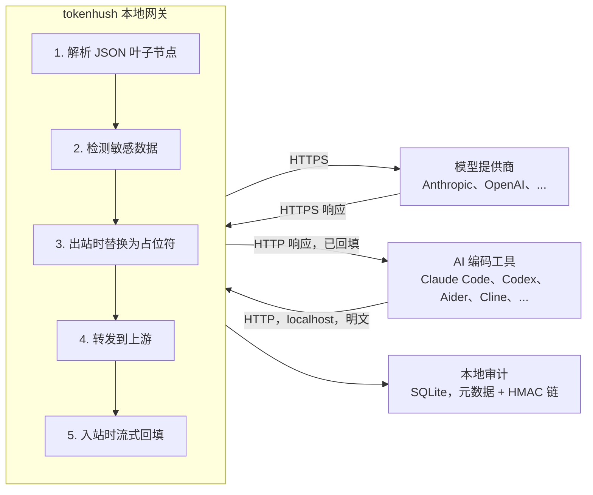

# 架构

[English](architecture.md) | **中文**

> 状态：V1 已实现，并作为 `v0.1.0` 发布（2026-09）。本文档描述已发布核心的架构以及开源核心边界。

Tokenhush 是一个本地 base-URL 网关。它位于你的 AI 编码工具与模型提供商之间，在请求离开本机前检测并脱敏敏感内容，并记录一条本地审计时间线。

## 目标与非目标

**目标**

- 在请求离开本机前检测并脱敏敏感内容（密钥、`.env` 值、PII）。
- 提供**本地审计时间线**，默认只记录元数据。
- 以**零配置阻力**接入接受 `*_BASE_URL` 或自定义端点的工具。
- 在 Windows、Linux 和 macOS 上**跨平台**运行。
- 全部在本地处理：**数据永不离开设备**。

**非目标（V1 明确排除在范围外）**

- 系统级 MITM / 根证书安装。
- 覆盖 Cursor agent 流量、ChatGPT/Claude 桌面应用或浏览器 Web UI。
- 团队协作、云或 SSO。
- 三个平台上的系统级拦截；系统扩展与 MITM 保持 macOS 优先，该决策记录在私有 Pro 仓库中。
- 用于语义检测的 NER 或本地小模型。

## 数据流

**关键洞察**：敏感方向是**请求**，而请求是**非流式**的。完整 JSON body 在转发前即可获得，因此可以完整脱敏，无需面对流式改写的难题。响应方向通常只携带占位符，因此回填是有界的“占位符替换为原文”。

> [!NOTE]
> 出站请求在脱敏前被完整读取。只有入站响应路径需要增量处理，且它只会把占位符改写回原文。

## 组件

| 包 | 职责 |
|---|---|
| `pkg/proxy` | 本地 HTTP 反向代理：监听器、上游路由、SSE 透传、生命周期 |
| `pkg/redact` | 检测器（确定性规则）+ 占位符生成/映射 + 回填 |
| `pkg/protocol` | 协议无关的 JSON 叶子遍历；增量 SSE 解析；递归处理工具调用中的双重编码 JSON |
| `pkg/audit` | 仅追加的 SQLite + HMAC 哈希链；仅元数据；保留策略 |
| `pkg/config` | 配置加载与默认值（`tokenhush.yaml`） |
| `pkg/platform` | 跨平台抽象：路径、密钥环、服务。导出以供私有 Pro 仓库复用 |
| `pkg/extension` | 内容插件接口（Inspector / Transformer / Registry）以及跨层扩展点（见 `extension-api.zh-CN.md`、`plugins.zh-CN.md`） |
| `pkg/license` | 只读的 Pro license 校验与展示（隔离，已做模糊测试） |
| `cmd/tokenhush` | 免费 CLI：`run`（前台网关）、`status`、`audit`、`env`（打印设置片段）、`doctor`、`version`，以及控制面 API |

## 关键设计决策

### 协议无关的叶子遍历（不做 API 规范化）

不为 Anthropic、OpenAI 或 Responses 构建中间表示。这样的层会随 API 演进而腐坏。相反，网关**递归遍历 JSON，对字符串叶子执行检测/替换**。工具调用内部的双重编码 JSON 字符串被递归处理，SSE 在叶子层级增量解析。这在 API 变化时保持稳健。

### 占位符与回填

- **格式**：JSON 安全、对 tokenizer 友好、高熵，例如 `__PII_email_3f9a2b__`。
- **映射**：同一密钥**以 HMAC 确定性方式**映射到同一占位符，避免跨会话冲突导致的“回填错误的密钥”。
- **存储**：**仅在内存中且以会话为范围**。重启会遗忘映射，因此失败的回填会向用户显示占位符。这是**安全的降级，而非泄露**。
- **硬不变量**：回填只朝向**客户端**发生。绝不向出站方向回填。

### 流式

- **出站**：完整读取 body，然后脱敏。没有缓冲问题。
- **入站**：**固定长度的滑动窗口**（等于最长占位符的长度）处理被 SSE 分块边界切开的占位符。无需缓冲整个流。延迟可忽略。

### 检测器策略（V1）

以**高精度优先**的确定性规则：已知密钥前缀（`sk-`、`AKIA`、`ghp_`、...）、高熵字符串、JWT、私钥头、Luhn 卡号校验和以及电子邮件地址。提供白名单与一键放行。措辞保持诚实：**“高置信密钥拦截”**，绝不使用“永不泄露”。

## 开源核心边界

公开核心（本仓库，Apache-2.0）提供**对单用户完全可用**的能力：代理、脱敏、审计、CLI 以及扩展点接口。

私有 Pro 仓库通过导入本仓库的 Go module 构建付费二进制。它提供：

- 系统扩展 / MITM 强力模式（在闭源 macOS 应用侧）
- 多提供商 / 多账号路由
- 成本追踪
- 团队审计导出 / SSO
- 仪表盘 / 菜单栏 UI

> [!IMPORTANT]
> Pro 代码与算法**绝不进入本仓库**，且本仓库不包含任何 `if license { ... }` 付费实现分支。完整的分发与开源核心策略位于私有 Pro 仓库。

## 能力阶梯

| 阶段 | 能力 | 渠道 |
|---|---|---|
| V1 | base-URL 网关：内容级脱敏 + 审计（覆盖 CLI/IDE 工具） | 开源核心 + 免费 CLI |
| V2 | 系统扩展元数据模式：域名/进程级拦截 + 审计（**无 CA**） | Pro（直接下载） |
| V3 | 透明代理 + 本地 CA：内容级脱敏，覆盖 Cursor/浏览器/桌面应用 | Pro（显式选择加入） |

> [!WARNING]
> V2 与 V3 依赖 macOS Network Extension 系统扩展（Developer ID 签名 + 用户批准 + Apple 能力审批），且**未在本仓库中实现**。
