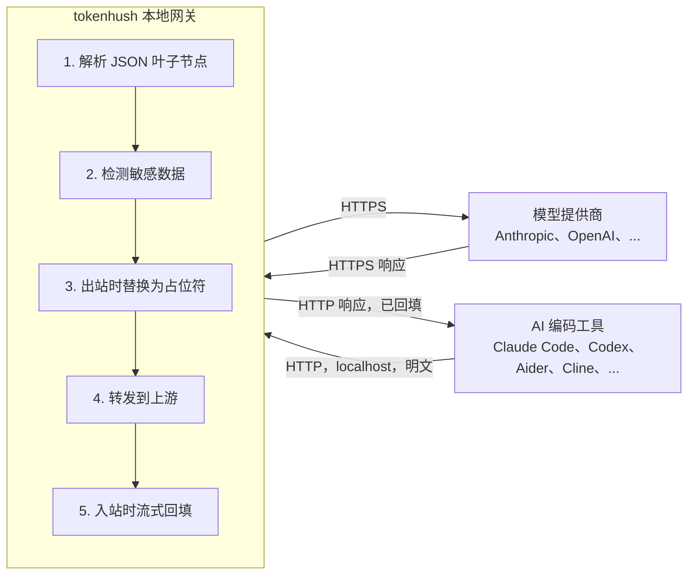

# 架构

[English](architecture.md) | **中文**

> 状态：V1 已实现，并作为 `v0.1.0` 发布（2026-09）。本文档描述已发布核心的架构，以及开源核心边界。

Tokenhush 是本地 base-URL 网关，夹在你的 AI 编码工具和模型提供商中间。请求出本机前，它先找出敏感内容换掉。

## 目标与非目标

**目标**

- 请求离开本机前，检测并脱敏敏感内容（密钥、`.env` 值、PII）。
- 让接受 `*_BASE_URL` 或自定义端点的工具几乎零配置就能接入。
- 在 Windows、Linux、macOS 上**跨平台**运行。
- 全部本地处理：**数据不离开设备**。

**非目标（V1 明确排除）**

- 系统级 MITM / 安装根证书。
- 覆盖 Cursor agent 流量、ChatGPT/Claude 桌面应用或浏览器 Web UI。
- 团队协作、云或 SSO。
- 三个平台都做系统级拦截；系统扩展与 MITM 保持 macOS 优先，该决策记录在私有 Pro 仓库。
- 用 NER 或本地小模型做语义检测。

## 数据流



**关键点**：敏感方向是**请求**，而请求**非流式**。工具把整个 JSON body 一次性发出，网关转发前就拿到全部内容，能一次脱敏干净，不必面对流式改写的难题。响应通常只带占位符，所以回填只是有界的“占位符换回原文”。

> [!NOTE]
> 出站请求先完整读取，再脱敏。只有入站响应路径需要增量处理，而且它只把占位符改写回原文。

## 组件

| 包 | 职责 |
|---|---|
| `pkg/proxy` | 本地 HTTP 反向代理：监听器、上游路由、SSE 透传、生命周期 |
| `pkg/redact` | 检测器（确定性规则）+ 占位符生成/映射 + 回填 |
| `pkg/protocol` | 协议无关的 JSON 叶子遍历；增量 SSE 解析；递归处理工具调用中的双重编码 JSON |
| `pkg/config` | 配置加载与默认值（`tokenhush.yaml`） |
| `pkg/platform` | 跨平台抽象：路径、密钥环、服务。导出以供私有 Pro 仓库复用 |
| `pkg/extension` | 内容插件接口（Inspector / Transformer / Registry）以及跨层扩展点（见 `extension-api.zh-CN.md`、`plugins.zh-CN.md`） |
| `pkg/license` | 只读的 Pro license 校验与展示（隔离，已做模糊测试） |
| `cmd/tokenhush` | 免费 CLI：`run`（前台网关）、`status`、`env`（打印设置片段）、`doctor`、`version`，以及控制面 API |

## 关键设计决策

### 协议无关的叶子遍历（不做 API 规范化）

“叶子”指请求 JSON 里最内层的字符串值。看这个 body：

```json
{"messages": [{"content": "my key is sk-abc123"}]}
```

网关遍历 JSON 树，对字符串 `"my key is sk-abc123"` 执行检测/替换。它不为 Anthropic、OpenAI 或 Responses 建一套内部统一结构，那套结构会随 API 每次变动而腐坏。工具调用内部的双重编码 JSON 字符串递归处理，SSE 在叶子层级增量解析。

### 占位符与回填

**占位符（placeholder）**：出站时替换真密钥的那段假字符串。格式要求 JSON 安全、对 tokenizer 友好、高熵，例如 `__PII_email_3f9a2b__`。

- **映射**：同一密钥**以 HMAC 确定性方式**映到同一占位符。HMAC 就是带密钥的哈希：同样输入，同样输出。两个不同密钥不会撞到同一个占位符，也就不会“回填错误的密钥”。
- **存储**：**只在内存里，且仅限当前会话**。重启即遗忘映射，失败的回填会让用户看到占位符。这是**安全的降级，不是泄露**。
- **硬不变量**：回填只朝向**客户端**。绝不向出站方向回填。

### 流式

- **出站**：完整读取 body，再脱敏。没有缓冲问题。
- **入站**：用**固定长度滑动窗口**（长度等于最长占位符）匹配被 SSE 分块边界切开的占位符。没有它，前一块的 `__PII_ema` 和后一块的 `il_3f9a2b__` 就永远配不上。网关不必缓冲整条流，额外延迟可以忽略。

### 检测器策略（V1）

确定性规则，**高精度优先**：已知密钥前缀（`sk-`、`AKIA`、`ghp_`、...）、高熵字符串、JWT、私钥头、Luhn 卡号校验和、电子邮件地址。另配白名单和一键放行。措辞保持诚实：**“高置信密钥拦截”**，绝不写“永不泄露”。

## 开源核心边界

公开核心（本仓库，Apache-2.0）**单用户即可完整使用**：代理、脱敏、CLI，以及扩展点接口。

私有 Pro 仓库导入本仓库的 Go module，构建付费二进制，提供：

- 系统扩展 / MITM 强力模式（在闭源 macOS 应用侧）
- 多提供商 / 多账号路由
- 成本追踪
- 团队导出 / SSO
- 仪表盘 / 菜单栏 UI

> [!IMPORTANT]
> Pro 代码与算法**绝不进入本仓库**，本仓库也不含任何 `if license { ... }` 付费实现分支。完整分发与开源核心策略在私有 Pro 仓库。

## 能力阶梯

| 阶段 | 能力 | 渠道 |
|---|---|---|
| V1 | base-URL 网关：内容级脱敏 | 开源核心 + 免费 CLI |
| V2 | 系统扩展元数据模式：域名/进程级拦截（**无 CA**） | Pro（直接下载） |
| V3 | 透明代理 + 本地 CA：内容级脱敏，覆盖 Cursor/浏览器/桌面应用 | Pro（显式选择加入） |

> [!WARNING]
> V2 与 V3 依赖 macOS Network Extension 系统扩展（Developer ID 签名 + 用户批准 + Apple 能力审批），**未在本仓库实现**。
