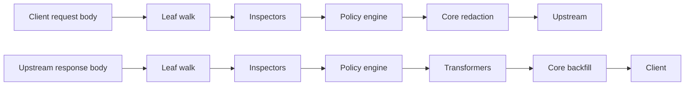

# Writing plugins

**English** | [中文](plugins.zh-CN.md)

> Status: V1 implemented (2026-09). This guide is for authors who want to extend detection and rewriting. The interface definitions live in [extension-api.md](extension-api.md); the security boundaries live in [security.md](security.md).

Tokenhush processes content through a **compiled-in, capability-tiered** plugin pipeline. The six built-in detectors (`pkg/redact`) are themselves plugins. Your plugin uses the same interfaces and the same least-privilege constraints. V1 has **no dynamic loading**: plugins are compiled into the binary at build time.

## Mental model



Two rules are non-negotiable:

1. **Plugins propose, the core decides.** An Inspector returns `Finding` values that carry the `Action` it wants. The core's policy engine aggregates them (`Allow < Warn < Redact < Block`) and executes the result.
2. **Only the core touches outbound plaintext.** A `Transformer` may declare `response_content` and `metadata` only. Request content and raw headers are never handed to it, and the placeholder-to-original mapping is unreachable to plugins.

## The two plugin kinds

| Interface | Role | Allowed phases | Returns |
|---|---|---|---|
| `Inspector` | Detect and report `Finding` values | all four | `[]Finding` |
| `Transformer` | Rewrite the document (inbound only) | `response_content`, `metadata` | `*Document` |

Both implement `Plugin`:

```go
type Plugin interface {
    ID() string
    Capabilities() Capabilities
}
```

## Phases and capabilities

`Phase` marks the position in the request/response lifecycle:

| Phase | Meaning |
|---|---|
| `extension.RequestContent` | Leaves of the outbound request body |
| `extension.ResponseContent` | Leaves of the inbound response body |
| `extension.Header` | Headers (**metadata only**; values are always withheld) |
| `extension.Metadata` | Non-content metadata (tool, model, byte counts, ...) |

`Capabilities` is the permission you request. **The less you ask for, the more the core can safely allow**:

```go
extension.Capabilities{
    Phases:       []extension.Phase{extension.RequestContent},
    ReadContent:  true,   // without it you only see leaf paths and lengths
    CanTransform: false,  // only a Transformer needs it
    CanBlock:     false,  // true lets the policy honor a Block
    CanNetwork:   false,  // always denied for the compiled-in third-party tier
    Priority:     100,     // ascending; ties break by id
}
```

| Field | Meaning |
|---|---|
| `Phases` | The lifecycle phases you handle; must be non-empty and defined |
| `ReadContent` | Access to `Leaf.Content`; without it you see paths and lengths only |
| `CanTransform` | Declares that you may return a rewritten document (Transformer only) |
| `CanBlock` | Lets the policy honor a `Block` from this plugin |
| `CanNetwork` | Request egress; denied at registration for the compiled-in tier |
| `Priority` | Execution order, ascending, non-negative; ties break by plugin id |

- Without `ReadContent`, `Leaf.Content == nil`; you only get `Leaf.Path` and `Leaf.Len`.
- In the `Header` phase, `Content` is cleared whether or not you requested `ReadContent`. `Authorization`, `Cookie`, and API key values never reach a plugin.
- A `Finding` with `Block` only takes effect when `CanBlock` is true; otherwise the core treats the plugin output as malformed.

## What the core guarantees

- Before invoking you, the core runs `extension.Gate`: content you did not ask for stays hidden, and a document whose phase you did not declare is never handed to you.
- The core overwrites `Finding.PluginID` with your own `ID()`, so you cannot spoof another plugin's provenance.
- `Inspect` runs in its own goroutine under a timeout, with panic recovery. A crash or timeout is never silent.
- Response Transformers run **before backfill**, so their output cannot contain plaintext that only backfill would restore.
- The core splices your returned content back into the body by leaf ordinal first, then by path. A `nil` `Content`, or content equal to the original, leaves the raw token untouched.

## Writing an Inspector

Here is a complete, compilable detector that marks the literal `INTERNAL-` as `Redact`:

```go
package myplugins

import (
	"bytes"

	"github.com/fregie/tokenhush/pkg/extension"
)

type InternalMarker struct{}

func NewInternalMarker() *InternalMarker { return &InternalMarker{} }

func (*InternalMarker) ID() string { return "example_internal_marker" }

func (*InternalMarker) Capabilities() extension.Capabilities {
	return extension.Capabilities{
		Phases:      []extension.Phase{extension.RequestContent},
		ReadContent: true,
		Priority:    100,
	}
}

func (*InternalMarker) Inspect(doc *extension.Document) ([]extension.Finding, error) {
	const marker = "INTERNAL-"
	var findings []extension.Finding
	for i, leaf := range doc.Leaves {
		for at := 0; at+len(marker) <= len(leaf.Content); {
			j := bytes.Index(leaf.Content[at:], []byte(marker))
			if j < 0 {
				break
			}
			start := at + j
			findings = append(findings, extension.Finding{
				LeafIndex:  i,
				Start:      start,
				End:        start + len(marker),
				Type:       "internal_marker",
				Confidence: 0.9,
				Action:     extension.Redact,
			})
			at = start + len(marker)
		}
	}
	return findings, nil
}
```

Key points:

- `Start` and `End` are byte offsets **within that leaf**, `End` exclusive, and must lie inside the leaf content.
- `Confidence` must be in `[0,1]`; otherwise the whole plugin is judged malformed.
- Do not write placeholders yourself. The core's redaction engine owns the substitution.
- A finding the core rejects (`Action` outside the known set, `Confidence` outside `[0,1]` or `NaN`, a negative `Start` or `LeafIndex`, an `End` before `Start`, or a `Block` without `CanBlock`) fails the **whole plugin**, not just that one finding. The core never drops a single bad finding, so a plugin cannot hide a real verdict behind malformed output.

## Writing a Transformer

A Transformer may declare `response_content` and `metadata` only. It rewrites inbound responses (for example, normalizing a class of fields). It **does not see the original secrets**.

```go
package myplugins

import "github.com/fregie/tokenhush/pkg/extension"

type HeaderStamper struct{}

func NewHeaderStamper() *HeaderStamper { return &HeaderStamper{} }

func (*HeaderStamper) ID() string { return "example_response_stamper" }

func (*HeaderStamper) Capabilities() extension.Capabilities {
	return extension.Capabilities{
		Phases:       []extension.Phase{extension.ResponseContent},
		ReadContent:  true,
		CanTransform: true,
		Priority:     200,
	}
}

func (*HeaderStamper) Transform(doc *extension.Document) (*extension.Document, error) {
	for i := range doc.Leaves {
		if len(doc.Leaves[i].Content) == 0 {
			continue
		}
		// Example only: this demonstrates the rewrite capability. A real plugin
		// should preserve structure and avoid breaking JSON.
		doc.Leaves[i].Content = append([]byte("handled: "), doc.Leaves[i].Content...)
	}
	return doc, nil
}
```

- Returning a `nil` document means "no change"; the core keeps the previous version.
- Multiple Transformers run in a `Priority` chain, and each one sees the previous one's result.
- In the `Header` phase, `Content` is always empty, so a Transformer never gets header values.

## Registering a plugin (compiled-in)

Plugins register into `extension.Registry` at startup. `Register` is the security gate:

```go
reg := extension.NewRegistry()
if err := reg.Register(myplugins.NewInternalMarker()); err != nil {
    return err
}
if err := reg.Register(myplugins.NewHeaderStamper()); err != nil {
    return err
}
```

The public core's `tokenhush run` registers only the built-in detectors. V1 has **no** runtime switch for loading external plugins: no `.so`, no WASM, no subprocess, and no "plugin directory". To put a custom plugin to work you have two options:

1. **Contribute it to the core:** add it to the built-in set so it ships and is reviewed with the core.
2. **Build your own host program:** write a separate `main` package that imports this core library, assembles the pipeline from the exported `pkg/proxy` primitives, and passes in your registry. The private Pro build follows this pattern, and its code never appears in the public repository.

The shape of an assembly built from exported primitives (illustrative; the fields are defined by `PipelineConfig`):

```go
package main

import (
	"log"

	"github.com/fregie/tokenhush/pkg/extension"
	"github.com/fregie/tokenhush/pkg/proxy"
	"github.com/fregie/tokenhush/pkg/redact"
	// ...your plugins
)

func main() {
	reg := extension.NewRegistry()
	if err := reg.Register(NewInternalMarker()); err != nil {
		log.Fatal(err)
	}

	engine, err := redact.NewPlaceholderEngine()
	if err != nil {
		log.Fatal(err)
	}
	pipe, err := proxy.NewPipeline(proxy.PipelineConfig{
		Registry: reg,
		Engine:   engine,
		Tool:     "my-host",
	})
	if err != nil {
		log.Fatal(err)
	}
	_ = pipe
	// Then assemble your server from proxy.Listen / NewResolver / NewForwarder /
	// HostAllowlist / ControlAuth / OriginPolicy.
}
```

> `pkg/proxy` exports `Listen`, `NewPipeline`, `NewResolver`, `NewForwarder`, `HostAllowlist`, `ControlAuth`, and `OriginPolicy`. The `run` wiring in `internal/cli` is the reference usage, though `internal/` cannot be imported by an external module.

## Registration-time rejections

`Register` returns **typed errors** (classify them with `errors.Is`). If any requirement fails, the plugin is not admitted:

| Error | Trigger |
|---|---|
| `ErrNotAPlugin` | nil, typed-nil, or a type implementing neither Inspector nor Transformer |
| `ErrMissingID` | id is empty or whitespace only |
| `ErrDuplicateID` | id is already registered |
| `ErrNoPhases` | no phase declared |
| `ErrInvalidPhase` | an undefined phase declared |
| `ErrTransformerPhase` | a Transformer declares `request_content` or `header` |
| `ErrNetworkDenied` | `CanNetwork` declared |
| `ErrInvalidPriority` | negative priority |

A plugin that implements both Inspector and Transformer is validated under the **stricter Transformer rules**, so it may declare `response_content` and `metadata` only.

## Failure strategy

- The default is `FailOpenWarn`: on error, timeout, or panic the core drops the plugin's findings, records an audit warning, and lets the request continue.
- `FailClosed`: for critical detectors, a failure rejects the request (returns `Block`). The built-in detectors use this stricter setting.
- Under either policy, **a failure always leaves an audit warning**. Nothing is swallowed silently.

## Testing your plugin

A plugin is an ordinary Go type, so unit-test it directly. No gateway needed:

```go
func TestInternalMarker(t *testing.T) {
	doc := &extension.Document{
		Phase: extension.RequestContent,
		Leaves: []extension.Leaf{
			{Path: "/messages/0/content", Content: []byte("token INTERNAL-42 end")},
		},
	}
	findings, err := NewInternalMarker().Inspect(doc)
	if err != nil {
		t.Fatal(err)
	}
	if len(findings) != 1 || findings[0].Action != extension.Redact {
		t.Fatalf("want one redact finding, got %+v", findings)
	}
}
```

Also cover: the core registration gate (`Register` rejects over-broad capabilities), visibility under `Gate` (`Content == nil` without `ReadContent`), and the path where a malformed finding fails the plugin. The `pkg/redact/*_test.go` files in the repo are good examples to follow.

## Do / Don't

- **Do** request the minimum `Capabilities`; declare only the phases you actually handle.
- **Do** stay robust against arbitrary bytes, including invalid UTF-8. Never panic.
- **Do** express intent with `Finding` values and let the core decide and execute.
- **Don't** try to hold or reconstruct the placeholder-to-original mapping. The interface does not provide it.
- **Don't** attempt to rewrite `RequestContent`. Only an Inspector can act on the request side, and it cannot rewrite.
- **Don't** rely on `CanNetwork`; the compiled-in tier is denied at registration.
