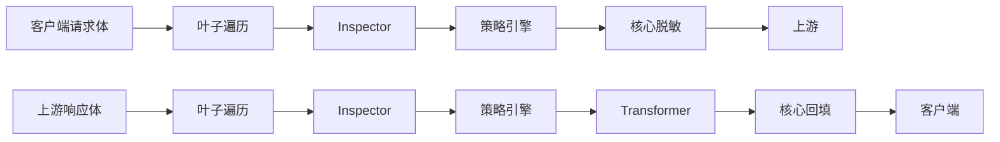

# 编写插件

[English](plugins.md) | **中文**

> 状态：V1 已实现（2026-09）。本指南面向希望扩展检测与改写能力的作者。接口定义见 [extension-api.zh-CN.md](extension-api.zh-CN.md)；安全边界见 [security.zh-CN.md](security.zh-CN.md)。

Tokenhush 通过一条**编译期内置、按能力分级**的插件流水线处理内容。六个内置检测器（`pkg/redact`）本身就是插件。你的插件使用相同的接口和相同的最小权限约束。V1 **没有动态加载**：插件在构建时被编译进二进制。

## 心智模型



有两条不可协商的规则：

1. **插件提议，核心裁决。** Inspector 返回携带其期望 `Action` 的 `Finding`。核心的策略引擎聚合这些结果（`Allow < Warn < Redact < Block`）并执行最终决定。
2. **只有核心能接触出站明文。** `Transformer` 只能声明 `response_content` 和 `metadata`。请求内容和原始头部永远不会交给它，占位符到原文的映射对插件不可达。

## 两种插件类型

| 接口 | 角色 | 允许的阶段 | 返回值 |
|---|---|---|---|
| `Inspector` | 检测并上报 `Finding` | 全部四个 | `[]Finding` |
| `Transformer` | 改写文档（仅入站） | `response_content`、`metadata` | `*Document` |

两者都实现 `Plugin`：

```go
type Plugin interface {
    ID() string
    Capabilities() Capabilities
}
```

## 阶段与能力

`Phase` 标记在请求/响应生命周期中的位置：

| Phase | 含义 |
|---|---|
| `extension.RequestContent` | 出站请求体的叶子 |
| `extension.ResponseContent` | 入站响应体的叶子 |
| `extension.Header` | 头部（**仅元数据**；值始终不予提供） |
| `extension.Metadata` | 非内容元数据（工具、模型、字节数……） |

`Capabilities` 是你请求的权限。**你请求得越少，核心就能安全地放行越多**：

```go
extension.Capabilities{
    Phases:       []extension.Phase{extension.RequestContent},
    ReadContent:  true,   // without it you only see leaf paths and lengths
    CanTransform: false,  // only a Transformer needs it
    CanBlock:     false,  // true lets the policy honor a Block
    CanNetwork:   false,  // always denied for the compiled-in third-party tier
    Priority:     100,     // ascending; ties break by id
}
```

| 字段 | 含义 |
|---|---|
| `Phases` | 你处理的生命周期阶段；必须非空且已定义 |
| `ReadContent` | 访问 `Leaf.Content` 的权限；没有它你只能看到路径和长度 |
| `CanTransform` | 声明你可以返回改写后的文档（仅 Transformer） |
| `CanBlock` | 允许策略引擎采纳此插件的 `Block` |
| `CanNetwork` | 请求出网；对编译期内置层级在注册时即被拒绝 |
| `Priority` | 执行顺序，升序，非负；相同值按插件 id 排序 |

- 没有 `ReadContent` 时，`Leaf.Content == nil`；你只能拿到 `Leaf.Path` 和 `Leaf.Len`。
- 在 `Header` 阶段，无论你是否请求了 `ReadContent`，`Content` 都会被清空。`Authorization`、`Cookie` 和 API key 的值永远不会到达插件。
- 带 `Block` 的 `Finding` 只有在 `CanBlock` 为 true 时才生效；否则核心会把该插件的输出视为格式错误。

## 核心的保证

- 在调用你之前，核心会运行 `extension.Gate`：你未请求的内容保持隐藏，未声明阶段对应的文档永远不会交给你。
- 核心会用你自己的 `ID()` 覆盖 `Finding.PluginID`，因此你无法伪造其他插件的来源。
- `Inspect` 在独立的 goroutine 中运行，带超时和 panic 恢复。崩溃或超时永远不会悄无声息。
- 响应 Transformer 在**回填之前**运行，因此其输出不可能包含只有回填才会还原的明文。
- 核心先按叶子序号、再按路径，把你返回的内容拼回请求体。`Content` 为 `nil`，或内容与原文相同时，原始内容保持不变。

## 编写 Inspector

下面是一个完整且可编译的检测器，它把字面量 `INTERNAL-` 标记为 `Redact`：

```go
package myplugins

import (
	"bytes"

	"github.com/fregie/tokenhush/pkg/extension"
)

type InternalMarker struct{}

func NewInternalMarker() *InternalMarker { return &InternalMarker{} }

func (*InternalMarker) ID() string { return "example_internal_marker" }

func (*InternalMarker) Capabilities() extension.Capabilities {
	return extension.Capabilities{
		Phases:      []extension.Phase{extension.RequestContent},
		ReadContent: true,
		Priority:    100,
	}
}

func (*InternalMarker) Inspect(doc *extension.Document) ([]extension.Finding, error) {
	const marker = "INTERNAL-"
	var findings []extension.Finding
	for i, leaf := range doc.Leaves {
		for at := 0; at+len(marker) <= len(leaf.Content); {
			j := bytes.Index(leaf.Content[at:], []byte(marker))
			if j < 0 {
				break
			}
			start := at + j
			findings = append(findings, extension.Finding{
				LeafIndex:  i,
				Start:      start,
				End:        start + len(marker),
				Type:       "internal_marker",
				Confidence: 0.9,
				Action:     extension.Redact,
			})
			at = start + len(marker)
		}
	}
	return findings, nil
}
```

要点：

- `Start` 和 `End` 是**该叶子内**的字节偏移，`End` 为排他上界，且必须落在叶子内容之内。
- `Confidence` 必须在 `[0,1]` 内；否则整个插件会被判定为格式错误。
- 不要自己写占位符。替换由核心的脱敏引擎负责。
- 核心拒绝的 finding（`Action` 不在已知集合内、`Confidence` 超出 `[0,1]` 或为 `NaN`、`Start` 或 `LeafIndex` 为负、`End` 早于 `Start`，或没有 `CanBlock` 却给出 `Block`）会让**整个插件**失败，而不只是那一个 finding。核心绝不会丢弃单个坏 finding，因此插件无法用畸形输出掩盖真实判定。

## 编写 Transformer

Transformer 只能声明 `response_content` 和 `metadata`。它改写入站响应（例如规范化某一类字段）。它**看不到原始机密**。

```go
package myplugins

import "github.com/fregie/tokenhush/pkg/extension"

type HeaderStamper struct{}

func NewHeaderStamper() *HeaderStamper { return &HeaderStamper{} }

func (*HeaderStamper) ID() string { return "example_response_stamper" }

func (*HeaderStamper) Capabilities() extension.Capabilities {
	return extension.Capabilities{
		Phases:       []extension.Phase{extension.ResponseContent},
		ReadContent:  true,
		CanTransform: true,
		Priority:     200,
	}
}

func (*HeaderStamper) Transform(doc *extension.Document) (*extension.Document, error) {
	for i := range doc.Leaves {
		if len(doc.Leaves[i].Content) == 0 {
			continue
		}
		// Example only: this demonstrates the rewrite capability. A real plugin
		// should preserve structure and avoid breaking JSON.
		doc.Leaves[i].Content = append([]byte("handled: "), doc.Leaves[i].Content...)
	}
	return doc, nil
}
```

- 返回 `nil` 文档表示“无变更”；核心保留上一版本。
- 多个 Transformer 按 `Priority` 组成链条依次运行，每一个都能看到前一个的结果。
- 在 `Header` 阶段，`Content` 始终为空，因此 Transformer 永远拿不到头部值。

## 注册插件（编译期内置）

插件在启动时注册到 `extension.Registry`。`Register` 就是安全门：

```go
reg := extension.NewRegistry()
if err := reg.Register(myplugins.NewInternalMarker()); err != nil {
    return err
}
if err := reg.Register(myplugins.NewHeaderStamper()); err != nil {
    return err
}
```

公开核心的 `tokenhush run` 只注册内置检测器。V1 **没有**用于加载外部插件的运行时开关：没有 `.so`，没有 WASM，没有子进程，也没有“插件目录”。要让自定义插件生效，你有两种选择：

1. **贡献给核心：** 把它加入内置集合，使其随核心一起发布并接受审查。
2. **构建你自己的宿主程序：** 编写一个独立的 `main` 包，导入这个核心库，用导出的 `pkg/proxy` 原语组装流水线，并传入你的 registry。私有 Pro 构建遵循这一模式，其代码从不出现在公开仓库中。

用导出原语组装起来的大致形态（仅作示例；字段由 `PipelineConfig` 定义）：

```go
package main

import (
	"log"

	"github.com/fregie/tokenhush/pkg/extension"
	"github.com/fregie/tokenhush/pkg/proxy"
	"github.com/fregie/tokenhush/pkg/redact"
	// ...your plugins
)

func main() {
	reg := extension.NewRegistry()
	if err := reg.Register(NewInternalMarker()); err != nil {
		log.Fatal(err)
	}

	engine, err := redact.NewPlaceholderEngine()
	if err != nil {
		log.Fatal(err)
	}
	pipe, err := proxy.NewPipeline(proxy.PipelineConfig{
		Registry: reg,
		Engine:   engine,
		Tool:     "my-host",
	})
	if err != nil {
		log.Fatal(err)
	}
	_ = pipe
	// Then assemble your server from proxy.Listen / NewResolver / NewForwarder /
	// HostAllowlist / ControlAuth / OriginPolicy.
}
```

> `pkg/proxy` 导出 `Listen`、`NewPipeline`、`NewResolver`、`NewForwarder`、`HostAllowlist`、`ControlAuth` 和 `OriginPolicy`。`internal/cli` 中的 `run` 接线是参考用法，不过外部模块无法导入 `internal/`。

## 注册期拒绝

`Register` 返回**类型化错误**（用 `errors.Is` 分类）。任一要求不满足，插件都不会被接纳：

| 错误 | 触发条件 |
|---|---|
| `ErrNotAPlugin` | nil、typed-nil，或既未实现 Inspector 也未实现 Transformer 的类型 |
| `ErrMissingID` | id 为空或仅含空白字符 |
| `ErrDuplicateID` | id 已被注册 |
| `ErrNoPhases` | 未声明任何阶段 |
| `ErrInvalidPhase` | 声明了未定义的阶段 |
| `ErrTransformerPhase` | Transformer 声明了 `request_content` 或 `header` |
| `ErrNetworkDenied` | 声明了 `CanNetwork` |
| `ErrInvalidPriority` | 优先级为负 |

同时实现 Inspector 和 Transformer 的插件按**更严格的 Transformer 规则**校验，因此它只能声明 `response_content` 和 `metadata`。

## 失败策略

- 默认是 `FailOpenWarn`（失败开放）：出错、超时或 panic 时，核心丢弃该插件的 findings，记录一条审计警告，并让请求继续。
- `FailClosed`（失败关闭）：对关键检测器，失败会拒绝请求（返回 `Block`）。内置检测器使用这一更严格的设置。
- 无论采用哪种策略，**失败总会留下审计警告**。不会有任何东西被悄无声息地吞掉。

## 测试你的插件

插件就是普通的 Go 类型，直接对它做单元测试即可，不需要网关：

```go
func TestInternalMarker(t *testing.T) {
	doc := &extension.Document{
		Phase: extension.RequestContent,
		Leaves: []extension.Leaf{
			{Path: "/messages/0/content", Content: []byte("token INTERNAL-42 end")},
		},
	}
	findings, err := NewInternalMarker().Inspect(doc)
	if err != nil {
		t.Fatal(err)
	}
	if len(findings) != 1 || findings[0].Action != extension.Redact {
		t.Fatalf("want one redact finding, got %+v", findings)
	}
}
```

还应覆盖：核心注册门（`Register` 拒绝过宽的能力）、`Gate` 下的可见性（没有 `ReadContent` 时 `Content == nil`），以及畸形 finding 导致插件失败的路径。仓库中的 `pkg/redact/*_test.go` 文件是很好的参考范例。

## 该做 / 不该做

- **要**请求最小的 `Capabilities`；只声明你实际处理的阶段。
- **要**对任意字节保持健壮，包括非法 UTF-8。永不 panic。
- **要**用 `Finding` 表达意图，让核心去裁决和执行。
- **不要**试图持有或重建占位符到原文的映射。接口不提供它。
- **不要**尝试改写 `RequestContent`。请求侧只有 Inspector 能动作，而它无法改写。
- **不要**依赖 `CanNetwork`；编译期内置层级在注册时就会被拒绝。
