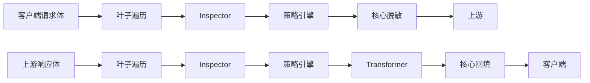

# 编写插件

[English](plugins.md) | **中文**

> 状态：V1 已实现（2026-09）。本指南面向扩展检测与改写的作者。接口见 [extension-api.zh-CN.md](extension-api.zh-CN.md)，安全边界见 [security.zh-CN.md](security.zh-CN.md)。

Tokenhush 用一条**编译期内置、按能力分级**的流水线处理内容。六个内置检测器（`pkg/redact`）本身就是插件，你的插件遵循同一套接口和同样的最小权限规则。V1 **不支持动态加载**：插件在构建时编译进二进制。

## 🎯 心智模型



两条规则不可协商：

1. **插件提议，核心裁决。** Inspector 返回一批 `Finding`，每个带上自己期望的 `Action`；核心的策略引擎把它们聚合（`Allow < Warn < Redact < Block`）再执行。插件只表达意图，落地由核心完成。
2. **出站明文只有核心能碰。** `Transformer` 只能声明 `response_content` 和 `metadata`。请求内容和原始头部永远不会交给它，占位符到原文的映射也对它不可达。

## 🧩 两种插件

| 接口 | 角色 | 允许的阶段 | 返回值 |
|---|---|---|---|
| `Inspector` | 检测并上报 `Finding` | 全部四个 | `[]Finding` |
| `Transformer` | 改写文档（仅入站） | `response_content`、`metadata` | `*Document` |

两者都实现 `Plugin`：

```go
type Plugin interface {
    ID() string
    Capabilities() Capabilities
}
```

## 🔁 阶段与能力

`Phase` 标记请求/响应生命周期中的一个位置，告诉核心你的插件在哪里运行。

| Phase | 含义 |
|---|---|
| `extension.RequestContent` | 出站请求体的叶子 |
| `extension.ResponseContent` | 入站响应体的叶子 |
| `extension.Header` | 头部（**仅元数据**；值始终不予提供） |
| `extension.Metadata` | 非内容元数据（工具、模型、字节数……） |

`Capabilities` 是你申请的权限。**要得越少，核心越敢放行**：

```go
extension.Capabilities{
    Phases:       []extension.Phase{extension.RequestContent},
    ReadContent:  true,   // without it you only see leaf paths and lengths
    CanTransform: false,  // only a Transformer needs it
    CanBlock:     false,  // true lets the policy honor a Block
    CanNetwork:   false,  // always denied for the compiled-in third-party tier
    Priority:     100,     // ascending; ties break by id
}
```

| 字段 | 含义 |
|---|---|
| `Phases` | 你处理的生命周期阶段；必须非空且已定义 |
| `ReadContent` | 访问 `Leaf.Content` 的权限；没有它你只能看到路径和长度 |
| `CanTransform` | 声明你可以返回改写后的文档（仅 Transformer） |
| `CanBlock` | 允许策略引擎采纳此插件的 `Block` |
| `CanNetwork` | 请求出网；对编译期内置层级在注册时即被拒绝 |
| `Priority` | 执行顺序，升序，非负；相同值按插件 id 排序 |

- 没有 `ReadContent` 时，`Leaf.Content == nil`，你只能拿到 `Leaf.Path` 和 `Leaf.Len`。
- 处于 `Header` 阶段时，无论你是否申请 `ReadContent`，`Content` 都会被清空。`Authorization`、`Cookie` 和 API key 的值永远到不了插件手里。
- 带 `Block` 的 `Finding` 只有在 `CanBlock` 为 true 时才生效；否则核心当作插件输出格式错误处理。

## 🛡️ 核心保证

- 调用你之前，核心先跑 `extension.Gate`：你没申请的内容保持隐藏，未声明阶段的文档绝不交给你。
- 核心用你自己的 `ID()` 覆盖 `Finding.PluginID`，所以你无法冒用别的插件来源。
- `Inspect` 在独立 goroutine 里运行，带超时和 panic 恢复，崩溃或超时绝不会无声无息。
- 响应 Transformer 在**回填之前**运行，输出里不可能含有只有回填才会还原的明文。
- 核心按叶子序号优先、路径次之，把返回内容拼回请求体。`Content` 为 `nil`，或内容与原文相同，原始内容不动。

## 🔍 编写 Inspector

Inspector 读取叶子并上报发现。下面这个检测器可编译，把字面量 `INTERNAL-` 标为 `Redact`：

```go
package myplugins

import (
	"bytes"

	"github.com/fregie/tokenhush/pkg/extension"
)

type InternalMarker struct{}

func NewInternalMarker() *InternalMarker { return &InternalMarker{} }

func (*InternalMarker) ID() string { return "example_internal_marker" }

func (*InternalMarker) Capabilities() extension.Capabilities {
	return extension.Capabilities{
		Phases:      []extension.Phase{extension.RequestContent},
		ReadContent: true,
		Priority:    100,
	}
}

func (*InternalMarker) Inspect(doc *extension.Document) ([]extension.Finding, error) {
	const marker = "INTERNAL-"
	var findings []extension.Finding
	for i, leaf := range doc.Leaves {
		for at := 0; at+len(marker) <= len(leaf.Content); {
			j := bytes.Index(leaf.Content[at:], []byte(marker))
			if j < 0 {
				break
			}
			start := at + j
			findings = append(findings, extension.Finding{
				LeafIndex:  i,
				Start:      start,
				End:        start + len(marker),
				Type:       "internal_marker",
				Confidence: 0.9,
				Action:     extension.Redact,
			})
			at = start + len(marker)
		}
	}
	return findings, nil
}
```

要点：

- `Start` 和 `End` 是**叶子内**的字节偏移。`End` 为开区间上界，必须落在叶子内容之内。
- `Confidence` 必须在 `[0,1]` 内，否则核心判定整个插件格式错误。
- 不要自己写占位符，替换由核心的脱敏引擎负责。
- 核心拒绝的 finding 会让**整个插件**失败，而不只是那一个。触发条件：`Action` 不在已知集合内、`Confidence` 超出 `[0,1]` 或为 `NaN`、`Start` 或 `LeafIndex` 为负、`End` 早于 `Start`、没有 `CanBlock` 却给出 `Block`。核心绝不单独丢弃一个坏 finding，插件也就无法用畸形输出盖住真实判定。

## 🔁 编写 Transformer

Transformer 改写入站响应（比如规范化某类字段）。它只能声明 `response_content` 和 `metadata`，而且**永远看不到原始机密**：它处理的已是脱敏后的内容，没有明文可泄。

```go
package myplugins

import "github.com/fregie/tokenhush/pkg/extension"

type HeaderStamper struct{}

func NewHeaderStamper() *HeaderStamper { return &HeaderStamper{} }

func (*HeaderStamper) ID() string { return "example_response_stamper" }

func (*HeaderStamper) Capabilities() extension.Capabilities {
	return extension.Capabilities{
		Phases:       []extension.Phase{extension.ResponseContent},
		ReadContent:  true,
		CanTransform: true,
		Priority:     200,
	}
}

func (*HeaderStamper) Transform(doc *extension.Document) (*extension.Document, error) {
	for i := range doc.Leaves {
		if len(doc.Leaves[i].Content) == 0 {
			continue
		}
		// Example only: this demonstrates the rewrite capability. A real plugin
		// should preserve structure and avoid breaking JSON.
		doc.Leaves[i].Content = append([]byte("handled: "), doc.Leaves[i].Content...)
	}
	return doc, nil
}
```

- 返回 `nil` 表示“无变更”，核心保留上一版本。
- 多个 Transformer 按 `Priority` 串成链，每个都能看到上一个的结果。
- `Header` 阶段里 `Content` 始终为空，Transformer 拿不到头部值。

## 🧩 注册插件（编译期内置）

插件在启动时注册进 `extension.Registry`。`Register` 就是安全门：它逐项校验能力，通过后才接纳插件。

```go
reg := extension.NewRegistry()
if err := reg.Register(myplugins.NewInternalMarker()); err != nil {
    return err
}
if err := reg.Register(myplugins.NewHeaderStamper()); err != nil {
    return err
}
```

公开核心的 `tokenhush run` 只注册内置检测器（另有下方已同步的远端规则解释器，在规则包生效时注册）。V1 **没有**加载外部插件的运行时开关：没有 `.so`，没有 WASM，没有子进程，也没有“插件目录”。两条路：

1. **贡献给核心。** 加进内置集合，随核心一起发布并接受审查。
2. **自己写宿主程序。** 另建一个 `main`，导入这个核心库，用导出的 `pkg/proxy` 原语组装流水线，再传入你的 registry。私有 Pro 构建就走这条路，代码从不出现在公开仓库。

用这些原语组装出的大致形态（仅作示例，字段由 `PipelineConfig` 定义）：

```go
package main

import (
	"log"

	"github.com/fregie/tokenhush/pkg/extension"
	"github.com/fregie/tokenhush/pkg/proxy"
	"github.com/fregie/tokenhush/pkg/redact"
	// ...your plugins
)

func main() {
	reg := extension.NewRegistry()
	if err := reg.Register(NewInternalMarker()); err != nil {
		log.Fatal(err)
	}

	engine, err := redact.NewPlaceholderEngine()
	if err != nil {
		log.Fatal(err)
	}
	pipe, err := proxy.NewPipeline(proxy.PipelineConfig{
		Registry: reg,
		Engine:   engine,
		Tool:     "my-host",
	})
	if err != nil {
		log.Fatal(err)
	}
	_ = pipe
	// Then assemble your server from proxy.Listen / NewResolver / NewForwarder /
	// HostAllowlist / ControlAuth / OriginPolicy.
}
```

> `pkg/proxy` 导出 `Listen`、`NewPipeline`、`NewResolver`、`NewForwarder`、`HostAllowlist`、`ControlAuth` 和 `OriginPolicy`。`internal/cli` 里的 `run` 接线是参考用法，不过外部模块无法导入 `internal/`。

## 📦 已同步的签名规则包

`tokenhush run` 会在内置检测器之外**多注册一个 Inspector**：由 `tokenhush rules sync` 写入的、已同步且已签名的远端规则包的解释器。

- **身份。** 插件 id 为 `customrules`（`rules.DefaultPluginID`），优先级 30（`rules.DefaultPriority`），因此在内置检测器（优先级 0）之后运行。每个 finding 带 `Type` `custom:<rule-id>` 与 `Meta["rule_id"]`，命中可追溯到具体规则。
- **失败策略。** 规则包生效期间，解释器以 **`FailClosed`** 注册：检视失败会拒绝请求，而不是丢弃 findings。没有生效的规则包时它根本不注册，因此也不存在对应的失败策略条目。
- **不是 `detectors:` 的取值。** `customrules` **不是** `detectors:` 配置项的成员，不能单独开关；远端规则包也无法关闭任何内置检测器：非弱化底线（`pkg/rules/floor.go`）会拒绝禁用内置检测器、移除必需类别或携带 `allow` 动作的规则包。
- **启动时应用一次。** 生效的规则包在进程启动时从本地缓存读取。没有热加载：在运行中的会话里执行 `rules sync` 不会改变当前管线，同步后的包要**重启**后才生效。启动只读本地缓存，不联系厂商（`TOKENHUSH_NO_RULE_SYNC` 只让 `rules sync` 拒绝发出请求，不会清除或停用已缓存的规则包）。

**发布者信任边界。** 底线的范围刻意很窄。它拦截禁用检测器、移除必需类别与自动放行（`allow`）规则，但**并不**让已签名的规则包变得无害。一个已带有效签名的规则包仍然可以：

- 用宽泛的 `block` 规则对响应内容造成拒绝服务。只要包里含有 block 动作规则或 blocklist 条目，解释器就会声明 `CanBlock`，策略会采纳由此产生的 `Block`。
- 用全局或 per-rule 的 `allowlist` 抑制它自身的命中（`pkg/rules/interpreter.go`），于是看起来存在的规则可能永远不触发。

因此，远端规则包能扩展检测的幅度**只取决于其发布者可被信任到什么程度**。它无法弱化内置检测器，但可以引入阻断、噪声或自我抑制的规则。请把规则签名密钥当作信任根。模式与上限（schema version 1、规则与命中上限）见 `pkg/rules/schema.go`；`rules` 命令组见 [deployment.zh-CN.md](deployment.zh-CN.md)。

## ✅ 注册期拒绝

`Register` 返回**类型化错误**，用 `errors.Is` 分类。任何一项要求不满足，插件都不会被接纳：

| 错误 | 触发条件 |
|---|---|
| `ErrNotAPlugin` | nil、typed-nil，或既未实现 Inspector 也未实现 Transformer 的类型 |
| `ErrMissingID` | id 为空或仅含空白字符 |
| `ErrDuplicateID` | id 已被注册 |
| `ErrNoPhases` | 未声明任何阶段 |
| `ErrInvalidPhase` | 声明了未定义的阶段 |
| `ErrTransformerPhase` | Transformer 声明了 `request_content` 或 `header` |
| `ErrNetworkDenied` | 声明了 `CanNetwork` |
| `ErrInvalidPriority` | 优先级为负 |

同时实现 Inspector 和 Transformer 的插件按**更严格的 Transformer 规则**校验，因此只能声明 `response_content` 和 `metadata`。

## 📌 失败策略

- 默认是 `FailOpenWarn`：出错、超时或 panic 时，核心丢弃该插件的 findings，通过注入的 `AuditSink` 接缝发一条审计警告，然后让请求继续。
- `FailClosed`：关键检测器用这一档，失败即拒绝请求（返回 `Block`）。内置检测器用的就是它。
- 两种策略下，**失败一定通过接缝发出审计警告**，不会有东西被无声吞掉。默认 sink 是 no-op，警告的持久化由私有 Pro 层负责。

## ✅ 测试插件

插件就是普通的 Go 类型，直接做单元测试即可，不需要网关：

```go
func TestInternalMarker(t *testing.T) {
	doc := &extension.Document{
		Phase: extension.RequestContent,
		Leaves: []extension.Leaf{
			{Path: "/messages/0/content", Content: []byte("token INTERNAL-42 end")},
		},
	}
	findings, err := NewInternalMarker().Inspect(doc)
	if err != nil {
		t.Fatal(err)
	}
	if len(findings) != 1 || findings[0].Action != extension.Redact {
		t.Fatalf("want one redact finding, got %+v", findings)
	}
}
```

还应覆盖：注册门（`Register` 拒绝过宽能力）、`Gate` 下的可见性（没有 `ReadContent` 时 `Content == nil`），以及畸形 finding 导致插件失败。仓库里的 `pkg/redact/*_test.go` 是很好的参考。

## 📌 该做 / 不该做

- **要**申请最小的 `Capabilities`，只声明你真正处理的阶段。
- **要**对任意字节保持健壮，包括非法 UTF-8。永不 panic。
- **要**用 `Finding` 表达意图，让核心裁决和执行。
- **不要**试图持有或重建占位符到原文的映射，接口不提供它。
- **不要**改写 `RequestContent`。请求侧只有 Inspector 能动，而它不能改写。
- **不要**依赖 `CanNetwork`，编译期内置层级在注册时就会被拒绝。
